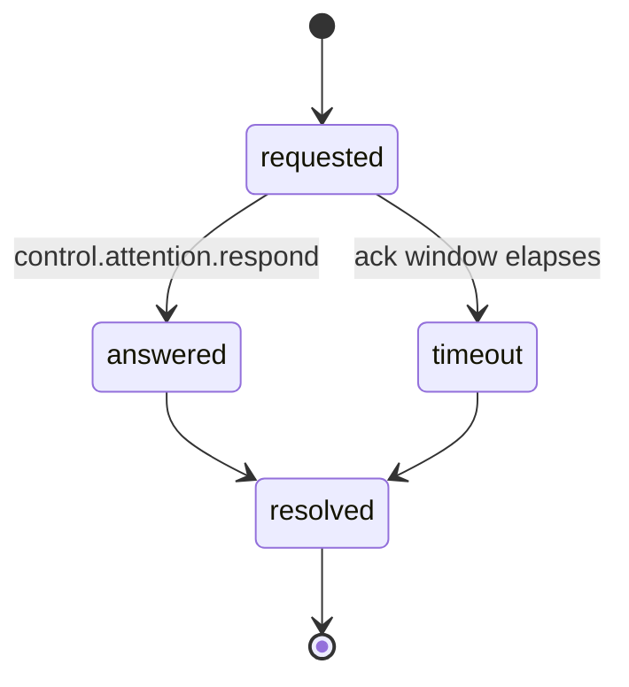
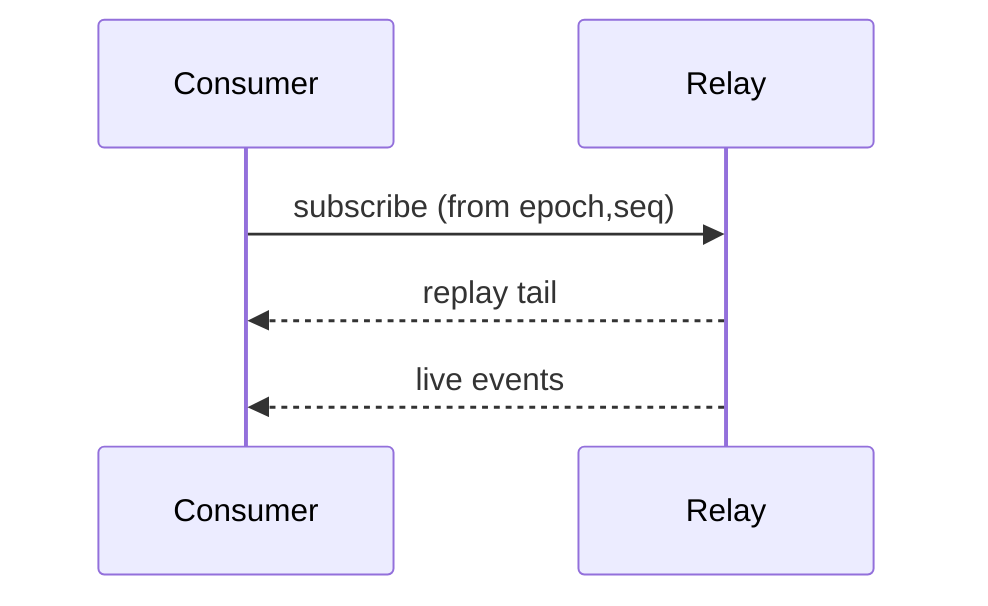

This file governs every document under [`docs/`](/). It exists so the
docs read as one voice and (the rule that outranks all others) so they
**never drift from the spec**. Read it before writing or editing any doc.

## The firewall: docs explain, the spec defines

The [`spec/`](/specification/draft) suite is the single normative source. A doc that
restates a normative requirement has two copies of the truth that can disagree.
The moment the spec changes, the doc is wrong and nobody notices.

So the rule is absolute:

> **Never restate a normative requirement.** When a doc needs a MUST / SHOULD /
> MAY, link to the exact spec section and paraphrase the *why*, not the rule.

Concretely:

- ✅ "The relay replays from `(epoch, seq)` so a consumer that reconnects
  receives the exact tail it missed; see [AEP-0003 §5](/specification/draft/aep-0003-bindings-and-lifecycle)
  for the ordering and idempotency guarantees."
- ❌ "The relay MUST replay all events with `seq` greater than the client's
  last-seen `seq` within the same `epoch`." *(This is a normative restatement.
  It will rot.)*

A useful test: **if the spec changed, would this sentence become false without
anyone editing the doc?** If yes, it's a restatement. Replace it with a link
and an explanation of intent.

Docs may freely: explain *why* a rule exists, show *how* to satisfy it in code,
walk through *what happens* end-to-end, and diagram flows. Docs may quote a
short normative phrase inline **only** as a pointer, immediately followed by its
spec link.

### If writing a doc exposes a spec bug or gap

Stop on that item. Do **not** fix it in the doc (a doc cannot patch a spec) and
do **not** edit `spec/`, `schemas/`, or `conformance/`. Open an issue (or a
spec-question) against the standard instead, and move on.

## Terminology: spec terms only

Use the exact vocabulary the spec defines. Do not introduce synonyms. A reader
who greps the spec for a docs term must find it.

| Use | Not |
|---|---|
| Event (an AEP envelope + `data`) | message, record, log line |
| attention (`attention.requested` …) | notification, alert, prompt |
| control command / control round-trip | action, RPC, request |
| relay | server, broker, hub |
| adapter (agent → AEP) | connector, exporter, plugin |
| consumer (reads the stream) | subscriber, client, listener |
| bridge (AEP → CE/OTLP) | exporter, forwarder |
| capture level (`none`/`metadata`/`digest`/`full`) | privacy level, verbosity |
| `(epoch, seq)` resume / replay | reconnect, catch-up, backfill |
| fleet observer | dashboard user, operator |

"consumer" is the spec's role term; "user" and "builder" are *audience* terms
this doc set uses to organize navigation. That is fine; they are not protocol
concepts.

## Front-matter (required on every doc)

Every `.md` under `docs/` opens with a YAML front-matter block. The tree is a
[Mintlify](https://mintlify.com) site (`docs.json` holds the navigation), so
`title` renders as the page heading, and pages carry **no in-body H1**:

```yaml
---
title: "Page title"                          # rendered by the site; no H1 in the body
description: "One sentence on what the page covers."
audience: user | builder | contributor      # who this doc is for (one primary)
spec-refs: [AEP-0001, AEP-0003]              # spec docs this doc links into ([] if none)
---
```

- **audience**: one primary audience drives placement and tone. A doc may
  serve more than one, but pick the one it's *organized for*.
- **spec-refs**: the AEP docs this page links into. Empty list is legitimate
  (this file, the index). `check-docs.sh` does not require them to be non-empty,
  but a concept/component/guide doc with `spec-refs: []` is a smell: either it
  has no normative anchor (rare) or it's missing its links.
- **verified-against**: used from the first tagged release onward. It names
  the release tag the page's technical claims were checked against; a page
  without the field is current as of the initial draft. When you materially
  revise a page after a release, re-verify and set the field to the tag you
  checked against. It is the honesty marker: it says *these diagrams and file
  paths matched the code at this tag*. Docs that cite a sibling repository's
  code prefix the pin with that repository's name (`reference@<tag>`,
  `typescript-sdk@<tag>`, `python-sdk@<tag>`; several pins when a doc cites
  several repositories); a bare pin resolves in this repository.

## Mermaid: which diagram for which job

Diagrams are first-class here; a flow is clearer drawn than prose'd. Use the
**right** mermaid type for the shape of the thing, consistently across docs:

| Diagram type | Use it for | Typical docs |
|---|---|---|
| `graph` (flowchart, `TD` by default) | **Structure**: how parts connect, data-flow, repo/module maps | repo map, SDK architecture, capture pipeline |
| `sequenceDiagram` | **Protocol flows over time**: who sends what to whom, in order | relay fan-out, control round-trip, resume/dedupe, adapter hook loop |
| `stateDiagram-v2` | **Lifecycles**: an entity moving through named states | attention lifecycle, control command lifecycle, run lifecycle |
| `erDiagram` | **Entity relationships**: identity fields and how they nest | envelope & identity (session/run/step, epoch/seq) |

Rules of thumb:

- A **lifecycle** (attention, command, run) is *always* `stateDiagram-v2`, never
  a flowchart of boxes. The states and transitions are the point.
- A **protocol interaction** (request → ack → outcome, subscribe → replay →
  live) is *always* `sequenceDiagram`. Ordering is the point.
- **Structure/topology** (what talks to what, what generates what) is `graph`.
- Label edges with the spec term or the actual event `type`
  (`attention.requested`, `control.ack`), not paraphrases.
- Keep one diagram to one idea. Two ideas = two diagrams.
- Every mermaid block must be syntactically valid. `docs/check-docs.sh`
  extracts and checks each one. Keep node ids simple (`[A-Za-z0-9_]`), quote
  labels containing punctuation.


### Minimal examples (copy the fence, not the content)

Lifecycle:



Protocol flow:



## Links

- Internal links are **root-relative site URLs** and must resolve.
  `check-docs.sh` fails on a dangling link or anchor. Pages are extensionless
  (`/concepts/what-and-why`); spec sections live under the generated mirror
  (`/specification/draft/aep-0003-bindings-and-lifecycle#6-the-attr-match-filter-dialect`).
- Repo files that are not site pages (fixtures, schemas, scripts) get full
  GitHub URLs. The site cannot serve them.
- Link code by repo-relative path in the text so the reference stays greppable
  (`impl/relay/server.js`), with the URL pointing at the file on GitHub. Cite
  the file when you make a claim about behavior.
- Prefer linking an existing doc over re-explaining a concept a second time.

## Voice

Senior, plain, and specific. Short sentences. Name the file. Explain the *why*.
No marketing adjectives, no "simply/just", no future-tense promises about
unshipped behavior: everything is Draft/pre-release, and the docs say so once,
in the index, not on every page.

## Punctuation

Avoid em dashes in prose; the working target is zero. Where a dash would
stand in for a colon (a label before its gloss), a comma or parentheses
(an aside), or a period or semicolon (two joined clauses), use that mark:
it is clearer and reads the same.

A dash may remain only inside a code span or fence, inside a verbatim quoted string, or inside a controlled
name the spec itself defines (the AEP-0001 §13 document types). Prefer a
colon in a heading (`Repo map: how the pieces fit`, not
`Repo map — how the pieces fit`).

Straight ASCII quotes and apostrophes everywhere a reader might copy text; never curly punctuation in
or near a code span. No exclamation marks. Headings in sentence case.
