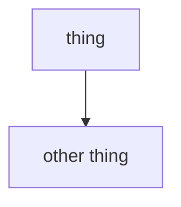

_One or two sentences: what this page is, who it's for, and what the reader
walks away able to do or understand. No preamble. No in-body H1: the site
renders `title` from the front-matter._

> Copy this file to start a new doc. Read [`STYLE.md`](STYLE.md) first,
> especially the firewall (docs link to normative text, never restate it) and
> the mermaid-type table. Delete this blockquote, replace every italic
> placeholder, fill the front-matter, and add the page to `docs.json` so it
> appears in the navigation.

## First real section

_Explanation. When a rule belongs to the spec, link its mirror page:
"…so the consumer receives the exact tail; see
[AEP-0003 §5](/specification/draft/aep-0003-bindings-and-lifecycle)." Cite
code by path when describing behavior: `impl/relay/server.js`._

## See also

- _A related doc, linked root-relative (`/concepts/what-and-why`). Note why
  the reader might go there next._
- Normative source: _the relevant AEP under_ [`/specification/draft`](/specification/draft).
