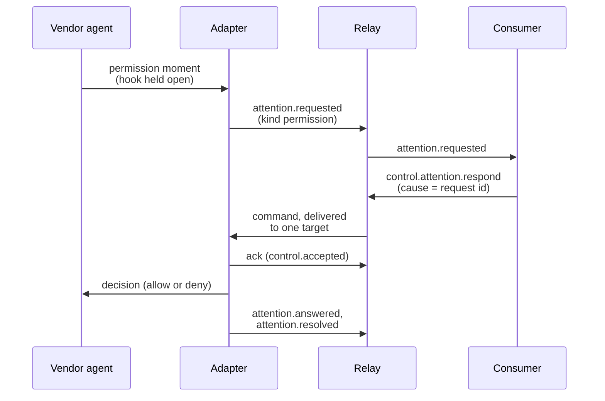
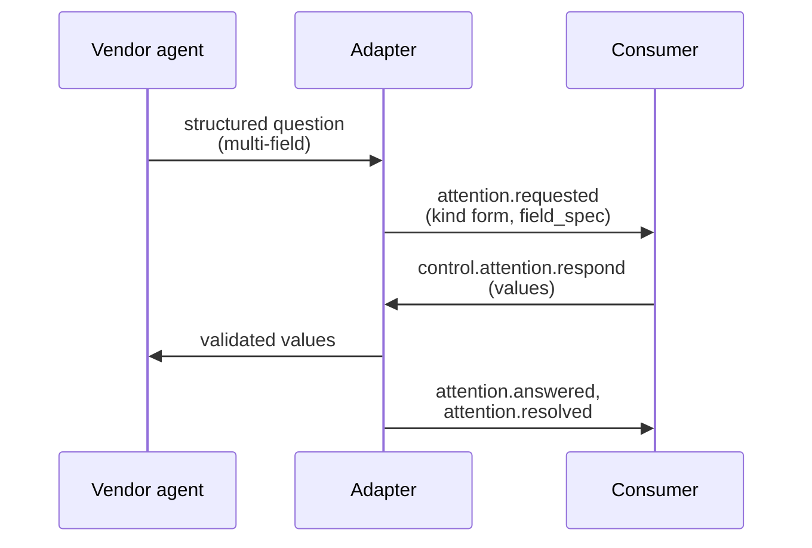

{/* GENERATED by docs/gen-agents.js from conformance/fixtures/mappings/*.json + docs/data/agents.json; do not edit. Edit the inputs and re-run `node docs/gen-agents.js` */}

Control in AEP is declarative and opt-in: a target says what it accepts in
its `hello` `control.accepts` list, consumers send only that, and every
command is acknowledged and answered by `cause`-linked outcome Events
([AEP-0004](/specification/draft/aep-0004-control-profile)). A source that
declares nothing is not broken; observe-only is a per-vendor honesty
decision, recorded with its reason in the tables below.

## The control loop

## Command support

| Source | `hello` `control.accepts` | Answerable kinds | Ack window | Observed-only attention | Vendor-side cancel | `tool.denied` facts |
| --- | --- | --- | --- | --- | --- | --- |
| [Claude Code](/components/adapters) | `control.attention.respond` + opt-in: `x.claude-code.control.instruct` (steering, `AEP_INSTRUCT=1`; see the [design record](/components/control-steering-design)) | `permission (typed text follows the AEP-0008 receiver rule: an option word counts as that option, other free text is a deny WITH the text as the hook message, the vendor's own custom-reply path)`, `form` | 10000 ms | n/a | n/a | `PermissionDenied` hook → `tool.denied` |
| [Codex](/components/adapters) | `control.attention.respond` + opt-in: `x.codex.control.instruct` (steering, `AEP_INSTRUCT=1`; see the [design record](/components/control-steering-design)) | `permission (typed text follows the AEP-0008 receiver rule: an option word counts as that option, other free text is a deny WITH the text as the decision message, the guidance path)` | 10000 ms | n/a | n/a | on the OTel channel (`tool_decision` deny); see the OTel-inbound row |
| [Gemini CLI](/components/adapters) | n/a (no `control` block) | n/a | n/a | n/a | n/a | n/a |
| [Qwen Code](/components/adapters) | `control.attention.respond` + opt-in: `x.qwen-code.control.instruct` (steering, `AEP_INSTRUCT=1`; see the [design record](/components/control-steering-design)) | `permission (typed text follows the AEP-0008 receiver rule: an option word counts as that option, other free text is a deny WITH the text as the decision message, the vendor's guidance path)` | 10000 ms | n/a | n/a | n/a |
| [VS Code agent (Copilot)](/components/adapters) | `[]` (declared read-only) + opt-in: `control.attention.respond` (the held PreToolUse permission gate: `AEP_VSCODE_CONTROL=1`, scoped by `AEP_VSCODE_GATE_TOOLS`; the vendor's own allow/deny/ask decision surface; see the adapter README), `x.vscode.control.instruct` (steering: `AEP_INSTRUCT=1`; queued text rides `hookSpecificOutput.additionalContext` on the next eligible hook reply, five source-settled moments; see the steering design record) | `permission (control opt-in: the held PreToolUse gate; an ask answer escalates to VS Code's own user-approval flow; typed text follows the AEP-0008 receiver rule: an option word incl. `ask` counts as that option, other free text denies with the text as the rendered reason)` | n/a | n/a | n/a | a commanded operator deny lands `tool.denied` `by: policy` cause-linked to the answer (hook denies are the vendor's hooks-policy plane; no further hook fires for the blocked call) |
| [Kimi Code CLI](/components/adapter-kimi-code-design) | `[]` (declared read-only) + opt-in: `control.attention.respond` (the held PreToolUse permission gate: `AEP_KIMI_CONTROL=1`, scoped by `AEP_KIMI_GATE_TOOLS`; the vendor decision surface is BINARY allow/deny: an allow is "no hook objection", the vendor's own permission flow still runs downstream; see the adapter README), `x.kimi-code.control.instruct` (steering: `AEP_INSTRUCT=1`; queued text rides `{message}` on the next `UserPromptSubmit` reply (the vendor's one context-accepting reply surface) and `SessionEnd` drops leftovers; see the steering design record) | `permission (control opt-in: the held PreToolUse gate, binary allow/deny; typed text follows the AEP-0008 receiver rule: an option word counts as that option, other free text denies with the text as the rendered reason)` | n/a | `permission (always on; the vendor's own TUI approval prompt observed as an out-of-band pair: `PermissionRequest` opens the request with no options claimed, `PermissionResult` records the human's answer, a rejection lands `tool.denied` `by: runtime`)` | the dedicated `Interrupt` hook IS the vendor's own Esc moment (fired only for reason "cancelled"): `run.cancelled` `by: user` with no drain heuristic on the happy path; a run left open drains at the next prompt or at `SessionEnd` | a commanded operator deny lands `tool.denied` `by: policy` cause-linked to the answer (the vendor renders the structured deny reason in the TUI); a vendor-side human rejection lands `tool.denied` `by: runtime` cause-linked to the oob answer |
| [OpenCode](/components/adapter-opencode-design) | `control.attention.respond` | `permission (typed text follows the AEP-0008 receiver rule: an option word counts as that option; unmatched free text applies the refusing status; the hook output carries status only, so guidance stays stream-visible)` | 10000 ms | n/a | n/a | n/a |
| [Kilo Code](/components/adapter-kilocode-design) | `control.attention.respond` | `permission (dual surface; through 7.4.5: the held hook, typed text follows the AEP-0008 receiver rule, an option word counts as that option, unmatched free text applies the refusing status with guidance stream-visible only; from 7.4.6: options mirror the vendor reply enum once/always/reject verbatim and a reject's free text REACHES the vendor as the reply message)`, `form (questions, from 7.4.6)` | 10000 ms | n/a | n/a | n/a |
| [Cline](/components/adapter-cline-design) | `[]` (declared read-only) + opt-in: `control.attention.respond` (hub approvals: `AEP_CLINE_HUB_CONTROL=1`; see the [design record](/components/adapter-cline-design)), `control.cancel` (scope `run` → hub `run.abort`, same gate), `x.cline.control.send_input` (user-plane input, same gate) | `permission (hub opt-in)` | n/a | `permission (tap-only mode, AEP_CLINE_HUB=1 without the control gate)` | `agent_abort` → `run.cancelled`; the opt-in `control.cancel` drives hub `run.abort`, and the same hook fact returns cause-linked to the command | n/a |
| [Hermes](/components/adapter-hermes-design) | `[]` (declared read-only) + opt-in: `control.attention.respond` (the held operator-deny gate on `pre_tool_call`: `AEP_HERMES_CONTROL=1`, scoped by `AEP_HERMES_GATE_TOOLS`; see the [design record](/components/adapter-hermes-design)), `x.hermes.control.instruct` (steering, `AEP_INSTRUCT=1`; see the [design record](/components/control-steering-design)) | `permission (control opt-in: the held tool gate; typed text follows the AEP-0008 receiver rule: an option word counts as that option, other free text is a deny with the text as the reason; the vendor's own approval gate stays observed read-only in every posture)` | n/a | `permission (the vendor's own gate, every posture; the card carries the vendor's four-way decision menu as `options` data and declares `respond_via: [oob]`, AEP-0008)`, `form (the `clarify` overlay: the ask AND the vendor-delivered answer both on the wire; `respond_via: [oob]`, AEP-0006)` | `on_session_end` `interrupted` → `run.cancelled`; no commanded cancel: no vendor cancel write exists on this surface (`control.cancel` not declared even under the gate) | policy denies → `tool.denied` `by: policy`; a commanded operator deny rides the SAME pinned mapping (the vendor classes the block `plugin_block`) cause-linked to the command |
| [Antigravity](/components/adapter-antigravity-design) | n/a (no `control` block) | n/a | n/a | n/a | n/a | n/a |
| [pi](/components/adapter-pi-design) | `[]` (declared read-only) + opt-in: `control.attention.respond` (the held operator gate on the blockable `tool_call`: `AEP_PI_CONTROL=1`, scoped by `AEP_PI_GATE_TOOLS`; registration itself is the opt-in; see the [design record](/components/adapter-pi-design)) | `permission (control opt-in: the held tool gate; a deny rides the vendor's own block result and the observed skip stays the pinned tool.failed, never recast)` | n/a | n/a | `stop_reason: aborted` → `run.cancelled`; no commanded cancel: aborts belong to the client-owned process modes (`control.cancel` not declared even under the gate) | none in any posture: a commanded operator deny lands as the pinned `tool.failed` cause-linked to the command (the bus does not distinguish blocked-from-failed; no recast) |
| [AG-UI](/components/bridge-agui-design) | `[]` (declared read-only) | n/a | n/a | n/a | n/a | n/a |
| [ACP](/components/bridge-acp-design) | `[]` (declared read-only) | n/a | n/a | `permission` | `stopReason: cancelled` → `run.cancelled` | n/a |
| [OpenHands](/components/bridge-openhands-design) | `[]` (declared read-only) + opt-in: `control.attention.respond` (answerable confirmation: `AEP_OPENHANDS_CONTROL=1`; see the [design record](/components/bridge-openhands-design)), `control.pause` (→ the vendor's own lifecycle pause, honored only from `running`, same gate), `control.resume` (→ the vendor's run call, honored only from `paused`; refused where it would start work or bypass a pending confirmation, same gate), `x.openhands.control.send_input` (user-plane input appended as a user message, the vendor run flag pinned false: never a run trigger, never an implicit approval; no status guard, same gate), `x.openhands.control.interrupt` (the escalated pause: instant, resumable; honored only from `running`, elsewhere the vendor falls back to a pause no-op and the command is refused, same gate) | `permission (control opt-in)` | n/a | `permission (default posture)` | status transition `deleting` → `run.cancelled`; no commanded cancel: no vendor write terminates a run (`control.cancel` deliberately not declared even under the gate) | hook-sourced `UserRejectObservation` → `tool.denied` (`by: policy`); a user-sourced rejection stays vendor-scoped (a human decision, not a policy block) |
| [OTel inbound](/components/bridge-otlp-inbound-design) | n/a (no `control` block) | n/a | n/a | n/a | n/a | `tool_decision` deny records → `tool.denied` |
| [OpenCode SSE](/components/adapter-opencode-design) | `[]` (declared read-only) + opt-in: `control.attention.respond` (answerable permission in the vendor's own `once`/`always`/`reject` vocabulary: `AEP_OPENCODE_SSE_CONTROL=1`, primary mode only; see the [design record](/components/adapter-opencode-design)), `control.cancel` (scope `run` → the server's own `session.abort`; the vendor's idle boundary closes the synthesized run as `run.cancelled` cause-linked, same gate) | `permission (control opt-in, primary mode)` | n/a | `permission (default posture, primary mode)` | the opt-in `control.cancel` drives the server's `session.abort` (a true activation terminal on this channel); without a command in flight the idle boundary stays a plain `run.finished` | n/a |
| [Kilo Code SSE](/components/adapter-kilocode-design) | `[]` (declared read-only) + opt-in: `control.attention.respond` (answerable permission in the vendor's own `once`/`always`/`reject` vocabulary: `AEP_KILOCODE_SSE_CONTROL=1`, primary mode only; the REST routes are byte-identical to OpenCode's at the re-verified pins), `control.cancel` (scope `run` → the server's own `session.abort`; the vendor's idle boundary closes the synthesized run as `run.cancelled` cause-linked, same gate) | `permission (control opt-in, primary mode)` | n/a | `permission (default posture, primary mode)` | the opt-in `control.cancel` drives the server's `session.abort` (a true activation terminal on this channel); without a command in flight the idle boundary stays a plain `run.finished` | n/a |
| [Kimi web (kap-server)](/components/adapter-kimi-code-design) | `[]` (declared read-only) + opt-in: `control.attention.respond` (answerable approval in the vendor's own `approved`/`rejected` decision vocabulary, free text as `feedback`: `AEP_KIMI_WEB_CONTROL=1`, primary mode only; POST /api/v1/sessions/{sid}/approvals/{approval_id}, outcome riding the vendor's own `event.approval.resolved` broadcast), `control.cancel` (scope `run` → the vendor session abort, a non-destructive active-work terminal; the `turn.ended` reason "cancelled" boundary closes the run cause-linked, same gate) | `permission (control opt-in, primary mode: approvals only; question answering is deferred, reason recorded)` | n/a | `permission (default posture, primary mode: the wire approval loop observed read-only)`, `form (default posture, primary mode: the question loop presented read-only on the field_spec shape)` | the opt-in `control.cancel` drives the vendor session abort; the vendor's own `turn.ended` reason "cancelled" is the boundary that closes the run; without a command in flight the same boundary maps to a plain `run.cancelled` (the channel does not know who cancelled) | n/a |

Two targets accept `control.cancel` today, both opt-in: Cline through its
hub control channel, where the vendor's abort verb returns as its own hook
fact cause-linked to the command, and the OpenCode SSE bridge in primary
mode, where the server's `session.abort` ends the in-flight work and the
vendor's own idle boundary closes the synthesized run as `run.cancelled`.
Every other cancellation fact in the table is a **vendor-side** moment
each mapping reports honestly. The demo synthetic agent remains the
reference implementation of a cancel-capable target, and consumers surface
a nack from any non-accepting target as the correct, sovereign answer.

`control.pause`/`control.resume` have their first real target: the
OpenHands bridge, opt-in, the one source whose vendor documents lifecycle
pause/run calls. The paused state returns as the vendor's own status
fact riding `state.delta`, cause-linked to the command, and the refusals
are load-bearing: a resume is refused where it would start new work or
silently accept a pending confirmation.

## The form loop

Structured input requests ([AEP-0006](/specification/draft/aep-0006-structured-input-requests))
carry a typed `field_spec` so a consumer can render real forms and answer
with validated `values`; invalid values earn `control.rejected` with the
request kept pending.

| Source | Form loop today |
| --- | --- |
| Claude Code | `AskUserQuestion` and MCP `Elicitation`/`ElicitationResult` → `attention.requested` kind `form` (AEP-0006), answered end to end |
| Codex | n/a |
| Gemini CLI | n/a |
| Qwen Code | n/a |
| VS Code agent (Copilot) | n/a |
| Kimi Code CLI | n/a |
| OpenCode | n/a |
| Kilo Code | `question.asked` (from 7.4.6) → `attention.requested` kind `form` on the AskUserQuestion shape (index-id choices, vendor `custom` → `other`), answered end to end over `POST /question/{requestID}/reply` |
| Cline | n/a |
| Hermes | SHIPPED observed: the `clarify` ask-the-user tool → `attention.requested` kind `form` (AEP-0006) beside the pinned tool trio, with `respond_via: [oob]`; no result-consuming hook exists on this surface, so the bus honestly cannot answer; the card mirrors the vendor's own entry-point choice normalization, and the vendor-delivered answer rides `attention.answered` via `oob` (a picked choice as its structural 1-based id; Other/open-ended as redacted-gated text); the vendor's timeout sentinels land `attention.timeout`, cancel/undeliverable/blocked/error resolve `dismissed` ([design record](/components/adapter-hermes-design)) |
| Antigravity | n/a |
| pi | n/a |
| AG-UI | n/a |
| ACP | n/a |
| OpenHands | n/a |
| OTel inbound | n/a |
| OpenCode SSE | n/a |
| Kilo Code SSE | n/a |
| Kimi web (kap-server) | n/a |

Today Claude Code, Kilo Code, Hermes are the form-loop sources; the loop itself is generic: any source whose vendor exposes a structured question surface adopts it without new protocol work.

A form loop is ANSWERABLE exactly when the vendor consumes an injected
answer (eligibility is a consumption property); where the ask and its
answer are only observable, the card declares `respond_via: ["oob"]` and
the vendor-delivered answer still rides `attention.answered` via `oob`;
the diagram above shows the answerable shape, and the observed shape
replaces the two middle arrows with the vendor asking its own user.

## Where the steering boundary sits

Most vendors expose surfaces that could *drive* the agent: context
injection, input rewriting, mid-run messages. The mappings deliberately
leave them unused: an observer that silently changes what it observes has
broken the capture-honesty contract. They are catalogued here because the
boundary is part of the protocol's claim to honesty; where one IS
exercised (the SHIPPED rows below), it arrives as an explicit, declared,
commanded, opt-in capability (the vendor-scoped verb path of
[AEP-0004 §5](/specification/draft/aep-0004-control-profile) and the
[steering design record](/components/control-steering-design)), never as
a side effect.

| Source | Vendor steering surface and its use | Ceiling and headroom |
| --- | --- | --- |
| [Claude Code](/components/adapters) | SHIPPED opt-in: `x.claude-code.control.instruct` queues text delivered as `additionalContext` on the next eligible hook reply, audited on the stream ([design record](/components/control-steering-design)); `updatedInput`/`updatedToolOutput` rewrites stay unused | blockable task/teammate/config moments are captured as facts, never driven; `PermissionDenied.retry` deliberately unused |
| [Codex](/components/adapters) | SHIPPED opt-in: `x.codex.control.instruct` queues text delivered as `additionalContext` on the five documented moments (`SessionStart`, `SubagentStart`, `PreToolUse`, `PostToolUse`, `UserPromptSubmit`), audited on the stream ([design record](/components/control-steering-design)); no `SessionEnd` hook exists, so the session-end drop outcome has no Codex moment (recorded deviation); `PostToolUse` result replacement stays unused | native OTel log export is the second channel, adopted through the OTel-inbound mapping |
| [Gemini CLI](/components/adapters) | `BeforeAgent`/`AfterTool` context injection; `BeforeModel` prompt/model mutation (automation-side hooks, out of the mapped scope) | no human-in-the-loop hook exists (`Notification` can neither grant nor deny): a vendor ceiling, so observe-only is the honest posture |
| [Qwen Code](/components/adapters) | SHIPPED opt-in: `x.qwen-code.control.instruct` queues text delivered as `additionalContext` on the seven documented moments (`SessionStart`, `UserPromptSubmit`, `PreToolUse`, `PostToolUse`, `Stop`, `SubagentStart`, `PreCompact`), audited on the stream with the session-end drop ([design record](/components/control-steering-design)); the async `command`-hook `systemMessage` surface stays deliberately unused | a `PermissionRequest` `interrupt` output field and a two-phase todo-hook structure are documented vendor-side and unmapped |
| [VS Code agent (Copilot)](/components/adapters) | SHIPPED opt-in: `x.vscode.control.instruct` queues text delivered as `additionalContext` on the five source-settled moments (`SessionStart`, `UserPromptSubmit`, `SubagentStart`, `PreToolUse`, `PostToolUse` (the last docs-silent but typed AND consumed, types over prose); `PreCompact` excluded, no output surface), audited on the stream ([design record](/components/control-steering-design)); no `SessionEnd` exists on this target, so there is no session-end drop moment (the Codex deviation); a held PreToolUse reply carries the permission decision, never steering | the opt-in OTel channel's LogRecord family is ADOPTED (the OTel-inbound sidecar's `--vendor vscode` profile, fixture `vscode-otel.json`: tool-failure visibility the hook surface cannot carry); the richer `invoke_agent`/`execute_tool` span channel is recorded headroom (a new receiver message shape); `updatedInput` rewrite stays deliberately unused; PostToolUse is success-only and the VSCode hook target has no SessionEnd; end visibility waits on the vendor (agent hooks are Preview) |
| [Kimi Code CLI](/components/adapter-kimi-code-design) | SHIPPED opt-in: `x.kimi-code.control.instruct` queues text delivered as `{message}` on the next `UserPromptSubmit` reply; the vendor wraps hook stdout as a hook_result block appended to context, and that is its ONE context-accepting reply surface (every other event's stdout is display-only); `SessionEnd` EXISTS here, so leftovers drop with reason "session-ended" (the Claude Code rule), audited on the stream | live-validated (the five-beat guide run, incl. the permission pair and both opt-in controls). The kap-server control plane is BUILT as the Kimi web channel (bridge-kimi-code-web; see its own card). Two further machine surfaces stay recorded, deliberately unbuilt: native ACP (`kimi acp`, protocol v1; observable TODAY through the ACP bridge with zero code) and the append-live `wire.jsonl` session records. The vendor ships weekly: the 16-event enum, the strict config schema, and the kap wire vocabulary are standing re-verify surfaces; a vendor-side config rewrite (the web UI settings save serializes config.toml) STRIPS the aep-setup fence comments; the writer then degrades to a presence check (no duplicate hooks, but fence-refresh stops working until the fence is re-landed). |
| [OpenCode](/components/adapter-opencode-design) | `chat.params`/`chat.headers`/`shell.env` mutation hooks exist and are deliberately unregistered; the server REST API can answer permissions out of band | `tool.execute.before` can block by throwing (unused); a typed v2 question/permission event family exists in the published SDK but is not yet plugin-exposed |
| [Kilo Code](/components/adapter-kilocode-design) | the same bus surface as OpenCode, observation hooks only by the design record | the vendor's event-model migration lands at 7.4.6 (verified against the shipped 7.4.11 binary; dual permission surface + the question form loop shipped 2026-07-20); `kilo serve` HTTP + SSE and a native OTLP export are documented second channels |
| [Cline](/components/adapter-cline-design) | typed `SubprocessHookControl` fields (`overrideInput`, `appendMessages`, `systemPrompt`) exist and are never returned; hub `session.send_input` ships as the opt-in `x.cline.control.send_input`: user-plane input (delivery queue/steer), deliberately NOT `instruct` | the hub approval loop, `run.abort`, and `session.send_input` are adopted opt-in (the design record); `session.fork`, `schedule.*`, and the hub's capability brokerage stay out of scope, stated |
| [Hermes](/components/adapter-hermes-design) | SHIPPED opt-in: `x.hermes.control.instruct` queues text delivered through the vendor's own context injection: the `pre_llm_call` hook reply's `{"context": …}`, the ONE site the runtime consumes (joined into the user message at turn start), audited on the stream; delivery at latest on the next turn start, drop rides the real session end (`on_session_finalize`, never the per-turn `on_session_end`) ([design record](/components/control-steering-design)) | the TUI-gateway JSON-RPC stream with `approval.request` is a documented second channel (bridge-shaped, deferred); the vendor's own approval gate stays hook-unanswerable by design (pre-answering it is the one thing the vendor forbids; verified at the pin and on a live install: the approval hook dispatch discards results) |
| [Antigravity](/components/adapter-antigravity-design) | `PreInvocation`/`PostInvocation` accept `injectSteps`; `Stop` can force continuation; never sent | `PreToolUse` decisions (`allow`/`deny`/`ask`/`force_ask`) exist on the wire, but approval outcomes are not hook-visible: the gap that keeps this mapping observe-only |
| [pi](/components/adapter-pi-design) | `--mode rpc` carries `steer`/`follow_up`/`abort`/`fork` and an extension-UI request/response sub-protocol: a client-owned process mode, not the adapter's channel | mutable `tool_result` stays unregistered; the blockable `tool_call` is now the opt-in gate's one surface (the default posture registers neither); the fork's typed approval pair has not reached upstream: the named trigger, mapping to the attention pair plus whatever the bus emits for the skipped call |
| [AG-UI](/components/bridge-agui-design) | n/a | the protocol is read-only by design: there is no control loop to claim |
| [ACP](/components/bridge-acp-design) | n/a | byte-transparency outranks everything: the tee never injects; the ACP v2 RFD track (permission-request shape) is the standing watch |
| [OpenHands](/components/bridge-openhands-design) | the events socket is read-write and the REST API carries `respond_to_confirmation`, lifecycle pause/run, the message append, and `/interrupt`; never-send is the DEFAULT posture (the auth frame is the only socket write, ever); `AEP_OPENHANDS_CONTROL=1` inverts it for exactly five REST writes, and the socket stays auth-frame-only either way. User-plane input rides `x.openhands.control.send_input` (an appended user message, run flag pinned false): the Cline-class divergence, deliberately outside the convergent `instruct` corpus per the [steering record](/components/control-steering-design) | the approval loop, pause/resume, user-plane send-input, and the interrupt escalation all ship on the opt-in control channel; remaining: the webhook second channel |
| [OTel inbound](/components/bridge-otlp-inbound-design) | n/a | companion/primary dedup keeps the hook adapter authoritative when both channels observe the same session |
| [OpenCode SSE](/components/adapter-opencode-design) | the SSE stream is read-only by construction and stays so; `AEP_OPENCODE_SSE_CONTROL=1` (primary mode) pairs it with exactly two REST writes: the permission reply and `session.abort`; the server's prompt/command routes (user-plane driving) stay out of scope, stated | the REST control channel ships opt-in (primary mode; the record's own natural actuator); remaining: the typed v2 question/permission surface (a named watch, not plugin- or stream-exposed at 1.18.3); the Kilo SSE twin ships as its own channel, the bus union verified byte-identical at `@kilocode/sdk` 7.4.11 vs 1.18.3 |
| [Kilo Code SSE](/components/adapter-kilocode-design) | the SSE stream is read-only by construction and stays so; `AEP_KILOCODE_SSE_CONTROL=1` (primary mode) pairs it with exactly two REST writes: the permission reply and `session.abort`; the server's prompt/command routes (user-plane driving) stay out of scope, stated | the fork twin of the OpenCode SSE channel, shipped with the same two-mode discipline and the same opt-in control pair; remaining: the typed v2 question/permission surface (the shared named watch) and live validation alongside the plugin channel's |
| [Kimi web (kap-server)](/components/adapter-kimi-code-design) | the WS stream is read-only by construction and stays so; `AEP_KIMI_WEB_CONTROL=1` (primary mode) pairs it with exactly two REST writes: the approval decision and the session abort; the prompt submit/steer routes (user-plane driving) stay out of scope, stated | reaches kap-hosted (`kimi web`) sessions ONLY: the terminal TUI runs in-process with no server surface (unreachable by vendor design, recorded unsupported); remaining: question-answer actuation (the per-item id round-trip), instance-registry discovery of multiple servers, and live validation against a real `kimi web` session |

Implementation homes: [`impl/adapter-claude-code`](https://github.com/agenteventprotocol/reference/tree/main/impl/adapter-claude-code) · [`impl/adapter-codex`](https://github.com/agenteventprotocol/reference/tree/main/impl/adapter-codex) · [`impl/adapter-gemini-cli`](https://github.com/agenteventprotocol/reference/tree/main/impl/adapter-gemini-cli) · [`impl/adapter-qwen-code`](https://github.com/agenteventprotocol/reference/tree/main/impl/adapter-qwen-code) · [`impl/adapter-vscode`](https://github.com/agenteventprotocol/reference/tree/main/impl/adapter-vscode) · [`impl/adapter-kimi-code`](https://github.com/agenteventprotocol/reference/tree/main/impl/adapter-kimi-code) · [`impl/adapter-opencode`](https://github.com/agenteventprotocol/reference/tree/main/impl/adapter-opencode) · [`impl/adapter-kilocode`](https://github.com/agenteventprotocol/reference/tree/main/impl/adapter-kilocode) · [`impl/adapter-cline`](https://github.com/agenteventprotocol/reference/tree/main/impl/adapter-cline) · [`impl/adapter-hermes`](https://github.com/agenteventprotocol/reference/tree/main/impl/adapter-hermes) · [`impl/adapter-antigravity`](https://github.com/agenteventprotocol/reference/tree/main/impl/adapter-antigravity) · [`impl/adapter-pi`](https://github.com/agenteventprotocol/reference/tree/main/impl/adapter-pi) · [`impl/bridge-agui`](https://github.com/agenteventprotocol/reference/tree/main/impl/bridge-agui) · [`impl/bridge-acp`](https://github.com/agenteventprotocol/reference/tree/main/impl/bridge-acp) · [`impl/bridge-openhands`](https://github.com/agenteventprotocol/reference/tree/main/impl/bridge-openhands) · [`impl/bridge-otlp-in`](https://github.com/agenteventprotocol/reference/tree/main/impl/bridge-otlp-in) · [`impl/bridge-opencode-sse`](https://github.com/agenteventprotocol/reference/tree/main/impl/bridge-opencode-sse) · [`impl/bridge-kilocode-sse`](https://github.com/agenteventprotocol/reference/tree/main/impl/bridge-kilocode-sse) · [`impl/bridge-kimi-code-web`](https://github.com/agenteventprotocol/reference/tree/main/impl/bridge-kimi-code-web).
