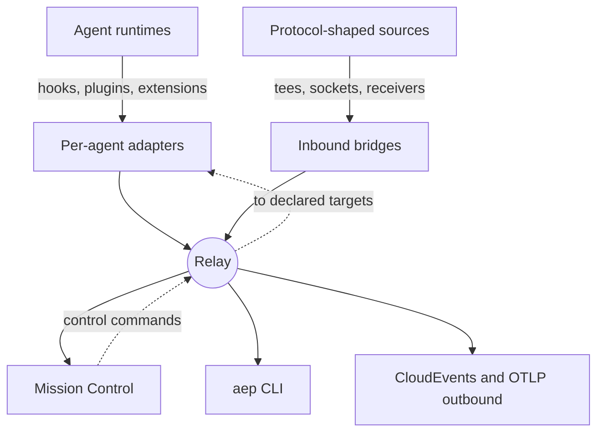

AEP observes agents through two shapes: a **per-agent adapter** riding the
vendor's own hook, plugin, or extension surface, and an **inbound bridge**
attaching to a protocol-shaped stream. Twelve adapters and five inbound
channels are adopted today, each pinned by a mapping fixture the
conformance suite runs on every commit. Two outbound bridges republish
the stream as CloudEvents and OTLP for existing pipelines.

## The matrices

Both pages are generated from the fixture corpus and a reviewed capability
record, so they cannot drift from what CI asserts.

<CardGroup cols={2}>
<Card title="Feature matrix" icon="list" href="/agents/feature-matrix">
Event coverage at several granularities: by family, by type group, and the
per-source vendor extension inventory.
</Card>
<Card title="Control and interaction matrix" icon="bolt" href="/agents/control-matrix">
Who answers and who only observes: the control loop, the form loop, and
each vendor's steering ceiling, stated honestly.
</Card>
</CardGroup>

## How to read a cell

- **`●` fixture-pinned**: a mapping table in
  [`conformance/fixtures/mappings/`](https://github.com/agenteventprotocol/agent-event-protocol/blob/main/conformance/fixtures/mappings)
  asserts the exact input/output pair; both conformance runners execute it.
- **`○` documented**: shipped coverage the component doc states, with no
  fixture pin yet (verified live for Claude Code).
- **live-validated vs fixture-proven**: a mapping is *fixture-proven* once
  its table passes conformance, and *live-validated* once a real vendor
  session has been driven through the full loop and checked. Each source
  keeps its own honest label.
- **Observe-only is a decision, not a gap**: where a source answers
  nothing, the matrix says why (a vendor ceiling, a neutrality rule, or a
  channel-ownership boundary). The reasoning lives in each
  [design record](/components/adapters) and on the
  [vendor surfaces](/vendor-surfaces) page.

## Where the deeper detail lives

<CardGroup cols={2}>
<Card title="Adapters" icon="plug" href="/components/adapters">

One section per agent adapter, with attach instructions and per-hook
mapping tables.

</Card>
<Card title="Bridges" icon="diagram-project" href="/components/bridges">

The inbound channels and both outbound bridges.

</Card>
<Card title="Vendor surfaces" icon="list" href="/vendor-surfaces">

What each runtime exposes beyond what AEP captures, re-verified on a
standing freshness cadence.

</Card>
<Card title="Write an adapter" icon="code" href="/guides/write-an-adapter">

The proven template, if your agent is not listed.

</Card>
</CardGroup>
