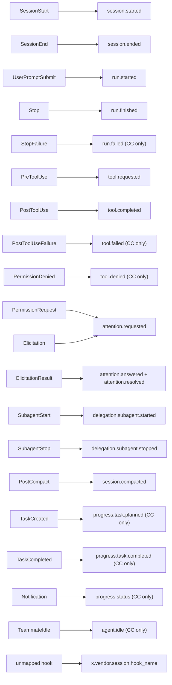
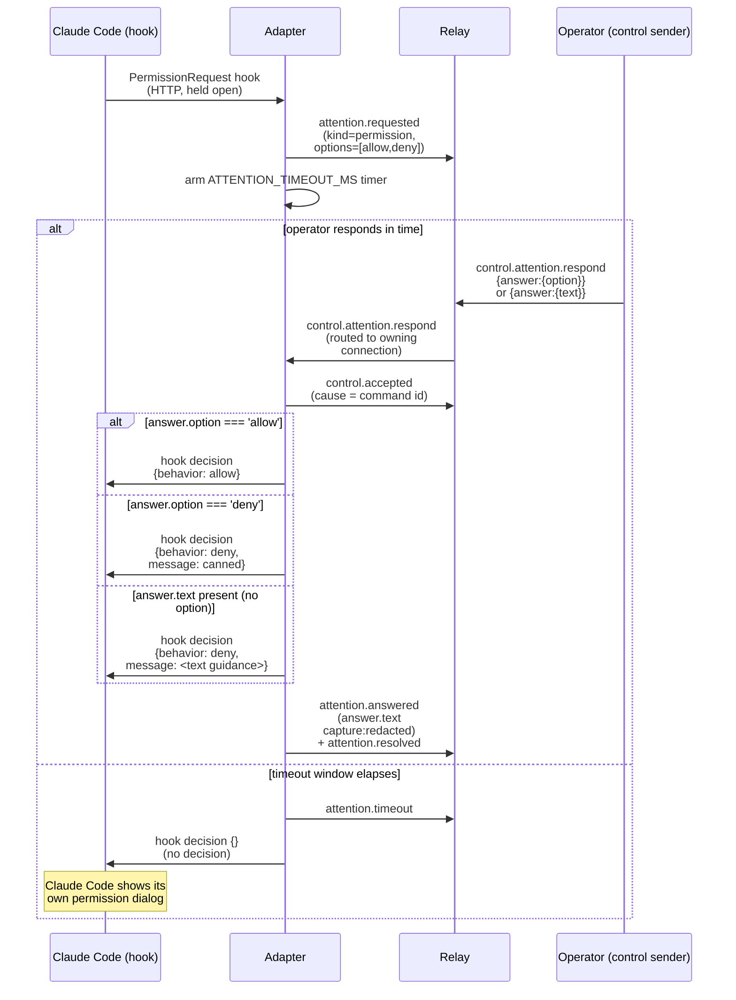

<Note>

The code this page cites lives in the reference repository,
[`agenteventprotocol/reference`](https://github.com/agenteventprotocol/reference); file paths below are
relative to that repository's source tree.

</Note>

Twelve adapters ship in the reference stack. Each one translates a vendor's
native hook or plugin callbacks into AEP events, per the [AEP-0002 Annex A
source-vocabulary
mappings](/specification/draft/aep-0002-taxonomy-and-types#annex-a-normative-source-vocabulary-mappings):

| Adapter | Source |
|---|---|
| Claude Code | `impl/adapter-claude-code/adapter.js` |
| Codex | `impl/adapter-codex/adapter.js` |
| Gemini CLI | `impl/adapter-gemini-cli/adapter.js` |
| Qwen Code | `impl/adapter-qwen-code/adapter.js` |
| VS Code agent | `impl/adapter-vscode/adapter.js` |
| Kimi Code | `impl/adapter-kimi-code/adapter.js` |
| OpenCode | `impl/adapter-opencode/adapter.js` |
| Kilo Code | `impl/adapter-kilocode/adapter.js` |
| Cline | `impl/adapter-cline/adapter.js` |
| Hermes | `impl/adapter-hermes/adapter.js` |
| Antigravity | `impl/adapter-antigravity/adapter.js` |
| pi | `impl/adapter-pi/adapter.js` |

Their control posture splits three ways:

- **The control loop.** Claude Code, Codex, Qwen Code, OpenCode, and Kilo Code
  implement the same experimental control loop for permission prompts
  ([AEP-0004](/specification/draft/aep-0004-control-profile)).
- **Observe-only by DEFAULT, with opt-in control legs.** Cline, Hermes, pi,
  the VS Code agent, and Kimi Code: the hub tap, the held operator-deny gate,
  the held `tool_call` operator gate, and the two held PreToolUse permission
  gates. See their design records and the adapter READMEs.
- **Observe-only, with no control leg to opt into.** The Gemini and
  Antigravity adapters: their vendor surfaces expose no answerable
  human-in-the-loop hook.

pi draws the line most cleanly. Its per-event registration means the default
posture never subscribes an interception surface, so neutrality is structural
rather than an answered value, and registration itself is where the opt-in is
drawn (see the [design record](/components/adapter-pi-design)).

The set is vendor-neutral on purpose: if a mapping decision only makes sense
for one vendor, it probably isn't a core event.

## The daemon shape

Each adapter is a small HTTP daemon (`http.createServer`) that the vendor's
own hook configuration calls synchronously, once per hook firing
(`impl/adapter-claude-code/adapter.js:589-616`,
`impl/adapter-codex/adapter.js:263-290`). It exposes one POST endpoint plus
`GET /healthz`, which reports `{ ok, relay }`, with `relay: true` once the WS
binding to the relay is live. Codex hooks are command-only, so `codex-hook.js`
is a stdin/stdout shim in front of the same daemon protocol; see
`impl/adapter-codex/*.example.*` for the wiring.

Every hook call runs through `handleHook(input, respond)`, which switches on
`hook_event_name` and calls the shared `emit(session, type, data, extra)`
helper (`impl/adapter-claude-code/adapter.js:99`,
`impl/adapter-codex/adapter.js:101`).

`emit()` always does two things with every event
(`impl/adapter-claude-code/adapter.js:56-118`):

1. it appends the envelope as one JSON line to a per-session file under
   `~/.aep/logs/<agent>/<session>.jsonl`, the durable record;
2. it sends the same JSON over the adapter's WebSocket connection to the
   relay's `/socket` endpoint if that connection is up, or queues it in
   `outbox` until the `hello` handshake completes.

The JSONL log is what `aep timeline --file` and `aep validate` read once the
relay's buffer has already rotated the session out. See
[cli.md](/components/cli).

Session/run identity: Claude Code's `session_id` maps directly to AEP
`session`, and a `UserPromptSubmit` hook starts an AEP `run`
(`impl/adapter-claude-code/adapter.js:341, 348-355`). Codex's `thread` is the
AEP `session` and its `turn_id` is the AEP `run`
(`impl/adapter-codex/adapter.js:151-158`); the comment at that line spells out
the mapping explicitly because the vocabulary doesn't match CC's one-to-one.

## Hook to event mapping

Both files carry the same fallback rule for hooks with no core mapping:
`x.{vendor}.session.{snake_case(hook)}`, the mechanical vendor-extension
fallback the taxonomy defines for exactly this case
(`impl/adapter-claude-code/adapter.js:552-585`,
`impl/adapter-codex/map-hooks.js:95-103`). The Codex mapping is a pure module
the daemon delegates to, pinned by the Annex A fixture.

The diagram below is the mapping as implemented today. The normative table it
must agree with is
[AEP-0002 Annex A](/specification/draft/aep-0002-taxonomy-and-types#annex-a-normative-source-vocabulary-mappings).

Three documented deviations from a strict mapping, worth knowing before you
read the code:

- `PreCompact` emits nothing; `session.compacted` fires once, at
  `PostCompact`. The Claude Code and Codex adapters carry a matching comment
  marking this a deviation (`impl/adapter-claude-code/adapter.js:548`,
  `impl/adapter-codex/map-hooks.js:93-94`). Whether the spec should pair
  pre/post compaction markers remains an open design question for a future
  revision.
- Codex has no separate tool-failure hook: a failed tool still produces
  `tool.completed`, never `tool.failed`
  (`impl/adapter-codex/map-hooks.js:52-54`). `tool.failed` on Codex is
  reserved for runtime-reported failures, which the hook surface doesn't
  report today.
- CC's `AskUserQuestion` maps to one `attention.requested (kind=form)` per
  tool call (AEP-0006), not the Annex-A `kind=permission`, because the tool
  *is* the agent asking the human, not a permission gate. See
  [the question loop](#askuserquestion-the-question-loop) below.

## The PermissionRequest control loop

This is the founding scenario for AEP's control profile: a tool call needs a
yes/no (or a redirect) from a human, and the agent process must not proceed
until it gets one.

Both adapters implement the identical state machine
(`impl/adapter-claude-code/adapter.js:422-496`,
`impl/adapter-codex/adapter.js:202-253`), and the CC adapter additionally
routes `AskUserQuestion` to a dedicated question loop (next section). The rest
of this section cites the Claude Code file; the Codex file is line-for-line
the same shape.

The hook fires and the adapter emits `attention.requested` with two named
options (`allow`/`deny`) and `respond_via: ['control']`
(`impl/adapter-claude-code/adapter.js:440-445`). It then **does not call
`respond()` yet**: the HTTP response to Claude Code's hook stays open.

A timer for `AEP_ATTENTION_TIMEOUT_MS` (default 55s) is armed alongside a
`pendingAttention` resolver keyed by the request's event `id`
(`impl/adapter-claude-code/adapter.js:447-455`).

The pending request resolves one of two ways:

1. **Timeout** (`impl/adapter-claude-code/adapter.js:447-453`): the timer
   fires, the adapter emits `attention.timeout`, and calls `done({})`, an
   empty decision body. Returning no decision tells Claude Code to fall back
   to its own interactive permission dialog; the adapter never blocks the
   agent indefinitely.
2. **A `control.attention.respond` command arrives** over the WebSocket
   (`onRespondCommand`, `impl/adapter-claude-code/adapter.js:129-155`) and is
   acked with `control.accepted`. The pending resolver in
   `impl/adapter-claude-code/adapter.js:455-495` then runs. The ack is
   `control.rejected` instead if the request id is unknown (answered twice,
   say), or if the waiter's `validate` hook rejects the answer, per the
   AEP-0006 form-values rule; the rejection's `detail` field is capture-gated
   at `redacted`, matching its schema annotation.

The resolver is where the three answer shapes branch. (The reference
adapter's source carries a comment block at exactly this branch; the
rationale is spelled out below.)

- **`{option: 'allow'}`** → `option = 'allow'` → hook decision
  `{behavior: 'allow'}`.
- **`{option: 'deny'}`** → `option = 'deny'` → hook decision
  `{behavior: 'deny', message: 'Denied via AEP attention loop'}`.
- **`{text: '...'}`** (no `option`) → the
  [AEP-0008](/specification/draft/aep-0008-text-answers-and-response-channels)
  receiver rule applies first. Text equal to an option word
  (`allow`/`deny`, any case, trimmed) IS that option: the word is the
  decision, not guidance. Any OTHER text lands as
  `{behavior: 'deny', message: <text>}`, Claude Code's "tell Claude what to
  do differently" path: the model reads the message text as guidance,
  adjusts its approach, and can re-request the tool. That is the same
  mechanism as typing a custom reply into CC's own permission dialog, just
  arriving over the control channel instead of the terminal.
- Empty/unrecognized answers (`option` absent and no usable `text`) fall
  through to a plain deny, same as the `{option:'deny'}` case.

`attention.answered` always records the APPLIED option (AEP-0008; the stream
is self-describing about what was decided). `answer.text` is present only when
guidance text survives the mapping, and it is redacted through the same
`gate()`/`red()` pipeline as prompts: the schema marks it
`x-aep-capture: redacted`, so it is never emitted above that ceiling
regardless of the adapter's general capture setting
(`impl/adapter-claude-code/adapter.js:474`).

`attention.resolved` follows immediately, `cause`-chained to the
`attention.answered` event (`impl/adapter-claude-code/adapter.js:475-479`).

### Why the free-text branch is load-bearing

The three-branch mapping above (specifically `{text}` → deny-with-guidance) is
the easiest part of the loop to get wrong. An adapter that maps
`answer.option` only turns a consumer's free-text answer into a **bare deny**,
discarding the guidance text the schemas define in `answer.text`.

The Claude Code and Codex adapters map all three answer shapes. A regression
smoke test exercises all three and is wired into `ci.sh`.

## AskUserQuestion: the question loop

Claude Code's `AskUserQuestion` tool (its structured clarifying-question UI)
also arrives through the `PermissionRequest` hook, but it is not a permission
gate; the tool *is* the agent asking the human. Mapping it through the generic
loop renders a multiple-choice question as an Allow/Deny permission card
whose "Allow" only unblocks CC's own local dialog.

The CC adapter therefore routes it to a dedicated handler,
`handleAskUserQuestion` (in the reference adapter; the Annex-A deviation
rationale is the comment block above it). The emission is AEP-0006's
structured-form shape:

- **One `attention.requested (kind=form)` per tool call.** The whole 1-4
  question batch is a single event carrying one `field_spec` per question
  (AEP-0002 §5.2): `type: "select"`, `required: true`, `other: true` always
  (the tool always offers a custom "Other" answer), `multi` mirroring
  `multiSelect`, and choice ids as 1-based indexes. The batch is a wire fact
  any consumer can render, not an adapter-local answer barrier. The pure
  mapping is `impl/adapter-claude-code/map-ask-user-question.js`, pinned by
  the Annex-A mapping fixture
  (`conformance/fixtures/mappings/claude-code.json`).
- **Answers arrive as `answer.values`.** That is a flat map keyed by field id:
  a `choices[].id`, an array of ids for `multi`, or free text (the "Other"
  path). The waiter's `validate` hook
  (`impl/adapter-claude-code/adapter.js:141-151`, via `impl/shared/aep.js`
  `formValuesError`) enforces AEP-0002 §5.3's MUST-reject rule: a missing
  required field, or a non-choice string for a `select` without `other:true`,
  is nacked `control.rejected{reason:"invalid"}` and the request **stays
  pending** for a retry. A valid answer maps back to Claude Code labels, and
  the held hook returns
  `{behavior: "allow", updatedInput: {questions, answers}}`, the same
  `PermissionResult` shape the Agent SDK documents for `canUseTool`. (A
  `{text}`/`{option}` answer from a consumer that predates `kind:"form"` is
  accepted for single-question calls: AEP-0006's degradation path.)
- **Fail-open on timeout.** A form's fields either all arrive in one `values`
  map or the whole form gets one `attention.timeout` terminal; there is no
  partial-answer split, by design (AEP-0006 Rationale). The hook is freed with
  no decision and CC re-asks the full set in its own dialog.
- **Non-gating surfaces dismiss.** As with permissions, a `PostToolUse`
  arriving while the form is pending settles it as one `resolved{dismissed}`
  and frees the hook.

Capture semantics differ from the permission card in one important way:
`Allow`/`Deny` labels are structural, but question text and choice labels are
**model-generated content**. `field_spec.label` and `choices[].label` carry
the same `[metadata*]` exception as `prompt` (AEP-0006): at
`capture: metadata` the mapping module degrades labels to structural
placeholders. Both ceilings are pinned in the mappings fixture.

Answered `values` are gated **type-dependently** (`impl/shared/aep.js`
`gateFormValues`, conformance corpus `conformance/fixtures/capture-gating/`):
choice ids and number/boolean values stay structural at any ceiling, while
string-field and "Other" free text follow `answer.text`'s redacted-minimum
rule.

Smoke cases 5-8 in `impl/adapter-claude-code/smoke-attention.js` cover four
cases: the single-question round-trip, the one-event-per-batch wire fact with
the required-field nack and the free-text "Other" answer, whole-form timeout
fail-open, and single-event dismissal.

Mission Control
([`agenteventprotocol/mission-control`](https://github.com/agenteventprotocol/mission-control))
renders the `fields` array as a real form: text/number/checkbox/select
controls plus an "other..." input per `field_spec.type`, one submit sending
`answer.values`. The Codex adapter is untouched, because Codex exposes no
equivalent hook and this mapping is ready if one appears. `updatedInput`
suppressing CC's own question dialog was verified against a live session.

## Elicitation: the same loop for MCP servers

Claude Code's `Elicitation` hook surfaces an MCP server's `elicitation/create`
request (the protocol AEP-0006's field vocabulary was designed congruent
with), and the CC adapter runs it through the same held-hook form loop as
`AskUserQuestion` (`handleElicitation`,
`impl/adapter-claude-code/adapter.js:277-337`).

The pure schema→`field_spec` mapping is
`impl/adapter-claude-code/map-elicitation.js`, pinned by the Annex-A mappings
fixture at both capture postures. Field ids are the requested schema's
property keys, so accepted `answer.values` map back to the elicitation content
verbatim. MCP's four primitive shapes land on the four field types, and enum
fields are **closed** selects, no `other:true` escape, unlike
`AskUserQuestion`.

A validated answer returns `{action: "accept", content: values}` to Claude
Code. A timeout frees the hook with no decision, and CC's own dialog takes
over. An `ElicitationResult` arriving while the request is pending, the
parallel-surface case, settles it as answered `via: "oob"`; an orphan
`ElicitationResult` emits nothing (one terminal per request).

## Gemini CLI: the observe-only third adapter

`impl/adapter-gemini-cli/` follows the Codex deployment shape exactly: a
fail-open stdin/stdout command shim (`gemini-hook.js`) in front of the same
one-endpoint daemon protocol, registered via the vendor's `settings.json`.
`settings.example.json` ships the block, and the per-chunk `AfterModel` hook
is deliberately left unregistered by default.

The pure mapping (`impl/adapter-gemini-cli/map-hooks.js`) is pinned
machine-usably by `conformance/fixtures/mappings/gemini-cli.json`, and the
differences are the point:

- **No control loop.** Gemini's `Notification` hook is observability-only:
  it can neither grant nor deny a `ToolPermission` alert, so the adapter
  maps it to `progress.status` and never raises `attention.requested`. A
  respond affordance the runtime cannot honor would be a lie.
- **Synthesized runs.** No turn id is exposed; the adapter opens one AEP
  `run` per `BeforeAgent` and closes it at `AfterAgent`, cause-linked.
- **An honest failure split.** `tool_response.error` maps to `tool.failed`
  with the error type at metadata, the split Codex's surface cannot make.
- **The model plane stays vendor-namespaced.** `BeforeModel`/`AfterModel`/
  `BeforeToolSelection` land in `x.gemini-cli.session.*` (model id at
  metadata; `AfterModel` at severity `debug` since it fires per streamed chunk).
- **Pre-moment compaction.** `PreCompress` is the vendor's only exposed
  compaction moment, so `session.compacted` fires there, a documented
  deviation from the siblings' post-moment emission; same fleet fact.

Verification status per Annex A: documented + fixture-proven (the CI smoke
drives all eleven hooks through the shim and daemon against a tokened
relay); live-session validation pending.

## Qwen Code: the Claude-Code-shaped sibling

`impl/adapter-qwen-code/` is the fourth adapter and the closest sibling to the
Claude Code one: sixteen registered hooks with the same common stdin fields,
an exact `tool_use_id` pairing (tighter than Gemini's `(session, tool)`
keying), and a `PermissionRequest` that runs the same hold-open control
round-trip the Claude Code and Codex daemons implement.

Qwen's native `type: "http"` hooks POST straight to the daemon, so the shipped
`settings.example.json` needs no shim, while `qwen-hook.js` wraps the same
endpoint fail-open for command-hook deployments.

Its honest calls:

- runs synthesized per prompt (no turn id is documented)
- the `permission_prompt` notification suppressed against the first-class
  hook (the Claude Code dedupe convention)
- compaction once at the post moment (the vendor's sixteen-hook set includes
  `PostCompact`)
- todos on `progress.task.*` emitted ONCE per persisted write (the vendor
  fires every registered todo hook in a validation AND a postWrite phase; the
  validation firing is the silent pre-moment, the same rule; verified from
  the published 0.19.10 tarball, 2026-07-15)
- `permission_mode` at metadata, a fleet-relevant security posture.

The vendor's seventeenth hook, the fire-and-forget streaming `MessageDisplay`
(0.19.10), stays deliberately unregistered: mid-turn streaming fails the
fleet-observer test, the Claude Code `MessageDisplay` position. Pin:
`conformance/fixtures/mappings/qwen-code.json`; verification status per Annex
A: documented + fixture-proven, live-session validation pending.

## OpenCode: the plugin-shaped fifth adapter

`impl/adapter-opencode/` is the first adapter whose vendor surface is not a
command-hook system. OpenCode loads JS plugins into its own Bun runtime, so
the shim half IS a plugin file: `opencode-plugin.js`, dropped into
`.opencode/plugins/`, fail-open by construction.

It forwards the typed bus events plus the `tool.execute.before/after` and
hold-open `permission.ask` interception moments to the same daemon shape every
other adapter uses.

Its honest calls:

- runs synthesized on user-message/idle boundaries (no turn id)
- `callID` tool pairing
- todo snapshots diffed into `progress.task.*` transitions
- NO `tool.failed` (the typed hooks expose no error surface; failures ride
  `x.opencode.session.error`)
- bus `permission.updated` suppressed against the first-class hook
- a child session naming its parent (the delegation shape)
- post-moment compaction.

Built to the [design record](/components/adapter-opencode-design) and verified
against the published `@opencode-ai/plugin`/`@opencode-ai/sdk` v1 types. Pin:
`conformance/fixtures/mappings/opencode.json`; verification status per Annex
A: documented + fixture-proven, live-session validation pending.

## Kilo Code: the OpenCode fork, carried whole

`impl/adapter-kilocode/` observes Kilo Code, whose CLI core is an OpenCode
fork. At the pinned versions the published bus union (`@kilocode/sdk@7.4.5`)
is byte-identical to OpenCode's, verified member by member in the [design
record](/components/adapter-kilocode-design).

The shim is a Kilo Code plugin (`kilocode-plugin.js`, the fork's
`{ server }` module shape, registered in the config's `plugin` array,
fail-open by construction) forwarding to the same daemon shape (`adapter.js`,
default `127.0.0.1:8391`).

It registers observation hooks ONLY: the output-mutating model/compaction
hooks stay unused, because an observer that changes what it observes has
broken capture honesty. That's a statement about hook *types*, not
answerability: like OpenCode, this adapter is control-capable, the hold-open
permission ask is answered over `control.attention.respond`, while never
registering a hook that could rewrite the agent's own output.

The honest calls are the OpenCode calls on Kilo's own identity:

- synthesized runs
- `callID` pairing
- snapshot-diffed todos
- NO `tool.failed` (failures ride `x.kilocode.session.error`)
- suppressed bus `permission.updated`
- the delegation parent
- post-moment compaction
- the machinery/UI planes in `x.kilocode.*`.

Pin: `conformance/fixtures/mappings/kilocode.json`; verification status per
Annex A: types-verified + fixture-proven, live-session validation pending.

## Cline: subprocess hooks, observe-only, an honest tool.failed

`impl/adapter-cline/` observes Cline's SUBPROCESS hook generation: ten
zod-typed events whose schemas ship in the published `@cline/shared@0.0.59`
package. The shim is a hook script (`cline-hook.js`) reading stdin JSON and
forwarding fail-open; it never returns the vendor's agent-mutating control
fields.

No typed hook moment is answerable (approvals ride the vendor's hub channel, a
deferred second shape per the [design
record](/components/adapter-cline-design)), so the adapter is observe-only.

The honest calls:

- `taskId` is the session with REAL run boundaries
  (`agent_start`/`agent_resume` open; `agent_end`, `agent_abort` →
  `run.cancelled`, `agent_error` → `run.failed` close, the vendor's
  abort/error distinction kept)
- the typed `ToolCallRecord.error` field splits `tool.completed`/`tool.failed`
  truthfully, the first plugin-generation vendor that can
- typed parent ids open and close the `delegation.subagent.*` pair
- `prompt_submit` stays vendor-namespaced (`message.user.submitted` is
  reserved)
- compaction lands at the vendor's only exposed (pre) moment
- the per-turn `iteration` counter stamps the envelope `step`.

Pin: `conformance/fixtures/mappings/cline.json`; verification status per
Annex A: types-verified + fixture-proven, live-session validation pending.

## Hermes Agent: shell hooks, source-pinned, the three-way tool split

`impl/adapter-hermes/` observes Hermes Agent's shell-hook generation. The
vendor publishes no typed schema artifact, so the mapping is pinned against
SOURCE at the tag named in the [design
record](/components/adapter-hermes-design), and every payload's own
`telemetry_schema_version` string is the drift sentinel.

The shim is a shell-hook command (stdin JSON, fail-open) that by DEFAULT never
blocks and never injects context; the block-capable hook output is unused and
no hook moment is answerable. The opt-in operator-deny gate
(`AEP_HERMES_CONTROL=1`; see the design record) is the one exception: a gated
`pre_tool_call` is held as an answerable Allow/Deny attention request.

Typed text follows the AEP-0008 receiver rule: an option word counts as that
option, and any other free text is a deny with the text as the reason, never
an allow. A deny rides the vendor's own block directive, and the observed
block rides the pinned mapping unchanged, cause-linked to the command. The
vendor's own approval gate stays observed read-only in every posture.

The honest calls:

- `session_id` is the session and the vendor's REAL per-turn `turn_id` rides
  verbatim as the run id (the per-turn hook closes RUNS, never sessions, the
  source-pinned naming trap)
- the three-state tool result splits
  `tool.completed`/`tool.failed`/**`tool.denied (by: "policy")`**, the first
  live surface onto the denied type
- the vendor's own approval gate is observed read-only with the card made
  self-describing (AEP-0008): `attention.requested` carries the vendor's
  four-way decision menu as `options` data (the return contract:
  `once`/`session`/`always`/`deny`; the menu's show-full-command entry
  dissolves into the prompt) and declares `respond_via: ["oob"]`, the
  decision is made in the agent's own UI
- answers ride via `oob`, timeouts as `attention.timeout`
- typed parent ids pair the delegation moments on the parent session
- no compaction moment is invented.

Pin: `conformance/fixtures/mappings/hermes.json`; verification status per
Annex A: source-verified + fixture-proven, early live operator sessions
exercised (the approval-identity join), full live validation pending.

## Antigravity: hooks.json on both hosts, the stepIdx join

`impl/adapter-antigravity/` observes the five-hook `hooks.json` command system
shared by Antigravity 2.0 and the Antigravity CLI. Docs provenance: the binary
is closed, so the vendor's public changelog pins the load-bearing behaviors,
and **CLI 1.0.16 is the minimum**, because that release makes the empty
decision string a safely-handled reply.

Two wire facts shape the whole design, per the [design
record](/components/adapter-antigravity-design):

- **no payload names its own hook event** (the
  `PreInvocation`/`PostInvocation` payloads are byte-indistinguishable), so
  each `hooks.json` registration passes its event name as the shim's argument
- **`PostToolUse` carries only `stepIdx` + `error`**, no tool name, while the
  registry requires one on `tool.completed`/`tool.failed`, so the daemon
  joins on (conversationId, `stepIdx`): `PreToolUse` supplies the name and
  args, the post moment closes the pair honestly (empty error → completed,
  non-empty → failed).

Unjoined completions fall back to `x.antigravity.step.completed`, because a
name is never invented. A dangling request synthesizes **nothing**: denied,
rejected, and still-running are indistinguishable, and approval outcomes are
not hook-visible on this surface, so nothing maps to `attention.*` or
`tool.denied`.

The neutral replies are byte-pinned in the smoke: `{"decision": ""}` on
`PreToolUse` and `Stop` (never a named decision, never `"continue"`), and `{}`
elsewhere (never `injectSteps`, never `terminationBehavior`).

Identity: `conversationId` verbatim; `session.started` synthesized on first
sight (no session end exposed); runs synthesized, opened at the first
invocation boundary and closed by `Stop`'s typed `terminationReason`, with
bounded terminations as completions. `PreInvocation`/`PostInvocation` land on
`run.step.started`/`run.step.finished`, with `invocationNum` setting the
envelope `step`.

Pin: `conformance/fixtures/mappings/antigravity.json`; verification status per
Annex A: docs-verified + fixture-proven, live-session validation pending.

## VS Code agent (Copilot): the Claude Code hook contract, adopted by the editor

`impl/adapter-vscode/` observes the VS Code agent (Copilot) through **agent
hooks (Preview)**. The vendor adopted the Claude Code hook contract wholesale,
so the eight VSCode-target lifecycle events arrive with CC-identical
snake_case payloads over stdin/stdout `command` handlers, and the proven shim
+ daemon template applies directly (`vscode-hook.js` forwards to the daemon on
`127.0.0.1:8381`, fail-open). Registration is workspace-native: merge
`hooks.example.json` into the workspace hooks file under `.github/hooks/`.

VS Code also parses `.claude/settings.json` hooks natively (read-only), so a
workspace wired for the Claude Code adapter already fires those commands under
the VS Code agent. That is worth knowing, because those events land on the
Claude Code daemon under the wrong agent identity; the workspace-native file
is the attribution-correct path.

Its honest calls:

- runs synthesized per prompt (no turn id exists)
- `tool_use_id` pairing
- compaction emitted at the PRE moment, the only moment this surface exposes
  (no post-compaction hook exists)
- three deliberate absences stated rather than papered over: the VSCode hook
  target has no session-end event, no run-failure event, and its post-tool
  hook fires on **success only**, so `session.ended`, `run.failed`, and
  `tool.failed` never appear from this adapter (the vendor's opt-in OTel
  telemetry channel, which spans tool executions and hook decisions, is the
  named failure-visibility follow-up on the OTel-inbound precedent).

**The OTel failure-visibility channel is verified** (source read at the
pin and current main, byte-identical): the channel is real and exportable to a
user-configured OTLP endpoint (opt-in setting, default off; both traces and
logs go to the same base).

It carries what the hook surface cannot: the `execute_tool` span records
failures (ERROR status, `error.type`, the error-bearing result attribute) and
the `invoke_agent` span carries per-invocation terminal status, while a
thinner tool-call LogRecord (`success` flag plus optional error type) rides
the logs channel, wire-compatible with the shipped OTLP-inbound receiver
as-is.

Two honest ceilings, stated:

- SESSION end does not exist on this product surface at all (the vendor's
  `SessionEnd` hook vocabulary belongs to its separate cloud coding-agent
  target, not the editor target; the eight-event claim above is exact)
- the hook span's decision attribute is coarse
  (`pass`/`block`/`non_blocking_error`); the finer allow/deny/ask tier is
  computed after the span closes and never reaches OTel.

**The LogRecord channel is implemented** (fixture-proven): the OTLP-inbound
sidecar's `--vendor vscode` profile consumes the `copilot_chat.*`
LogRecord family: `tool.call` outcomes onto
`tool.completed`/`tool.failed` with the vendor's own `error.type` token,
the `session.started` frame in primary mode, everything else
channel-visible under `x.vscode.otel.*`, with both ceilings pinned as
fixture invariants (never `tool.denied`, never a synthesized
`session.ended`). The richer trace-span channel (a new receiver message
shape) is deferred; live validation of the OTel channel is pending.

The OPT-IN permission gate (`AEP_VSCODE_CONTROL=1`, scoped by
`AEP_VSCODE_GATE_TOOLS`) holds matched pre-tool calls as answerable attention
requests on the vendor's own three-decision surface: allow, deny, and **ask**,
an adapter with a vendor ask tier. An ask answer escalates the call into VS
Code's own user-approval flow.

A free-text answer denies with the text as the rendered reason (VS Code shows
every deny reason in chat, where the model reads it), and a commanded deny's
outcome is stated as `tool.denied` with `by: "policy"`, cause-linked to the
answer. The held window (default 25 s) deliberately fits inside the vendor's
30 s hook timeout, and an unanswered gate frees the hook with no decision,
fail-open, like every held loop in the stack.

Agent hooks are **Preview** ("configuration format and behavior might
change"), so the adapter pins the contract at a source ref, unknown events
degrade to the `x.vscode.session.*` fallback, and a moved contract re-pins
before any further build.

Pin: `conformance/fixtures/mappings/vscode.json` (both conformance runners),
adopted in [AEP-0002 Annex
A](/specification/draft/aep-0002-taxonomy-and-types#annex-a-normative-source-vocabulary-mappings)
as the sixteenth source mapping; verification status: documented +
fixture-proven against the pinned vendor source, live-session validation
pending.

## See also

- [Relay internals](/components/relay): `routeCommand` is what delivers
  `control.attention.respond` to the adapter that owns the session.
- [Capture & redaction](/concepts/capture-and-redaction): the
  ceiling/gate mechanism `gate()`/`red()` implement here.
- [Write an adapter](/guides/write-an-adapter): building your own
  adapter against this same contract.
- Normative source: [AEP-0002 Annex A](/specification/draft/aep-0002-taxonomy-and-types#annex-a-normative-source-vocabulary-mappings),
  [AEP-0004](/specification/draft/aep-0004-control-profile).
