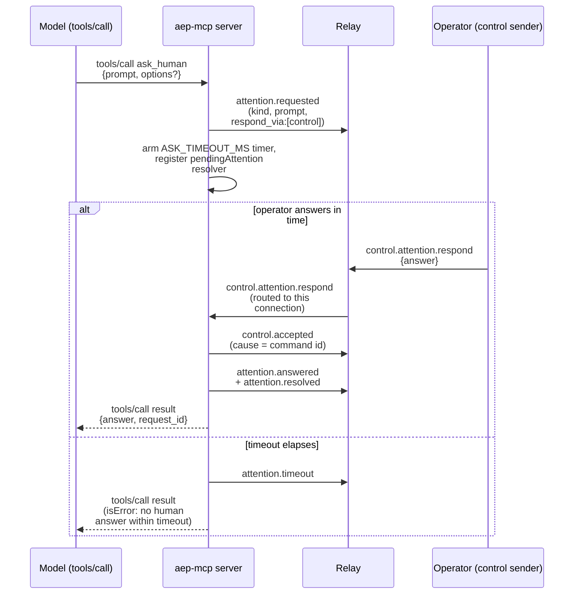

<Note>

The code this page cites lives in the reference repository,
[`agenteventprotocol/reference`](https://github.com/agenteventprotocol/reference); file paths below are
relative to that repository's source tree.

</Note>

`impl/mcp/server.js` is the MCP server exposing AEP's **LLM-fired emit path**:
a model calling a tool, rather than a runtime hook firing, produces the
event. (The package is named `aep-mcp`; the folder is `impl/mcp/`. Folders
under `impl/` don't carry the `aep-` prefix, matching `relay/`, `cli/`, and
[`impl/README.md`](https://github.com/agenteventprotocol/reference)'s listing.) It speaks MCP over
stdio: newline-delimited JSON-RPC 2.0, tools capability only, dependency-free
(`impl/mcp/server.js:9-10, 224-263`), exposing exactly two tools, declared in
`TOOLS` (`impl/mcp/server.js:125-169`):

| Tool | What |
|---|---|
| `emit_event` | Emit an AEP event: `type`, optional `data`/`subject`/`severity`/`session`/`run`. Rejects malformed types and refuses `control.*` (`toolEmitEvent`, `impl/mcp/server.js:173-185`) |
| `ask_human` | `attention.requested` → blocks on the control round-trip → returns the answer or reports a timeout (`toolAskHuman`, `impl/mcp/server.js:187-222`) |

## Identical envelopes by construction

[AEP-0001 §9](/specification/draft/aep-0001-core-and-envelope#9-emit-paths)
requires exactly this: the LLM-fired and programmatic emit paths must produce
structurally identical envelopes, so a consumer can't tell, and shouldn't need
to, which path an event came from.

`aep-mcp` doesn't reimplement emission to satisfy that; it reuses the *same*
`emit()` function shape as the adapters: per-session JSONL log under
`~/.aep/logs/<agent>/`, WebSocket to the relay with the same
`hello`/outbox-until-ready pattern, and the same `(epoch, seq)` per-session
counters seeded from a state file (`impl/mcp/server.js:32-101`, essentially
the same code as `impl/adapter-claude-code/adapter.js:49-107`). Identity is
structural: it's the same code path, not a parallel one kept in sync by hand.

The `emit_event` tool description itself carries the other half of §9's
guidance to the model: don't duplicate events your runtime adapter already
emits programmatically (`impl/mcp/server.js:128-132`). The tool exists for
milestones a fleet observer would act on that nothing else is already
emitting, not as a second path to the same event.

## `ask_human`

`toolAskHuman` builds the same `attention.requested` payload shape the
adapters' `PermissionRequest` path uses (`kind`, `prompt`, optional
`options`, `respond_via: ['control']`), gates the prompt through the same
redact-or-synthesize capture pipeline
([AEP-0003 §9.2](/specification/draft/aep-0003-bindings-and-lifecycle#9-adapter-conformance-guidance-and-capture-redaction)),
and registers a `pendingAttention` resolver exactly like the adapters'
control loop (`impl/mcp/server.js:187-222`, compare
`impl/adapter-claude-code/adapter.js:435-483`). The one structural difference
from the adapter case: there's no hook to hold open, so the MCP `tools/call`
response itself is deferred. `toolAskHuman` returns a `Promise` that resolves
only when `onRespondCommand` (`impl/mcp/server.js:110-120`) fires the pending
resolver, or the `ASK_TIMEOUT` timer does.

Unlike the adapters, there is no fallback UI to hand control back to on
timeout. `ask_human` just reports the timeout to the model as a tool result,
since an MCP tool call has nowhere else to defer to.

## See also

- [Adapters (CC + Codex)](/components/adapters): the `PermissionRequest` control loop
  this reuses the same resolver/timeout pattern from.
- [The control profile](/concepts/control-profile): the acknowledged
  round-trip (`control.accepted`/`control.rejected`) both paths ride on.
- Normative source: [AEP-0001 §9](/specification/draft/aep-0001-core-and-envelope#9-emit-paths),
  [AEP-0004](/specification/draft/aep-0004-control-profile).
