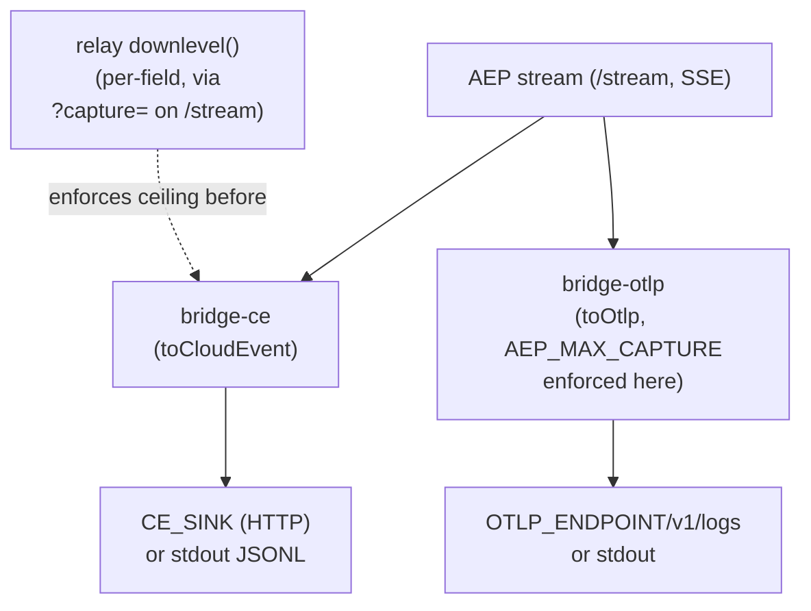

<Note>

The code this page cites lives in the reference repository,
[`agenteventprotocol/reference`](https://github.com/agenteventprotocol/reference); file paths below are
relative to that repository's source tree.

</Note>

`impl/bridge-ce/` and `impl/bridge-otlp/` are sidecar consumers, not
infrastructure the relay depends on. Each subscribes to an AEP stream over
SSE and projects it into another ecosystem's wire format:
[CloudEvents 1.0](/specification/draft/aep-0005-bridges) for `bridge-ce`, OTLP
LogRecords for `bridge-otlp`. Both can also run offline against a JSONL file
(`--from-file`), which is how conformance pins them against fixtures without a
live relay.

## Shape shared by both bridges

Both `impl/bridge-ce/bridge.js` and `impl/bridge-otlp/bridge.js` follow the
same structure: connect via `openStream()` (`impl/shared/sse-client.js`) with
an `attr-match` filter, dedupe on `id` in a bounded `Set` (consumer
conformance per [AEP-0001 §10](/specification/draft/aep-0001-core-and-envelope)),
project each event, and deliver with retry/backoff to an HTTP sink, or write
JSONL to stdout when no sink is configured
(`impl/bridge-ce/bridge.js:41-59`, `impl/bridge-otlp/bridge.js:47-73`). The
projection logic lives in `impl/shared/`, not the bridge files, so both the
live sidecar and the offline `--from-file` mode call the identical function:
exactly one mapping implementation per target format, never a "live" and
"offline" copy that could drift.

- `bridge-ce` calls `toCloudEvent(ev)` (`impl/shared/ce-bridge.js:27`), which
  is total and injective: every AEP attribute lands somewhere in the CE
  envelope (core attrs to the `aep*` extension namespace, extension attrs
  pass through unprefixed).
- `bridge-otlp` calls `toOtlp(ev, maxCapture)` (`impl/shared/otlp.js:26`),
  which additionally batches records (`OTLP_BATCH_MS`/`OTLP_BATCH_MAX`) before
  POSTing an OTLP/HTTP export request.

The mapping tables themselves (which envelope attribute becomes which CE
extension or OTLP attribute, the severity number projection, the reverse-DNS
type prefix) are exactly what
[AEP-0005 §1-3](/specification/draft/aep-0005-bridges) defines. This page doesn't
restate them, and you shouldn't either when reading the bridge source: the
comments in `ce-bridge.js` and `otlp.js` cite the AEP-0005 rule letter
(`B1`-`B5`, `§3.3`) next to each line so the two stay traceable to each
other.

## Where capture enforcement sits

The bridge, not the relay, is the last point that can still see an event's
declared `capture` level before it leaves the AEP trust boundary for another
ecosystem's format, so the ceiling is enforced there, not earlier.

- `bridge-otlp` takes an explicit `AEP_MAX_CAPTURE` (default `metadata`,
  `impl/bridge-otlp/bridge.js:17`). `toOtlp()` drops the record's `data`
  body entirely whenever the event's own `capture` exceeds that ceiling
  (`impl/shared/otlp.js:48-50`): a conservative strip, not a per-field
  down-level, because the exporter has no access to the schema's per-field
  capture annotations at that point.
- `bridge-ce` instead relies on the relay's own subscription-level `capture`
  parameter (`AEP_CAPTURE` env, `impl/bridge-ce/bridge.js:31`, passed as
  `&capture=` on the `/stream` query). The relay's `downlevel()`
  (`impl/relay/server.js` via `impl/shared/aep.js:93`) does the per-field
  down-level before the bridge ever sees the event, using the schema
  annotations the relay loaded at startup.

## OCSF: a mapping without a sidecar, by design

The third bridge annex, the
[OCSF projection (AEP-0005 §4)](/specification/draft/aep-0005-bridges#4-ocsf-projection-aep--ocsf),
ships as specification text plus conformance pins only. There is no
`impl/bridge-ocsf/` sidecar, and that is deliberate: the projection covers
three security-relevant event families (sessions, tool activity, attention
outcomes), and its normative content is the class/severity/disposition
tables, which
[`conformance/fixtures/ocsf/`](https://github.com/agenteventprotocol/agent-event-protocol/tree/main/conformance/fixtures/ocsf)
pins against independent implementations in both runners (the targeted OCSF
class subset is itself pinned in `ocsf-classes.json`, so class-validity is
checked offline). A deployment that wants a live OCSF feed follows the §3.5
consumer shape exactly like the two sidecars above.

## The round-trip claim is conformance-gated, not asserted here

Whether `toCloudEvent`/`toOtlp` actually produce byte-for-byte the expected
projection (and, for CE, that the inverse direction recovers the original
envelope where AEP-0005 promises it) is not something this doc verifies by
reading the code. It's what
[`conformance/fixtures/ce-roundtrip/`](https://github.com/agenteventprotocol/agent-event-protocol/tree/main/conformance/fixtures/ce-roundtrip)
and [`conformance/fixtures/otlp/`](https://github.com/agenteventprotocol/agent-event-protocol/tree/main/conformance/fixtures/otlp) pin, run
by both `conformance/run.js` and `conformance/run.py`
([AEP-0005 §5](/specification/draft/aep-0005-bridges#5-conformance)). If you
change either mapping function, the fixtures are what has to agree, not
this page.

## See also

- [OTel-inbound sidecar design record](/components/bridge-otlp-inbound-design):
  the shipped mirror of the outbound OTLP projection: Codex telemetry
  captured into AEP (`impl/bridge-otlp-in/`), decisions recorded.
- [AG-UI bridge design record](/components/bridge-agui-design): the third inbound
  channel and the first protocol-source implementation: a tee proxy
  between an AG-UI client and its agent (`impl/bridge-agui/`), real
  vendor identity, pinned in the fixture's delta-opt-in forks.
- [ACP bridge design record](/components/bridge-acp-design): the fourth inbound
  channel and the second protocol-source implementation: a
  command-substitution stdio tee between an ACP editor and its agent
  (`impl/bridge-acp/`), byte-transparent both ways, real `sessionId`
  identity, the editor's permission gate observed read-only.
- [OpenHands bridge design record](/components/bridge-openhands-design): the fifth
  inbound channel and the third protocol-source implementation: a
  WebSocket observer on the OpenHands agent server's own multi-observer
  events fan-out (`impl/bridge-openhands/`), never-send posture by
  default (the auth frame is the only frame it ever writes), runs
  synthesized from the server's own execution-status facts, the
  approval loop observed read-only, with an opt-in control channel
  (answerable approvals, real pause/resume, and the
  send-input/interrupt vendor verbs; see the record).
- [OpenCode adapter design record](/components/adapter-opencode-design), the SSE bridge section:
  the second inbound channel: `impl/bridge-opencode-sse/` attaches to a
  running OpenCode server's event stream, zero-install, companion/primary
  per the same dedup discipline (mode policy pinned in the fixture's
  `sse_modes` block, both runners).

- [Relay internals](/components/relay): the `/stream` subscription and `downlevel()`
  both bridges depend on.
- [Capture & redaction](/concepts/capture-and-redaction): what the
  capture levels mean and why an exporter enforces a ceiling.
- Normative source: [AEP-0005](/specification/draft/aep-0005-bridges).
