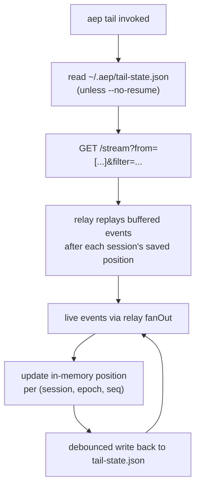

<Note>

The code this page cites lives in the reference repository,
[`agenteventprotocol/reference`](https://github.com/agenteventprotocol/reference); file paths below are
relative to that repository's source tree.

</Note>

`impl/cli/aep.js` is one file, eight subcommands, dispatched at the bottom of
the file by `process.argv` (`impl/cli/aep.js:1027-1072`). Four observe (`tail`,
`sink`, `timeline`, `validate`), two act (`respond`, `cancel`, the
control sender), and two operate (`doctor`, the environment diagnostic;
`replay`, capture re-emission). All eight consume the same envelope shape
the relay and adapters speak; there is no separate CLI data model.

## `aep tail`

`cmdTail(args)` (`impl/cli/aep.js:135-143`) opens the relay's SSE binding
(`GET /stream`, via `impl/shared/sse-client.js`'s `openStream`) with a filter
built from `--type`/`--session`/`--agent`/`--severity`/`--filter`
(`buildFilter`, `impl/cli/aep.js:50-58`). This is the same `attr-match`
filter dialect the relay validates, not a CLI-specific query language; see
[relay.md](/components/relay) for what a filter can express. The subscribe/resume
plumbing lives in `subscribeWithState` (`impl/cli/aep.js:88-132`), shared
between `tail` and `sink`.

Before connecting, `tail` reads a per-session position map from
`~/.aep/tail-state.json` (or `--state <file>`, disabled by `--no-resume`) and
sends it as the `from` query parameter (`impl/cli/aep.js:90-101`), the same
`(epoch, seq)` resume mechanism
[relay.md](/components/relay#subscribe-with-resume) documents.

As events arrive it dedupes on `id` and updates the position map,
debounced-saving it back to disk 250ms after the last event
(`impl/cli/aep.js:102-131`). Killing and restarting `aep tail` picks up
roughly where it left off, per session, bounded by however much the relay's
buffer still holds: a `replay-exhausted` relay comment surfaces as a warning
to consult a durable history store instead (`impl/cli/aep.js:139`).

## `aep sink`: durable capture

`cmdSink(args)` (`impl/cli/aep.js:154-278`) is the shipped answer to the
durability posture in [AEP-0003](/specification/draft/aep-0003-bindings-and-lifecycle):
the relay is deliberately a *bounded* buffer, so a consumer that needs
completeness runs a supervised sink beside it. `aep sink --out DIR` uses the
same `subscribeWithState` subscribe/resume path as `tail`, but instead of
printing, it appends each envelope as one JSONL line to `DIR/<session>.jsonl`.

What makes it durable rather than just a redirected `tail`:

- **Batched fsync**: writes flush at ≤500 ms or 64 events, and the batch is
  `fsync`ed before the resume position is committed to the state file
  (`DIR/.sink-state.json` by default). A crash can therefore only leave the
  state *behind* the file, never ahead of it: on restart the relay replays
  the overlap and the file-tail `id` scan drops the duplicates
  (`openWriter`, `impl/cli/aep.js:169-207`).
- **Crash recovery**: on reopen, a torn final line (a write cut mid-JSON by
  the crash) is detected and truncated. The last durable line, not the
  state file, is the resume authority, so the replayed stream refills
  exactly what the file lost: no duplicate `id`s, no `(epoch, seq)` gaps.
- **Rotation**: with `--rotate-mb N`, a file reaching the threshold is
  renamed to `<session>.<unix-ts>.jsonl` and never reopened; the live file
  starts fresh while in-memory `id` dedupe spans the boundary
  (`rotate`, `impl/cli/aep.js:209-218`).
- **Clean shutdown**: SIGTERM/SIGINT flush, fsync, write the state file,
  exit 0.

The captured files pass `aep validate` and feed `aep timeline --file`
directly. `impl/cli/smoke-sink.js` (a `ci.sh` step) proves the crash story:
SIGKILL mid-stream, a deliberately torn final line, restart, and rotation,
asserting no duplicates, no gaps, and validate-green files throughout.

## `aep timeline <session> [--dag]`

`cmdTimeline(args)` (`impl/cli/aep.js:299-338`) fetches every buffered event
for one session, either from a JSONL file (`--file`, e.g. an adapter's
`~/.aep/logs/<agent>/<session>.jsonl` or a sink capture) or from the relay in
**replay-only** mode. `collectEvents` requests `/stream?filter={session}&live=0`
(`impl/cli/aep.js:281-297`); per the relay's `live=0` handling
(`impl/relay/server.js:330-389`), this serves the session's buffered history
and closes with a `replay-complete` marker instead of holding the connection
open for live events. The CLI dedupes on `(source, id)` and sorts by
`(epoch, seq)` before printing (`impl/cli/aep.js:303-305`).

Without `--dag` it's a flat chronological listing (same `fmtEvent` renderer as
`tail`). With `--dag`, it builds a tree from each event's `cause` link: an
event with no resolvable `cause` in the set is a root, everything else is
nested under the event it names as `cause` (`impl/cli/aep.js:312-337`), a
rendering of the causal chain
[AEP-0001 §5.1's `cause` attribute](/specification/draft/aep-0001-core-and-envelope)
records, e.g. `tool.requested` → `tool.completed` → `attention.requested` →
`attention.answered` → `attention.resolved`.

## `aep respond` / `aep cancel`: the control sender

`aep respond <session> <request-id> (--option ID | --text S | --values JSON)`
answers an `attention.requested` Event; `aep cancel <session> [--run R]
[--reason S]` cancels a run (or the whole session when no `--run` is named,
[AEP-0004 §5](/specification/draft/aep-0004-control-profile)). Both ride one shared
sender (`sendControl`, `impl/cli/aep.js:347-424`) that implements the
[AEP-0004 §7](/specification/draft/aep-0004-control-profile) sender obligations
directly:

- **The command envelope omits `seq`** (§2.2): the sender does not own the
  target session's order; the target's ack and outcome land as ordinary
  sequenced session Events.
- **Retries reuse the id** (§2.3): every attempt resends the *same* envelope
  (`--retries N`, default 2), so a target that already executed dedupes on
  `id` and never re-executes.
- **Acks correlate by `cause`** (§3): the sender subscribes to the target
  session *before* sending, since a fresh consumer only receives live
  traffic, then waits `--ack-window MS` (default 10 000) for a
  `control.accepted` or `control.rejected` whose `cause` is the command id.
  Acks are sequenced session Events, so they are also buffered: before
  giving up on a window the sender polls the relay's replay (`live=0`), so
  a slow live push does not read as a dead target.
- **Window silence is a `timeout` nack**, synthesized locally and never
  emitted on the wire (§3).

Exit codes are scriptable: `0` accepted, `2` usage, `3` nacked (by the target
or by the relay on its behalf, §4.2, reason on stderr), and `4` ack-window
timeout (`runControl`, `impl/cli/aep.js:426-437`).

`respond` sets `subject` and `cause` to the request id (§6) and declares
free-text answers at the `redacted` capture while bare option ids stay
`metadata` (`cmdRespond`, `impl/cli/aep.js:439-461`); `cancel` carries
`--reason` at `redacted` and names the run scope per §5's table (`cmdCancel`,
`impl/cli/aep.js:463-480`).

`impl/cli/smoke-control.js` (a `ci.sh` step) drives both commands against a
live demo agent and pins the `refused` nack on an already-terminal run, the
timeout + same-id-retry path against a declared-but-silent target, and
`aep validate` on what flowed.

## `aep validate <file.jsonl|->`

`cmdValidate(args)` (`impl/cli/aep.js:482-632`) is the conformance-grade
check, run line-by-line over a JSONL stream (a file or stdin). It checks:

- envelope schema validation against `schemas/aep-event.schema.json`
- type-registry membership (unregistered core-namespace types fail,
  `reserved`-status types warn)
- per-payload schema validation against `schemas/types/*.schema.json`
- `id` duplication, flagged even though at-least-once delivery is legal on
  the wire, because a file has no fan-out to dedupe for you
- `(epoch, seq)` monotonicity per session: an epoch regression or a
  same-epoch non-increasing `seq` is an error
- a **capture violation** check: for every field in `data`, the event's
  declared `capture` level must be at or above that field's
  `x-aep-capture` annotation, or the line fails (`impl/cli/aep.js:600-604`)

This is the CLI's enforcement of the same schema-driven per-field capture
contract `downlevel()` reads on the relay side (see [relay.md](/components/relay)).

This is the same command `ci.sh` and the adapters' own smoke tests run against
captured JSONL logs to confirm an adapter's output is conformant, not just
plausible-looking.

## `aep doctor`: the environment diagnostic

`cmdDoctor(args)` (`impl/cli/aep.js:649-820`) exists for the failure class
where every component reads up and a consumer is still refused: those are
environment problems (address family, vantage, token, CORS), and burning
them down by hand is slow. One read-only pass prints `ok`/`info`/warning/
finding lines per lane, each finding with its remedy attached, and exits
`0` (no findings) or `1`:

- **Reachability per address family**: the relay URL's port is probed on
  IPv4 and IPv6 loopback separately, and bind-vs-URL agreement is *derived*
  from the pair, since from outside a bind is only observable family by
  family. The mismatch remedy names `AEP_HOST` and the setup path
  (`impl/cli/aep.js:715-718`).
- **Auth posture**: read from the relay's own semantics (an unauthenticated
  `/healthz` that still carries counts means auth is off) plus a
  `/connections` check with the supplied token. The token is adopted, never
  generated: `--token`, `AEP_TOKEN`, or the setup-managed file.
- **CORS visibility**: the preflight `OPTIONS /stream` and a deliberately
  refused request must both carry `access-control-allow-origin`; a browser
  can only explain a refusal it is allowed to read.
- **Relay stats**: buffer depth and the relay's own
  `sessions · subscribers · connections` counters, informational, never
  pass/fail.
- **Managed-daemon sweep**: ids, ports, and pid files come from the setup
  tool's catalogs (`impl/cli/aep.js:791`), the single source of truth;
  a wedged daemon (pid alive, port dead) is a finding, a stale pid file a
  warning, down an info line (`impl/cli/aep.js:803-805`).

Probes run from the machine `doctor` runs on, and the closing note says to
re-run on the refused machine against the same `--relay` to compare
vantages (`impl/cli/aep.js:816`): a clean local report proves nothing about
a browser behind a port forward, a container, or a VM boundary.
[Troubleshoot the stack](/guides/troubleshoot-the-stack) is the
symptom-indexed companion built on this command.

`impl/cli/smoke-doctor.js` (a `ci.sh` step) pins the lane semantics against
scripted endpoints, including that the setup tool stays require-safe for
the catalog import.

## `aep replay`: re-emit a capture as a new session

`cmdReplay(args)` (`impl/cli/aep.js:842-1024`) re-emits an `aep sink`
capture onto a relay, so a consumer can be exercised, or a report
reproduced, without the original agent installed. Everything follows from
one rule: a re-emitter cannot carry a foreign emitter's `(epoch, seq)`
counter forward
([AEP-0001 §7](/specification/draft/aep-0001-core-and-envelope#7-ordering-replay-and-the-epoch-seq-contract)),
so a replay is always a **new** session, never a resume:

- Each recorded `(source, session)` group becomes one `replay-<ulid>`
  session with fresh event ids, a single fresh epoch, contiguous fresh
  `seq`, and restamped `time`; recorded `(epoch, seq)` order is the
  authority within a group, and redelivered duplicates in overlapping
  capture segments coalesce on `(source, id)` *before* fresh identity is
  assigned (`impl/cli/aep.js:892-916`), so a replayed stream passes
  `aep validate`.
- Provenance rides three extension attributes
  ([AEP-0001 §5.4](/specification/draft/aep-0001-core-and-envelope#54-extension-attributes)):
  `aepreplayof`, `aepreplayid`, and `aepreplaytime` carry the trail home
  (`impl/cli/aep.js:939`), never the data plane.
- `cause` and attention-request references are rewritten through the
  per-group id map, so causal chains and `timeline --dag` still resolve
  inside the replayed session.
- **Command frames are skipped** (`isCommandType`,
  `impl/cli/aep.js:895`): a replay must never drive a live target.
- `--speed N` accelerates recorded pacing, `--max-gap MS` caps dead air,
  `--dry-run` prints the emission plan and sends nothing
  (`impl/cli/aep.js:855-867`, summary at `:961-968`). Exit codes: `0`
  emitted (or dry-run), `1` aborted, `2` usage.

Multi-session captures interleave by recorded time across groups while
each group keeps its own recorded order. This operator verb is distinct
from the relay's bounded replay buffer
([AEP-0003 §5](/specification/draft/aep-0003-bindings-and-lifecycle#5-replay-buffers)):
`replay-exhausted` and `replay-complete` in relay comments refer to that
buffer, not to this command.

`impl/cli/smoke-replay.js` (a `ci.sh` step) pins the fresh-identity,
dedupe-before-reidentify, command-skip, and `--max-gap` rules, including
the overlapping-rotated-segments case.

## See also

- [Relay internals](/components/relay): the `/stream` binding, resume contract, and
  `downlevel()` this CLI is a client of.
- [Adapters (CC + Codex)](/components/adapters): the JSONL logs `timeline --file` and
  `validate` typically read.
- [Write a consumer](/guides/write-a-consumer): building your own
  subscribe/resume/dedupe client against the same binding.
- [Troubleshoot the stack](/guides/troubleshoot-the-stack): the
  symptom-indexed diagnosis guide built on `aep doctor`.
- Normative source: [AEP-0001](/specification/draft/aep-0001-core-and-envelope),
  [AEP-0003](/specification/draft/aep-0003-bindings-and-lifecycle),
  [AEP-0004](/specification/draft/aep-0004-control-profile) (the control sender).
