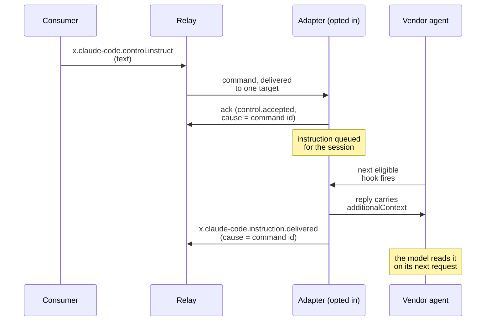

<Info>

**Status: SHIPPED for Claude Code, Codex, Qwen Code, the VS Code agent,
and Hermes** (each in `impl/adapter-*/`, `AEP_INSTRUCT=1`; per-adapter
steering smokes in the reference CI).

</Info>

Most captured runtimes expose a surface that could *drive* the agent;
the [control matrix](/agents/control-matrix) catalogues them as
deliberately unused, because an observer that silently changes what it
observes breaks capture honesty. Steering is the one sanctioned path
from "unused" to "used": explicit, declared, commanded, audited, built
entirely from what
[AEP-0004 §5](/specification/draft/aep-0004-control-profile) already
provides. Nothing normative moves.

## The loop

## Design

- **Vendor-scoped verbs, one shared shape.**
  `x.{vendor}.control.instruct`, gated by `hello` `control.accepts`
  like a core command (AEP-0004 §5's extension rule); payload
  `{ "text": string [redacted] REQ }`, target scope `session`,
  identical across adapters so the corpus stays convergent. *Rejected:*
  a core `control.instruct` now (a normative change the evidence does
  not yet earn); `steer`/`inject` naming ("instruct" names what the
  surface does: instructions read by the model).
- **Opt-in, never default.** Only under `AEP_INSTRUCT=1`. Off, the verb
  is absent from `hello`, and a compliant relay refuses the command
  sender-side (the AEP-0004 §4.2 relay-behalf `error` frame, code
  `unsupported`); the daemon's own `unsupported` nack is
  defense-in-depth for relays that do not gate on `control.accepts`.
  *Rejected:* default-on; observe-only is the shipped posture and the
  product's honesty claim.
- **Delivery rides the vendor's documented surface, honestly queued.**
  For Claude Code: `hookSpecificOutput.additionalContext`, accepted on
  eleven hook moments, capped at 10,000 characters, read by the model
  on its next request; steering is advisory and asynchronous by vendor
  design. Accepted instructions queue per session (FIFO, cap 20; a full
  queue nacks `control.rejected { code: "invalid" }` with a
  capture-gated detail) and attach,
  joined in arrival order, to the next eligible hook reply. Eligible =
  a context-accepting moment whose reply would otherwise be empty AND
  whose context the runtime actually consumes: a parser that accepts a
  field nothing reads is not a delivery surface. Held loops
  (permission, elicitation) never mix with steering; their replies
  carry decisions. *Rejected:* replying on held loops (two semantics in
  one reply); synthesizing a delivery moment (no such vendor surface
  exists); delivering on one hook type only (starves sessions that
  never fire it).
- **Every step is on the stream.** Receipt earns the standard ack
  (`control.accepted`, cause = command id; AEP-0004 §2.3/§3). Delivery
  emits `x.{vendor}.instruction.delivered { queued_ms }`, cause-linked
  to the command; a session ending with instructions still queued emits
  `x.{vendor}.instruction.dropped { reason: "session-ended" }` per
  instruction. The instruction `text` on the stream is capture-gated
  `[redacted]`-class; the hook reply into the vendor is local control
  flow, never capture-gated. *Rejected:* silent drops (unaudited
  steering is the failure mode this design prevents); a delivered flag
  with no cause link.
- **Authorization is the relay's existing rule.** Commands flow only on
  authenticated bindings (AEP-0004 §4.1); tokenless consumers are
  watch-only; finer grain means separate relays with separate tokens.
- **Consumer behavior.** Render the steering affordance only where
  `hello` declares the verb; send via the owning relay; settle on the
  stream (ack + delivery event), never on optimistic local state: the
  same discipline as cancel and respond.

## What this is not

Not a chat channel (one-way instructions, no reply semantics), not
input rewriting (`updatedInput` and `updatedToolOutput` stay unused;
mutating what the agent *did* is a different, undesigned capability),
and not a core protocol change (no schema, registry, or spec text
moves; the verbs live in the vendor extension namespace the protocol
already defines).

## Adoption map

| Vendor | Surface | Status |
|---|---|---|
| Claude Code | `hookSpecificOutput.additionalContext`: eleven moments, 10,000-char cap | `x.claude-code.control.instruct`; drop rides `SessionEnd` |
| Codex | `additionalContext` on `SessionStart`, `SubagentStart`, `PreToolUse`, `PostToolUse`, `UserPromptSubmit`; no documented cap | `x.codex.control.instruct`; no `SessionEnd` hook, so no session-end drop moment: the queue lives for the daemon lifetime, and a live session delivers at latest on its next `UserPromptSubmit` |
| Qwen Code | `additionalContext` on `SessionStart`, `UserPromptSubmit`, `PreToolUse`, `PostToolUse`, `Stop`, `SubagentStart`, `PreCompact`; no documented cap; async `systemMessage` unused | `x.qwen-code.control.instruct`; drop rides `SessionEnd` |
| VS Code agent | `additionalContext` on `SessionStart`, `UserPromptSubmit`, `SubagentStart`, `PreToolUse`, `PostToolUse`, typed and consumed in the pinned source; no documented cap; `PreCompact` excluded, its hook has no output surface on this vendor | `x.vscode.control.instruct`; no `SessionEnd` on this hook target (same queue posture as Codex); a held `PreToolUse` reply (the opt-in permission gate) carries the decision, never steering |
| Hermes | the `pre_llm_call` reply's `{"context": ...}`, the one context return the runtime consumes (joined into the user message at turn start, never the system prompt); other events parse context that nothing reads, so they are ineligible; no documented cap | `x.hermes.control.instruct`; delivery at latest on the next turn start; drop rides `on_session_finalize`, the real session end (`on_session_end` fires per turn and closes the run); a gated `pre_tool_call` reply carries the deny decision, never steering |
| Cline | hub `session.send_input`, user-plane prompt submission (the vendor's own `steer` is a pending-prompt queue-jump, not context injection) | divergent by design: `x.cline.control.send_input` instead of `instruct`; see [its design record](/components/adapter-cline-design) |
| OpenHands | `POST .../events` send_message, user-plane prompt submission (always appended; a live run consumes it on a later step; the `run` flag stays false) | divergent by design: `x.openhands.control.send_input` under its bridge's control gate; see [its design record](/components/bridge-openhands-design) |
| Others | see the [steering boundary](/agents/control-matrix#where-the-steering-boundary-sits) | each needs its own design record |

Verified against `code.claude.com/docs/en/hooks`,
`learn.chatgpt.com/docs/hooks`, and the
`qwenlm.github.io/qwen-code-docs` hooks reference (all fetched
2026-07-15), and against vendor source at microsoft/vscode tag 1.129.0
(`125df4672`) and NousResearch/hermes-agent tag v2026.7.7.2
(`9de9c25f`; consumption confirmed on a live install).
