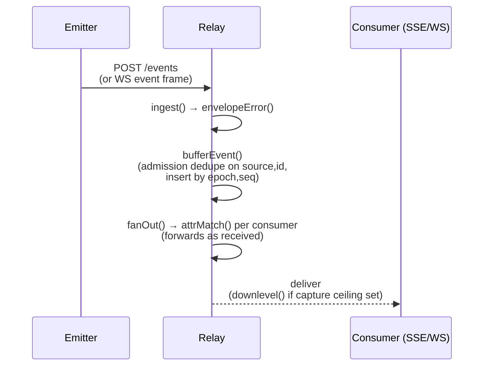
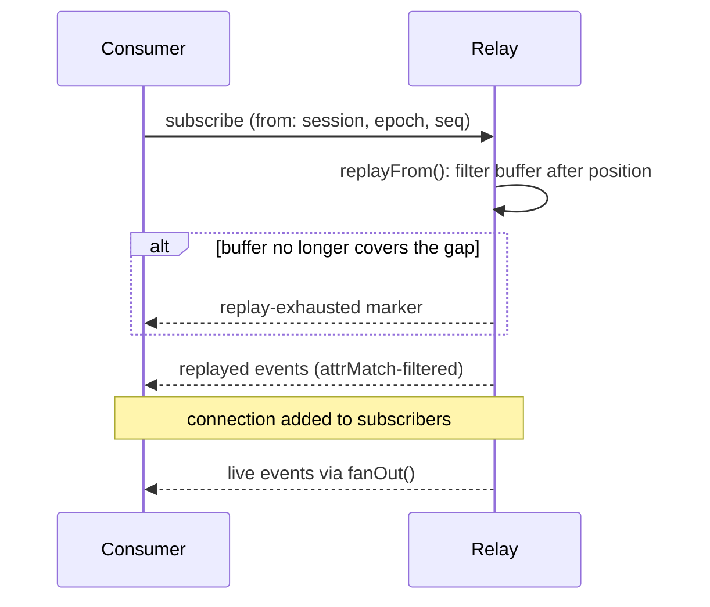

<Note>

The code this page cites lives in the reference repository,
[`agenteventprotocol/reference`](https://github.com/agenteventprotocol/reference); file paths below are
relative to that repository's source tree.

</Note>

`impl/relay/server.js` is the reference relay. This page traces, in order,
what happens from a POSTed event to a delivered one, and from a resuming
consumer to the moment it's caught up to the live tail. Every step cites the
function and line it comes from; if you change `server.js`, re-check this
page against the diff.

## The frozen ceiling

<Warning>

The file's own header says it plainly: "FROZEN CEILING: ingest + attr-match
fan-out + bounded replay + token auth. Nothing else:
no UI, no durable store, no scheduling, no channel logic"
(`impl/relay/server.js:1-4`). The ceiling is a governance rule, not a matter
of taste; see the [governance firewall, GOVERNANCE §3](/community/governance#3-the-governance-firewall-normative)
for why the reference relay is not allowed to grow beyond this list. Anything
you'd want to add belongs in a sidecar (a bridge, `aep-mcp`, the `aep sink`
durable capture) or a separate consumer, not here.

</Warning>

## Ingest, buffer, fan-out

`ingest(ev, fromConn)` (`impl/relay/server.js:149`) is the single entry point
for both the HTTP `POST /events` handler and inbound WebSocket event frames.
It runs `envelopeError(ev)` (`impl/shared/aep.js:223`) first, rejecting
malformed envelopes, then branches three ways:

- Command types (`control.*`) go to `routeCommand` (`impl/relay/server.js:110`),
  the frozen ceiling's one exception to "no channel logic": it routes a
  command to *at most one* emitter connection, the single one that owns the
  target session, per [AEP-0004](/specification/draft/aep-0004-control-profile).
  If more than one live connection claims the addressed session (session
  identity is emitter-scoped, AEP-0001 §5.2: colliding names are distinct
  sessions the relay cannot tell apart by `session` alone), the relay refuses
  the command with an `ambiguous` error frame toward the sender, never a
  guessed claimant and never a broadcast (AEP-0004 §4.5).
- `agent.*` types (liveness signals) go straight to `fanOut`, live-only,
  never buffered (`impl/relay/server.js:153`).
- Everything else is buffered via `bufferEvent(ev)` (`impl/relay/server.js:56`)
  and fanned out **as received**: buffer *admission* dedupes on `(source, id)`,
  but live fan-out forwards even a byte-identical redelivery (AEP-0003 §5:
  the relay is not a terminal consumer, and the re-acknowledgement a retried
  command elicits must be able to traverse it; subscribers dedupe, replay
  serves one copy).

`bufferEvent` keeps one `{ events, ids }` structure per session
(`impl/relay/server.js:51-82`): it dedupes admission on `(source, id)` (the
at-least-once contract the wire format assumes), insert-sorts by
`(epoch, seq)` position (cheap because events almost always arrive in order),
and trims to `AEP_BUFFER` (default 10000) per session, evicting the oldest.
Each buffered write also refreshes the session's recency, which is what the
session-count cap evicts by (see [Deployment](#deployment) below).

`fanOut(ev)` (`impl/relay/server.js:98`) then walks the `subscribers` set and
delivers to every consumer whose filter matches via `attrMatch`
(`impl/shared/aep.js:59`), down-leveling with `downlevel()`
(`impl/shared/aep.js:93`) first if the subscription named a capture ceiling
below the event's own.

## Subscribe-with-resume

Both bindings accept a resume position: SSE via `?from=[{session,epoch,seq}]`
or the `Last-Event-ID` header (`impl/relay/server.js:272-283`), WS via the
`from` array on a `subscribe` frame (`impl/relay/server.js:410-417`).

Either path calls `replayFrom(session, epoch, seq)`
(`impl/relay/server.js:84`), which filters the session's buffer to events
strictly after that position and reports whether the buffer no longer covers
the gap (`exhausted`). The relay writes a `replay-exhausted` marker (SSE
comment or a `replay-exhausted` WS frame) rather than silently
under-delivering.

After replay drains, the connection is added to `subscribers` and receives the
live tail through the same `fanOut` path described above; there is no separate
"switch to live" step, replayed and live events flow through the same
`deliver` callback.

Resume is keyed on `(epoch, seq)`, not wall-clock time or an opaque cursor;
see [AEP-0003 §5](/specification/draft/aep-0003-bindings-and-lifecycle) for
the ordering and idempotency guarantees that key gives a reconnecting
consumer.

## Auth and discovery

`authorized(req, url)` (`impl/relay/server.js:177`) is a single bearer-token
check (`AEP_TOKEN` env, `Authorization: Bearer` header, or `access_token`
query param for SSE/browser clients that can't set headers).

When `AEP_TOKEN` is unset, every *observation* request is authorized (the
local/dev default), but the relay is then **watch-only**: control commands are
refused toward the sender with an `unauthorized` error frame instead of routed
(`routeCommand`, `impl/relay/server.js:110-119`), because control flows only
on authenticated bindings, unconditionally, localhost included ([AEP-0004
§4.1](/specification/draft/aep-0004-control-profile) / [AEP-0003
§8.1](/specification/draft/aep-0003-bindings-and-lifecycle#81-trust-per-binding)).
The boot log states the posture; set `AEP_TOKEN` to enable command routing.

`GET /events` and `GET /.well-known/aep` both return the same `DISCOVERY`
object (`impl/relay/server.js:44-49`): the relay's declared capabilities
(filters, replay buffer size, capture levels, control acceptance) per the
[AEP-0003 hello/discovery
contract](/specification/draft/aep-0003-bindings-and-lifecycle).

## Deployment

Running the relay beyond a single dev machine changes nothing about its
ceiling: the notes below are operational hardening of what is already
there, not new capability.

- **TLS terminates at a reverse proxy.** The relay itself speaks plain HTTP;
  any off-host deployment MUST sit behind a TLS-terminating proxy per the
  binding trust table in
  [AEP-0003 §8.1](/specification/draft/aep-0003-bindings-and-lifecycle#81-trust-per-binding).
- **Access logs are sensitive.** For browser `EventSource` clients that
  cannot set headers, the bearer token also rides the query string
  (`?access_token=...`, `impl/relay/server.js:181`). AEP-0003 §8.1 requires
  that it never be logged, so proxy and relay access logs must either strip
  query strings or be treated as secret material.
- **Liveness: `GET /healthz`.** The one unauthenticated surface
  (`impl/relay/server.js:187-200`): supervisors and load-balancer probes
  can't carry tokens, so it answers `{"ok":true}` bare. The session,
  consumer, and connection counts (`sessions`, `subscribers`, `connections`)
  plus `uptime_s` are included only when the request passes the same
  `authorized()` check as everything else: counts are topology information
  and stay behind auth.
- **Shutdown: drain, don't drop.** On SIGTERM/SIGINT
  (`impl/relay/server.js:448-466`, `shutdown()` at line 452) the relay stops
  accepting, writes a
  `: shutting-down` SSE comment and a clean end to every SSE consumer, closes
  every WebSocket with 1001 (going away), and exits 0 once drained; a 5s
  timer force-exits 1 if the drain hangs. Consumers see an orderly stream
  end and resume by `(epoch, seq)` on reconnect, exactly as in the
  subscribe-with-resume path above.
- **Eviction under the session cap.** At `AEP_MAX_SESSIONS` (default 500)
  the relay evicts the least-recently-*written* session; recency is
  refreshed on every buffered event (`bufferEvent`,
  `impl/relay/server.js:58-66`), so an active long-lived session outlives
  an idle newer one. Within a session, the per-session buffer still trims
  to `AEP_BUFFER` oldest-first; a consumer that resumes past either bound
  gets the explicit `replay-exhausted` marker rather than silent gaps.
- **Ingest and replay are bounded, and every refusal answers.**
  - An oversize ingest body gets `413 payload-too-large` before the upload
    is cut off (`AEP_MAX_BODY`, default 16 MiB; `impl/relay/server.js:226-233`;
    §3.2 lists 413, so the emitter learns *why* instead of seeing a TCP
    reset).
  - An NDJSON batch over the event-count cap is rejected whole with
    `413 too-many-events` and nothing ingested (`AEP_MAX_BATCH`, default
    10 000; `impl/relay/server.js:241-244`; ingest work is per event, not
    per byte).
  - A `from` resume array is bounded by `AEP_MAX_FROM` (default = the
    session cap; `impl/relay/server.js:277-279`) since each entry costs a
    replay-buffer scan: an over-cap or malformed `from` answers `400`
    before any headers go out.
  - The WS `subscribe.from` array carries the same bound in-band per
    AEP-0003 §6.5 (`impl/relay/server.js:403-417`): a non-array answers
    `invalid-filter`, an over-cap array answers `limit-exceeded` naming
    `AEP_MAX_FROM`. The guard is not optional: the subscribe handler's
    replay loop would otherwise throw on a non-iterable `from`, uncaught,
    killing the process; the connection now survives each rejection.

## See also

- [Adapters (CC + Codex)](/components/adapters): the emitters that connect to this
  relay over `/socket`.
- [The `aep` CLI](/components/cli): `aep tail`'s resume flow is a client of the
  subscribe-with-resume path above.
- Normative source: [AEP-0003](/specification/draft/aep-0003-bindings-and-lifecycle),
  [AEP-0004](/specification/draft/aep-0004-control-profile).
