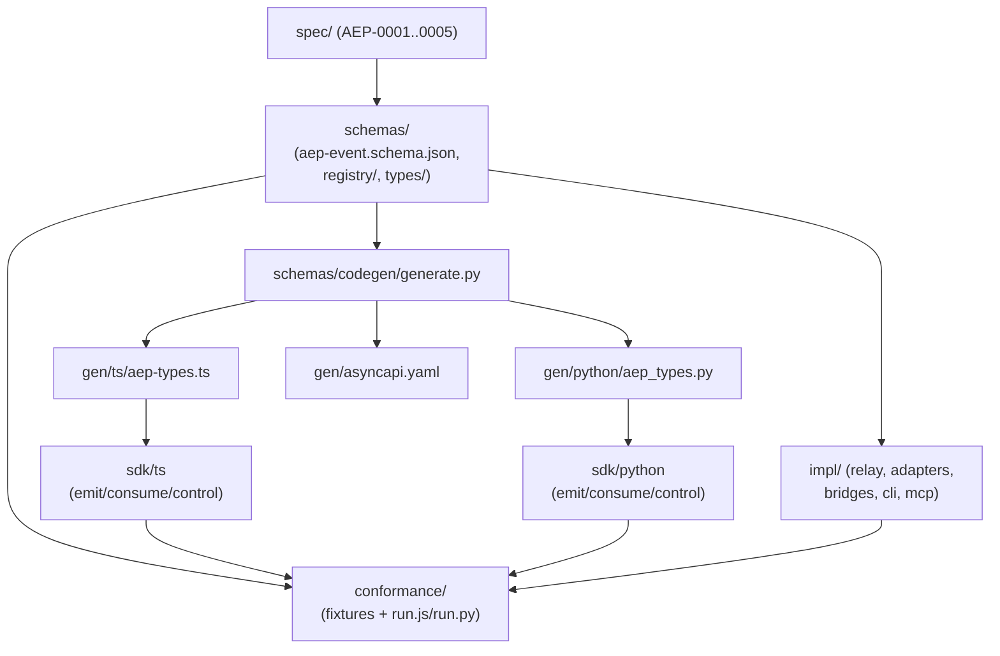

<Note>

This page maps the whole ecosystem. The spec, schemas, conformance, and docs
live in **this** repository. The runtime code (the reference stack
[`agenteventprotocol/reference`](https://github.com/agenteventprotocol/reference) and the SDKs
[`typescript-sdk`](https://github.com/agenteventprotocol/typescript-sdk),
[`python-sdk`](https://github.com/agenteventprotocol/python-sdk)) lives in sibling
repositories. `impl/` and `sdk/` paths below name those repositories' source
trees.

</Note>

A tour from the source of truth outward: the spec defines the wire format,
the schema registry makes it machine-checkable, codegen turns that into typed
SDK code, and every runtime component (adapters, the relay, bridges, the
CLI, MCP) consumes the same generated types. Read this before touching code,
to see what depends on what.

## The chain: spec to running code

[`spec/`](/specification/draft) is normative. [AEP-0001](/specification/draft/aep-0001-core-and-envelope)
through [AEP-0005](/specification/draft/aep-0005-bridges) define the envelope, the
mandatory type set, bindings, the control profile, and the CE/OTLP mappings.
Nothing here restates them; see [STYLE.md](/STYLE) for why.

[`schemas/`](https://github.com/agenteventprotocol/agent-event-protocol/tree/main/schemas) is the machine-readable projection of the taxonomy
part of the spec: `aep-event.schema.json` (the envelope), `registry/types.json`
(the type list with status/category/schema pointers), and `types/*.schema.json`
(one payload schema per mandatory type, each field annotated `x-aep-capture:
none|metadata|redacted|full`). `schemas/codegen/generate.py` reads these
inputs (the envelope schema, the registry lists in `registry/*.json`, and the
payload schemas) and emits `schemas/gen/ts/aep-types.ts`,
`schemas/gen/python/aep_types.py`, and `schemas/gen/asyncapi.yaml`
deterministically: identical input is byte-identical output (the header
comment in each generated file says so, and CI diffs against a fresh run).
Generated files are never hand-edited.

The SDKs ([`sdk/ts/`](https://github.com/agenteventprotocol/typescript-sdk),
[`sdk/python/`](https://github.com/agenteventprotocol/python-sdk)) copy the
generated file into their own tree (`sdk/ts/src/gen/aep-types.ts`,
`sdk/python/aep_sdk/gen/aep_types.py`) and layer hand-written emit/consume/
control modules on top; see [sdk.md](/components/sdk) for that layering.

Everything under `impl/` (the relay, the twelve adapters, the eight bridge
sidecars (two outbound, six inbound), the CLI, `aep-mcp`) builds and parses
the same envelope shape by hand against `impl/shared/aep.js`, not the
generated TS/Python types, because `impl/` predates the SDKs and is plain
Node. `impl/shared/aep.js:223` (`envelopeError`) is the implementation's own
structural check, independent of the generated validators.

`conformance/` is the arbiter that both trees agree with the spec:
`conformance/fixtures/` holds pinned inputs/outputs (envelope cases, CE and
OTLP round-trips, redaction corpora), and `conformance/run.js` /
`conformance/run.py` are dual runners so neither language's toolchain is
privileged.

Fixtures aren't optional: the [GOVERNANCE §2 SEP
rule](/community/governance#2-requirements-for-accepted-the-sep-rule) requires every accepted
spec change to land with its conformance fixtures in the same change. A
taxonomy or wire-format change without a fixture is not accepted, full stop.
That coupling keeps `schemas/` (and therefore the generated types and every
SDK/impl consumer) from drifting silently out of sync with `spec/`.

## Component directories

[`impl/README.md`](https://github.com/agenteventprotocol/reference) is the authoritative per-directory
map with spec references; this grid mirrors it at a glance and links to the
matching component doc:

<CardGroup cols={2}>
<Card title="Relay" href="/components/relay">

`impl/relay/`

</Card>
<Card title="Adapters" href="/components/adapters">

`impl/adapter-*/`

</Card>
<Card title="Outbound bridges" href="/components/bridges">

`impl/bridge-ce/`, `impl/bridge-otlp/`

</Card>
<Card title="OTel-inbound sidecar" href="/components/bridge-otlp-inbound-design">

`impl/bridge-otlp-in/`

</Card>
<Card title="OpenCode SSE bridge" href="/components/adapter-opencode-design">

`impl/bridge-opencode-sse/`

</Card>
<Card title="ACP bridge" href="/components/bridge-acp-design">

`impl/bridge-acp/`

</Card>
<Card title="AG-UI bridge" href="/components/bridge-agui-design">

`impl/bridge-agui/`

</Card>
<Card title="OpenHands bridge" href="/components/bridge-openhands-design">

`impl/bridge-openhands/`

</Card>
<Card title="aep CLI" href="/components/cli">

`impl/cli/`

</Card>
<Card title="aep-mcp server" href="/components/aep-mcp">

`impl/mcp/`

</Card>
<Card title="SDKs" href="/components/sdk">

`sdk/ts/`, `sdk/python/`

</Card>
</CardGroup>

`impl/shared/` (attr-match, envelope checks, capture down-leveling, redaction,
the CE/OTLP mapping helpers, the SSE client, ULID) has no dedicated page. It
is referenced from whichever component doc uses each function.

## See also

- [What AEP is, and why](/concepts/what-and-why): the problem the whole chain
  above exists to solve.
- [GOVERNANCE.md](/community/governance): the SEP rule and the governance
  firewall between spec and code.
- Normative source: all of [`spec/`](/specification/draft).
