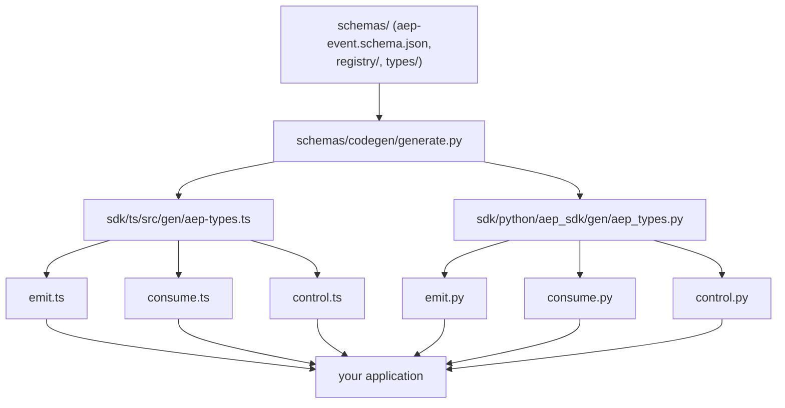

<Note>

The code this page cites lives in the SDK repositories,
[`agenteventprotocol/typescript-sdk`](https://github.com/agenteventprotocol/typescript-sdk) and
[`agenteventprotocol/python-sdk`](https://github.com/agenteventprotocol/python-sdk); `sdk/ts/` and
`sdk/python/` paths below name each SDK repository's source tree.

</Note>

Both SDKs share the same three-layer shape over the same generated types,
kept in parity on purpose: `sdk/ts/` (zero dependencies, Node ≥ 22) and
`sdk/python/` (one dependency, `pydantic>=2`, Python ≥ 3.10). Both publish
from their own repositories (see each package's README).

## Layering

At the bottom, `sdk/ts/src/gen/aep-types.ts` and
`sdk/python/aep_sdk/gen/aep_types.py` are generated from `schemas/` by
`schemas/codegen/generate.py`; see [repo-map.md](/components/repo-map) for the full
spec→schemas→codegen chain. Neither file is hand-edited: each generated
file's first line says `DO NOT EDIT` (`sdk/ts/src/gen/aep-types.ts:1`,
`sdk/python/aep_sdk/gen/aep_types.py:1`), and each repo's CI regenerates from
the pinned spec commit and fails on any diff (`sdk/ts/README.md:73-76`,
`sdk/python/README.md:120-123`).

Hand-written modules sit on top of the generated types, matched
concern-for-concern across languages (the Python SDK additionally ships
`aep_sdk/aio.py`, an asyncio mirror of the consume surface and of the
control-sender contract):

| Concern | TypeScript | Python |
|---|---|---|
| Emit | `sdk/ts/src/emit.ts` (`Emitter`/`SessionEmitter`) | `sdk/python/aep_sdk/emit.py` (`Emitter`/`SessionEmitter`) |
| Consume | `sdk/ts/src/consume.ts` (`subscribe()`) | `sdk/python/aep_sdk/consume.py` (`subscribe()`) |
| Control | `sdk/ts/src/control.ts` (`ControlClient`/`ControlTarget`) | `sdk/python/aep_sdk/control.py` (`ControlSender`/`ControlTarget`) |

`Emitter`/`SessionEmitter` construct valid envelopes and own a session's
`(epoch, seq)` counter (`sdk/ts/src/emit.ts:38-110`,
`sdk/python/aep_sdk/emit.py:33-126`), the same ownership contract
[AEP-0001 §7](/specification/draft/aep-0001-core-and-envelope) requires of any
emitter, whether it's this SDK, an adapter, or `aep-mcp`. `subscribe()` wraps
the SSE binding with `attr-match` filtering, `id`-dedupe, and resume-position
tracking built in, not left to the caller
(`sdk/ts/src/consume.ts:1-4, 34-109`), the same consumer conformance
[relay.md](/components/relay) and [cli.md](/components/cli) describe for the relay and CLI.

## The control state machine

`control.ts`'s `ControlClient` and `control.py`'s `ControlSender` are the same
state machine, the control-as-events design priced into ~250 lines in
TypeScript and ~140 in Python.

`send()` builds a command envelope (addressing the session, omitting `seq`,
since commands aren't buffered events, per [AEP-0004
§2.2](/specification/draft/aep-0004-control-profile)), transmits it, and
resolves when a `control.accepted`/`control.rejected` arrives correlated by
`cause = command.id`. A window timeout (default 10s) synthesizes a local
`timeout` nack if nothing comes back. Retries resend the identical envelope
with the same `id`, so a target that dedupes on `id` never re-executes a
retried command (`sdk/ts/src/control.ts:143-191`,
`sdk/python/aep_sdk/control.py:86-114`).

The two implementations differ only where the transport forces them to. The TS
`ControlClient` owns its own WebSocket connection and subscribes to ack types
itself (`sdk/ts/src/control.ts:64-135`), because a browser/Node runtime has
`WebSocket` built in. The sync Python `ControlSender` is transport-agnostic
(the caller injects a `send` callback and feeds inbound events to
`on_event()`), because the standard library has no WebSocket client
(`sdk/python/aep_sdk/control.py:1-5`).

The asyncio module closes that gap with a hand-rolled, dependency-free duplex:
`aio.ControlClient` owns its WebSocket connection (RFC 6455 client side on
`asyncio.open_connection`, `sdk/python/aep_sdk/aio.py`) and mirrors the same
`send()` contract with the same `NackError`, so both languages serve both
worlds.

Both also ship `ControlTarget`, the target-side helper (dedupe-on-id, exactly
one ack per deduplicated command, `unsupported` nack for undeclared types)
implementing the target-side conformance rules from [AEP-0004
§7](/specification/draft/aep-0004-control-profile). The TS one mirrors the
Python original and pairs with a `SessionEmitter`
(`sdk/ts/src/control.ts:205-244`, `sdk/python/aep_sdk/control.py:116-140`).

## See also

- [The control profile](/concepts/control-profile): what a command,
  an ack, and a nack mean before you read the state machine that implements
  them.
- [SDK quick guides: TypeScript](/guides/sdk-typescript) ·
  [Python](/guides/sdk-python): task-oriented walkthroughs.
- [Relay internals](/components/relay): the WebSocket `hello`/`subscribe` handshake
  the control clients speak.
- Normative source: [AEP-0001](/specification/draft/aep-0001-core-and-envelope),
  [AEP-0004](/specification/draft/aep-0004-control-profile).
