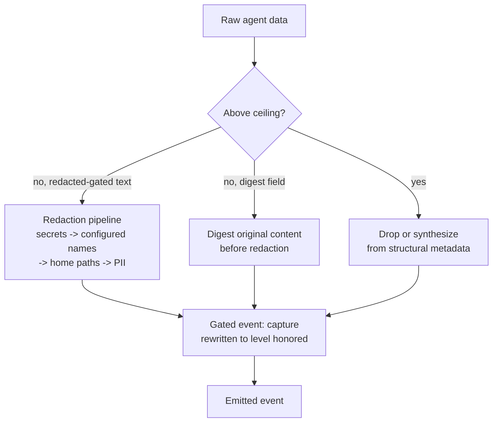

## Why capture is a level, not a toggle

An agent's raw activity includes things you never want leaving the host by
default: file contents, shell command output, prompts that might quote a
secret. But an observer with nothing at all can't tell two tool calls apart,
route an alert, or show a human what's being asked of them. AEP resolves this
with a declared-per-event `capture` level rather than a single on/off privacy
switch: an emitter chooses, event by event, how much content is worth the
exposure. The four levels, and what an event's `data` may honor at each, are
[AEP-0001 §8.2](/specification/draft/aep-0001-core-and-envelope):

- **`none`**: envelope only. No payload content at all; you get that
  something happened and its routing attributes, nothing else.
- **`metadata`**: structural facts: names, ids, counts, durations, statuses.
  No free text. This is the default emitter posture; content is opt-in, not
  opt-out.
- **`redacted`**: free text is present, but it has passed the redaction
  pipeline described below first.
- **`full`**: verbatim content, unmodified.

Because `capture` travels on the envelope, any downstream hop (a relay, a
bridge, a subscription with a capture ceiling) can tell at a glance what a
given event is allowed to carry. It can then strip that content down further
(down-level) without needing to know what the fields mean.

It cannot do the reverse. Up-leveling isn't something a downstream party can
ever do honestly, since it doesn't have the original content.

## Per-field gating, not just per-event

The level on the envelope is a ceiling; individual fields inside `data`
declare their own minimum level, so a `tool.completed` event at `capture:
metadata` can still omit `result` (gated `full`) while carrying
`result_digest` (gated `metadata`), a fingerprint for correlation without
the content itself. This per-field annotation is the mechanical part of
down-leveling: drop everything above the new ceiling, rewrite `capture`, done.

<Warning>

One boundary is deliberate: `redacted` is a *provenance claim* (the text
passed the redaction pipeline below), and dropping fields can't establish
that claim. A mechanical hop asked for `redacted` from a `full` event lands
on `metadata` instead; only a hop that runs the pipeline itself may write
`redacted`. See [AEP-0002 §5.1](/specification/draft/aep-0002-taxonomy-and-types) for
the annotation mechanism and its rules, and AEP-0001 §8.2(e) for the boundary.

</Warning>

## Digest before redaction

A `*_digest` field exists so two parties can confirm they're talking about
the same content without either of them holding that content: a stable hash
computed over the *original*, pre-redaction value. Order matters here:
digesting after redaction would make two different secrets that both got
replaced with `[REDACTED:secret]` hash identically, defeating the point of a
digest. The rule is normative in
[AEP-0003 §9.3](/specification/draft/aep-0003-bindings-and-lifecycle).

## The redaction pipeline

For content gated `redacted`, an adapter runs the raw text through a fixed
pipeline before it ever leaves the process. The normative floor is
[AEP-0003 §9.4](/specification/draft/aep-0003-bindings-and-lifecycle): the minimum
every adapter must apply, in order: secrets/credentials, then
operator-configured names, then home-path scrubbing, then PII.

The reference implementation, `impl/shared/redact.js`, goes beyond that
floor: the spec explicitly allows redacting more than the minimum. An
adversarial security pass found and fixed 13 real bypasses in the original
pattern set:

- quoted credential assignments
- lowercase `bearer`
- well-known bare token shapes, like GitHub/Slack/OpenAI keys
- home paths for users other than the operator
- credential-named object keys whose value shape wouldn't otherwise match

See the adversarial corpus in `conformance/fixtures/redaction/`.

<Warning>

Hardening the pipeline further is always in scope; loosening it below the
§9.4 floor is a spec change, not a code change.

</Warning>

At `capture: metadata` (the default), a field gated higher than `metadata`
isn't just dropped; where the event needs *something* usable in its place,
that something is synthesized from structural metadata alone (never from the
gated content). See
[AEP-0003 §9.2](/specification/draft/aep-0003-bindings-and-lifecycle) for the rule
and its rationale.

## The pipeline end to end

<Note>

Every hop after emission can only move an event's content toward `none`
(never back toward `full`), which is why a subscription's capture ceiling
([AEP-0003 §6.4](/specification/draft/aep-0003-bindings-and-lifecycle)) is enough to
guarantee what a given consumer will ever see, regardless of what the
original emitter captured.

</Note>

## See also

- [The envelope & identity](/concepts/envelope-and-identity): where `capture` lives
  on the envelope.
- [Taxonomy tour](/concepts/taxonomy-tour): which payload fields are gated at what
  level.
- [The control profile](/concepts/control-profile): free-text control answers are
  redaction-gated the same way.
- Normative source: [AEP-0002 §5.1](/specification/draft/aep-0002-taxonomy-and-types),
  [AEP-0003 §9](/specification/draft/aep-0003-bindings-and-lifecycle).
