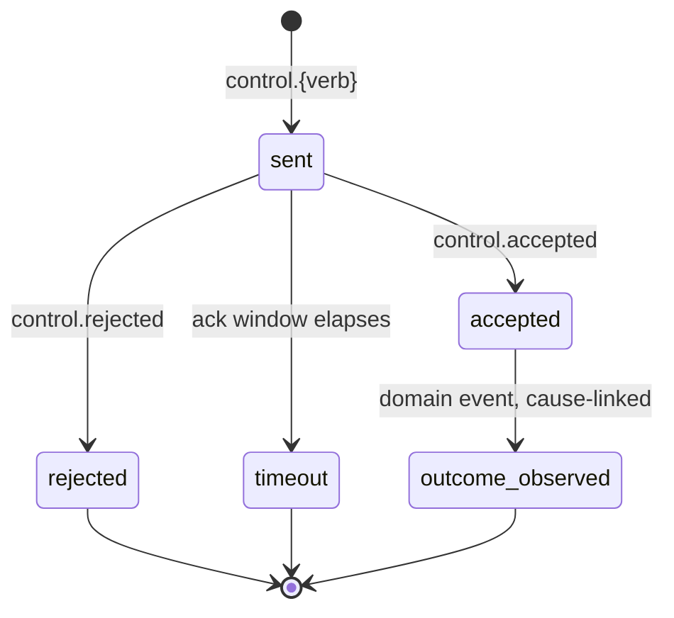
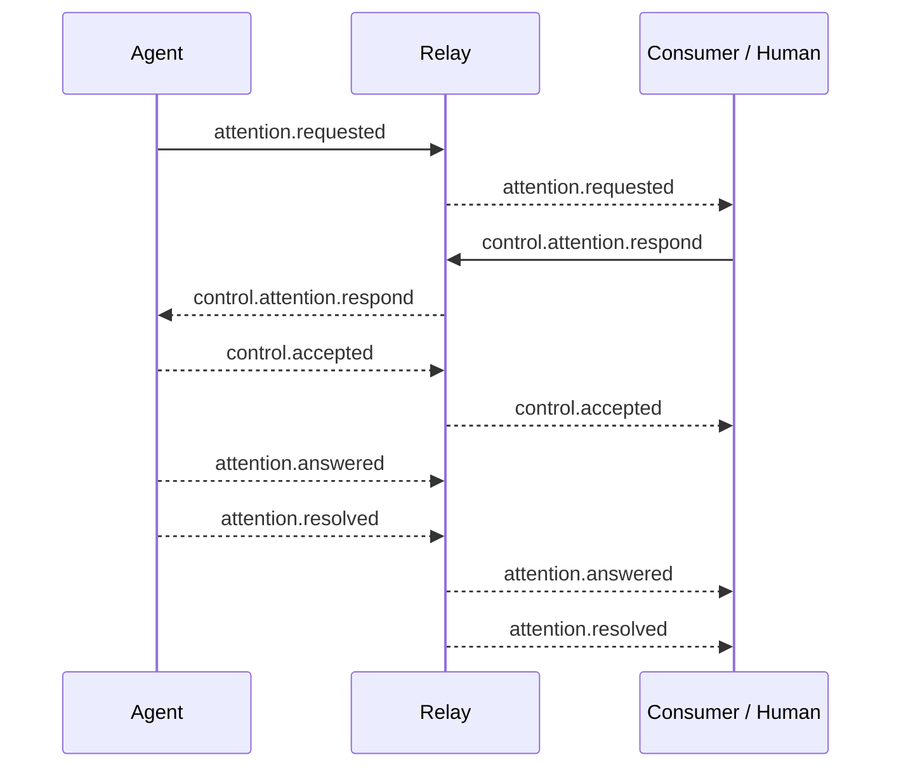

## Why control is events, not RPC

A control command in AEP (`control.cancel`, `control.attention.respond`) is
an ordinary event: same envelope, same storage, same filters as
`tool.completed` or `attention.requested`. Over an RPC-shaped alternative,
this means a session's replay includes who commanded what, when, with what
result, for free. The audit trail is structural, not a separate log a
deployment has to remember to keep. See
[AEP-0004](/specification/draft/aep-0004-control-profile) for the full profile.

The profile is marked `experimental` in 0.1 deliberately. It has the most
operational surface of any part of the protocol: authenticated duplex
bindings, acknowledgement windows, deployment-specific authorization. The
governance process graduates it only after it is proven end-to-end on a real
adapter, not on paper.

<Note>

Read `experimental` here as "the shape is settled enough to build against,
the graduation bar hasn't been cleared yet," not "unstable."

</Note>

## Command, ack, outcome

Three things happen for every command, and each is a deliberately different
kind of promise.

<Steps>

<Step title="The command">

The command says "please do this."

</Step>

<Step title="The ack">

The ack (`accepted` or `rejected`, always exactly one decision, always
within the negotiated window) says "I will try" or "I won't," nothing about
whether it worked. Retry a command and you get that same recorded ack again,
byte-identically: a lost ack is recovered by the retry, never re-decided.

</Step>

<Step title="The outcome">

The outcome is whatever ordinary domain event actually resulted
(`run.cancelled`, `attention.resolved`, ...), and it can arrive much later
than the ack. Keeping ack and outcome separate lets an agent take real time
to honor a `pause` without leaving the sender guessing whether the command
was even heard. The model and its sequencing are
[AEP-0004 §1](/specification/draft/aep-0004-control-profile).

</Step>

</Steps>

Note what the diagram deliberately leaves out: there's no state for "the
command executed." From the sender's side, the only executed signal *is* an
ordinary domain event turning up with the right `cause`; control never gets
a private success channel the rest of the stream doesn't have access to. The
command lifecycle and the target's acknowledgement obligations are normative
in [AEP-0004 §3](/specification/draft/aep-0004-control-profile) and
[§6](/specification/draft/aep-0004-control-profile) (correlation rules).

## The four commands

0.1 defines four command types, all `experimental`:
`control.attention.respond` (answer a pending attention request),
`control.cancel` (stop a run or session), `control.pause`, and
`control.resume`. Each names its target scope and expected outcome event in
[AEP-0004 §5](/specification/draft/aep-0004-control-profile); vendors can add more
via the `x.{vendor}.control.{verb}` extension namespace, gated by
`control.accepts` exactly like the core set.

## Where attention and control meet

The attention lifecycle ([taxonomy-tour.md](/concepts/taxonomy-tour)) describes
*what an agent emits* when it needs a human. Control is *how the human's
answer gets back*. A human tapping "Allow" in some UI is, underneath,
`control.attention.respond`: a command like any other, acknowledged like
any other, producing `attention.answered` then `attention.resolved` as its
outcome, both `cause`-linked back to the command.

The two profiles share one correlation trick: every event after
`attention.requested` carries that request's `id` as `subject`, so a
consumer can reconstruct the whole loop (request, response, resolution) from
`subject` alone, even if it missed intermediate hops. See
[AEP-0004 §6](/specification/draft/aep-0004-control-profile) for the correlation
rules that make this work.

## Beyond allow/deny: free-text guidance

The closed-choice case (`options` like allow/deny) is the common path, but
`control.attention.respond`'s answer shape also allows free text
(`answer.text`, redaction-gated per
[AEP-0002 §5.3](/specification/draft/aep-0002-taxonomy-and-types)), so a human can
tell the agent *how* to proceed instead of only whether to. This mirrors
typing a custom reply directly in an agent's own dialog rather than picking a
button: the model reads the guidance and adjusts.

The reference Claude Code adapter handles the three answer shapes around its
`pendingAttention` handler; a text answer maps onto Claude Code's own "tell
the agent what to do differently" hook decision rather than collapsing to a
bare deny. How
adapters wire this hook-by-hook is covered in
[../components/adapters.md](/components/adapters), not here.

## See also

- [Taxonomy tour](/concepts/taxonomy-tour): the attention lifecycle this profile
  answers.
- [The envelope & identity](/concepts/envelope-and-identity): `cause` and `subject`,
  the correlation fields control relies on.
- [Write a consumer](/guides/write-a-consumer): issuing commands and
  watching for their outcomes.
- Normative source: [AEP-0004](/specification/draft/aep-0004-control-profile).
