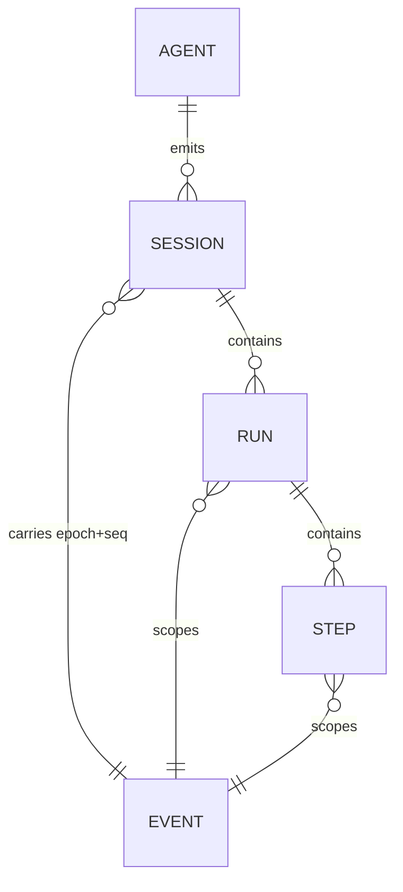
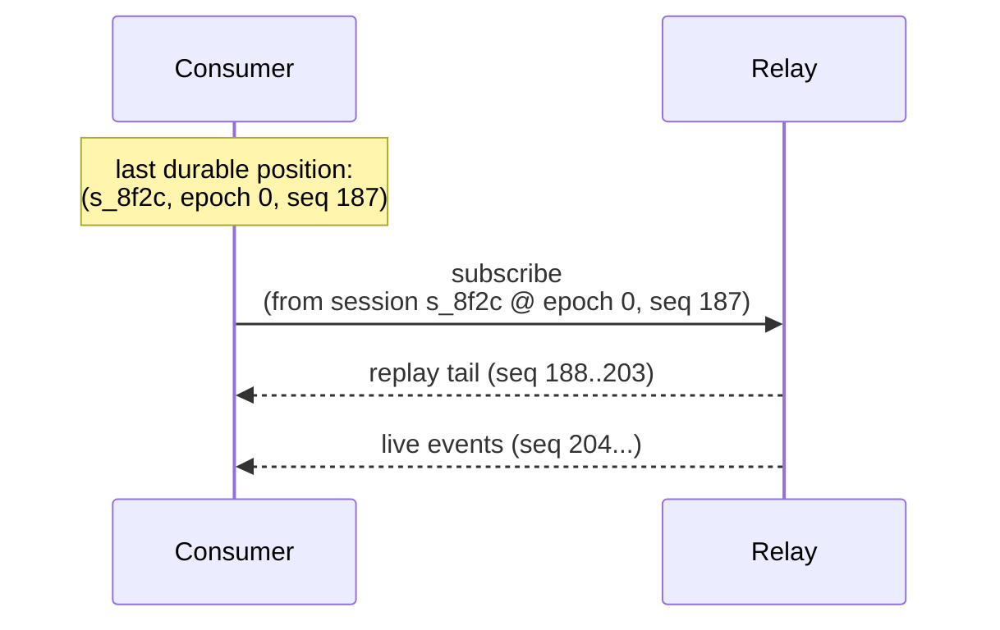

## Why 16 attributes and not a free-form payload

Every Event is one JSON object: a fixed set of context attributes plus an
optional `data` payload. The attribute set is fixed and small for routing: a
relay, a filter, or a dashboard needs to decide which session an event
belongs to, whether it's urgent, and whether it can show the content, all
without parsing `data`. The full normative list, with types and requirement
levels, is [AEP-0001 §5.1](/specification/draft/aep-0001-core-and-envelope); this
page is a guided tour of *what each one is for*, not a restatement of the
table.

Grouped by purpose:

- **Wire identity**: `aep` (protocol version), `id` (the idempotency key
  every consumer dedupes on), `type` (the bare, dot-separated event name),
  `time` (display and joins; never ordering, see below).
- **Who and what**: `source` (a URI naming the emitting agent/session),
  `agent` (the stable logical identity, e.g. `claude-code`), `subject` (the
  thing acted upon: a tool name, a file, an attention-request id).
- **Where in the work**: `session`, `run`, `step`, the nesting described
  below.
- **Order and causality**: `seq`, `epoch` (this page, next section),
  `cause` (the `id` of the event that immediately caused this one; the edge
  in the causal DAG the [taxonomy tour](/concepts/taxonomy-tour) traces through the
  attention lifecycle), `traceparent` (W3C Trace Context, for OpenTelemetry
  interop).
- **Handling**: `severity` (six-level, for filtering and backpressure) and
  `capture` (how much content is present: see
  [capture-and-redaction.md](/concepts/capture-and-redaction)).
- **Content**: `data`, the type-specific payload. Its schemas live in
  [AEP-0002](/specification/draft/aep-0002-taxonomy-and-types).

Keeping this list closed and small means a consumer that has never seen a
given agent before can still route, order, and filter its events correctly:
the routing surface never depends on understanding that agent's payloads.

## Identity nesting: source, agent, session, run, step

An agent is not a flat stream of events. It has conversations, activations
within a conversation, and sometimes phases within an activation. AEP names
three nesting levels so a fleet observer can group correctly without
inventing its own convention:

- **Session**: the unit of conversation or work an emitter groups events
  under.
- **Run**: one activation within a session: a turn, a task, a job.
- **Step**: an optional finer phase within a run (an agentic-loop phase).

`source` and `agent` sit above all of this: they name *which emitter*
produced the session. A subagent's own session links back to its parent via
`session.started.data.parent`
([AEP-0002 §5.3](/specification/draft/aep-0002-taxonomy-and-types)), so delegation
trees are reconstructable without a special protocol concept for them.

Not every event carries every level: `step` is optional, and `run` is
optional for session-level facts. What's fixed is the direction of nesting:
an event's `run` and `step` (when present) always resolve inside the `session`
it names. The conditions under which `session`/`seq` are required versus
omitted (agent-scoped events, and the foreign-emitter exception for inbound
control events) are normative: see
[AEP-0001 §5.2](/specification/draft/aep-0001-core-and-envelope).

## Ordering & replay: why `(epoch, seq)` exists

`time` looks like the obvious ordering key, but it deliberately isn't one:
clocks skew, retries reorder delivery, and a wall-clock timestamp can't
express "this is a fresh counter because the process restarted." `seq` is a
counter the emitter itself owns and increments, so ordering authority stays
with the party that actually knows what happened first.

`epoch` handles the one case a bare counter can't: a restart. Bumping
`epoch` says "this session's counter started over," so a consumer never
confuses a low `seq` after a crash with going back in time. The full
ordering contract, including that gaps are legal but regressions are not, is
[AEP-0001 §7](/specification/draft/aep-0001-core-and-envelope).

What this buys a consumer is resume: reconnect with the last `(session,
epoch, seq)` you durably processed, and the endpoint replays exactly the tail
after that position, with no gap (delivery is at-least-once; `id` is the
dedupe key). That's what makes "kill a consumer, reattach" a safe, ordinary
operation instead of a special recovery path. The resume contract and its
per-binding carriage (SSE `Last-Event-ID`, WebSocket `subscribe.from`) are
defined in [AEP-0003 §7](/specification/draft/aep-0003-bindings-and-lifecycle),
building on the `(epoch, seq)` semantics in
[AEP-0001 §7](/specification/draft/aep-0001-core-and-envelope).

A consumer that never disconnects never needs this: replay is what turns a
crash or a deliberate restart into a non-event.

## See also

- [What AEP is, and why](/concepts/what-and-why): why this envelope shape exists at all.
- [Taxonomy tour](/concepts/taxonomy-tour): the vocabulary that fills `type` and
  `data`.
- [Write a consumer](/guides/write-a-consumer): subscribe, resume, and
  dedupe in practice.
- Normative source: [AEP-0001](/specification/draft/aep-0001-core-and-envelope),
  [AEP-0003](/specification/draft/aep-0003-bindings-and-lifecycle).
