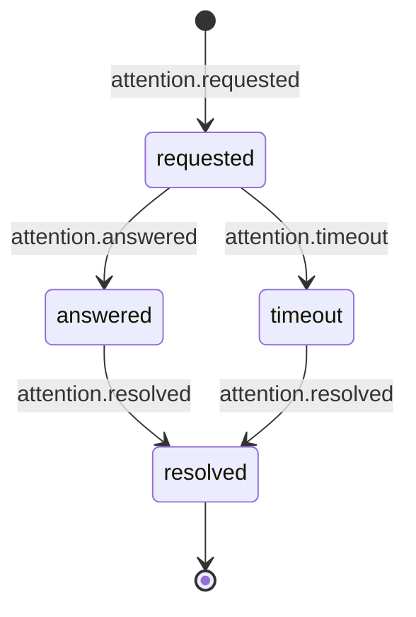

## Categories, not a flat list

Every AEP `type` starts with a category (`session`, `run`, `tool`,
`attention`, and so on). The category tells you what a type is *about*
before you've read the rest of its name. [AEP-0002 §3](/specification/draft/aep-0002-taxonomy-and-types)
defines the closed set of categories for 0.1 and what each one scopes to: a
session, an agent, or session-or-agent for control. This tour walks the
fourteen types every consumer must understand, the **mandatory type set**
([AEP-0002 §4.1](/specification/draft/aep-0002-taxonomy-and-types)), by
category, rather than restating that table verbatim.

### Session and run: the shape of activity

`session.started` and `session.ended` bracket a whole conversation or unit of
work. `run.started`, `run.finished`, `run.failed`, and `run.cancelled`
bracket one activation within it: a turn, a task, a job. There are three
distinct terminal types for a run rather than one type with a status field,
deliberately: success, failure, and cancellation are meaningfully different
outcomes for a fleet observer routing on `type` alone. See
[AEP-0002 §2](/specification/draft/aep-0002-taxonomy-and-types) for the
start/finish-pairing and distinct-terminal-states conventions that shape the
whole taxonomy, not just this category.

### Tool: what the agent actually did

`tool.requested`, `tool.completed`, `tool.failed`, and `tool.denied` cover
one tool invocation end to end. `tool.requested` is a pre-execution fact: the
tool is about to run. `tool.denied` is specifically for a policy/runtime
block *before* execution, with no human involved. Compare
`attention.requested` below, which is exactly the case where a human (or a
policy delegate) has to decide.

### Attention: the lifecycle this protocol exists for

[what-and-why.md](/concepts/what-and-why) names this category as one of the
three things no incumbent protocol carries as a first-class citizen. Four
mandatory types trace one request from start to close:

- `attention.requested`: the agent needs a human.
- `attention.answered`: a response was produced, whether via a control command
  or out of band.
- `attention.resolved`: the request's lifecycle closed.
- `attention.timeout`: it expired unanswered, a terminal outcome in its own
  right, not a failure of the other three.

The full lifecycle is normative in
[AEP-0002 §7](/specification/draft/aep-0002-taxonomy-and-types). That section
also covers the optional `attention.routed` hop a consumer may emit when it
forwards a request to a human surface, and the correlation rules that let a
consumer reconstruct the whole loop even if it missed intermediate events. How a
human's answer actually gets back to the agent is the control profile's job.
See [control-profile.md](/concepts/control-profile), which picks up this
lifecycle from the other side.

## Beyond the fourteen mandatory types

The mandatory set is a floor a consumer must understand, not a ceiling on
what it might see. AEP-0002 also registers **optional core types**: things
like `session.compacted`, `run.step.started`/`finished`, `progress.*`,
`delegation.subagent.*`, and the `agent.*` presence/health/heartbeat family,
which a conformant consumer should handle but must tolerate either way, the
same as any type it doesn't recognize at all. See
[AEP-0002 §4.2](/specification/draft/aep-0002-taxonomy-and-types) for that
list, and §4.3 for the reserved `message.*` names a future sub-profile will
fill in. Vendors can also carry runtime-specific detail through `x.{vendor}.*`
extension types without touching the core namespace
([AEP-0002 §6](/specification/draft/aep-0002-taxonomy-and-types)).

## See also

- [The envelope & identity](/concepts/envelope-and-identity): the attributes every
  one of these types rides on.
- [The control profile](/concepts/control-profile): how an `attention.requested`
  gets answered.
- [Capture & redaction](/concepts/capture-and-redaction): what content these
  payloads are allowed to carry at each capture level.
- Normative source: [AEP-0002](/specification/draft/aep-0002-taxonomy-and-types).
