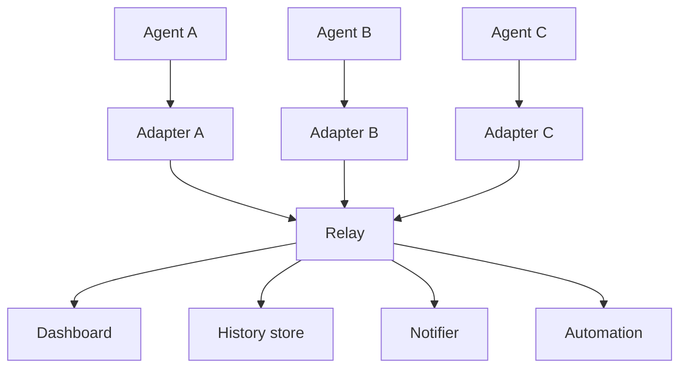

## The fleet-observer problem

Say you run three agent runtimes side by side: a coding agent, a support
bot, a batch job runner. Each ships its own hooks, its own event names, its
own idea of what a "turn" is. To watch all three on one timeline, retain
history uniformly, or notify a human at the right moment, you write three
ingesters, each learning one vendor's vocabulary, then reconcile them into
something a dashboard can render. Add a fourth runtime and you write a
fourth ingester. Every "agent observability" integration re-solves this
problem from scratch.

The pattern repeats because each runtime's hooks are *convergent* in what
they mean (something started, a tool ran, a human is needed) but
*divergent* in how they spell it. AEP standardizes the spelling: any agent
emits lifecycle, tool, progress, and **attention** events once, and any
consumer (dashboard, history store, notifier, automation) reads one
vocabulary for every agent it watches. See the envelope-in-one-glance example
in the root [README](https://github.com/agenteventprotocol/agent-event-protocol/blob/main/README.md#the-envelope-in-one-glance) for
that shared shape on the wire.

## What no incumbent protocol carries

Adjacent protocols solve adjacent problems well: MCP hands an agent tools
and context, A2A lets agents delegate to each other, AG-UI renders an
agent's turn into a UI. None is built for a *fleet observer*: a party
watching many sessions, across many agents, that it did not initiate and
does not control. AEP's non-goals are normative. See
[AEP-0001 §3.2](/specification/draft/aep-0001-core-and-envelope) for the full
list of planes it deliberately does not enter. Inside the plane it does own,
three things fall out of the design that no incumbent carries as a
first-class citizen:

- **A routable attention lifecycle.** *Agent-needs-a-human* is an event, not
  a side channel: `attention.requested` / `answered` / `resolved` /
  `timeout`, routable to a phone, a chat channel, or a policy automation
  without the agent knowing or caring which. See
  [taxonomy-tour.md](/concepts/taxonomy-tour) for the lifecycle itself.
- **An acknowledged control round-trip.** Approve, cancel, pause, or answer
  from wherever the human happens to be, and get an ack. Commands are
  ordinary events, so every control action lands in the same replayable
  history as everything else: an audit trail by construction, not a
  bolted-on log. See [control-profile.md](/concepts/control-profile).
- **Spec-guaranteed session replay.** A consumer can be killed and
  reattached and receive exactly the tail it missed, gap-free within an
  epoch, deduplicated by construction. See
  [envelope-and-identity.md](/concepts/envelope-and-identity) for how
  `(epoch, seq)` makes that guarantee possible.

## The fleet-observer test

AEP's scope court for *every* proposed addition (a new event type, a new
attribute) is one question: would an observer watching many sessions it
didn't initiate act on this? If the answer only makes sense inside one
rendering surface or one vendor's UI, it belongs to a neighbor protocol or an
`x.*` extension, not the core. The test is defined normatively in
[AEP-0001 §3.2](/specification/draft/aep-0001-core-and-envelope) and enforced by
[GOVERNANCE.md §3](/community/governance); it is why the reference relay's
feature ceiling is frozen rather than growing with every integration
request.

## One contract, many agents

Every agent's adapter emits the same envelope (AEP-0001 §5); the relay is
optional plumbing that fans events out (AEP-0001 §4.2). Nothing downstream
needs to know which runtime produced which event. A fourth agent adds one
adapter, not one integration per consumer.

## See also

- [The envelope & identity](/concepts/envelope-and-identity): the 16 attributes
  that make this topology possible.
- [Taxonomy tour](/concepts/taxonomy-tour): what actually shows up on the stream.
- [Capture & redaction](/concepts/capture-and-redaction): what content leaves the
  machine, and what never does.
- [Run the stack](/guides/run-the-stack): see this topology running on
  one machine.
- Normative source: [AEP-0001](/specification/draft/aep-0001-core-and-envelope).
