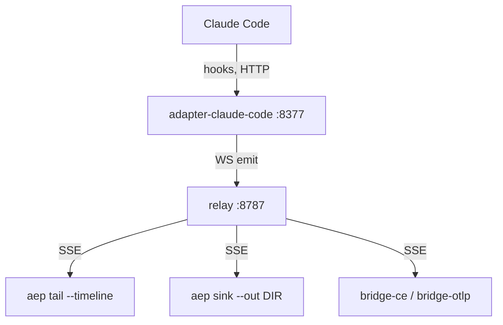

Start a relay, a Claude Code adapter, and a fleet-view consumer on one
machine, with no external accounts, nothing but `node`. You'll watch
real [Event](/concepts/envelope-and-identity)s stream by as you use
Claude Code normally.

The runnable code lives in the reference repository,
[`agenteventprotocol/reference`](https://github.com/agenteventprotocol/reference); clone it and run the
commands below from its root. This page covers the running stack, a live
view, and everyday operations (stop, health checks) around it. (For a
self-contained demo with synthetic agents instead of your own Claude Code,
one command that tears itself down, run `./run-demo.sh` from that repository's
root instead.)

## Prerequisites

Node ≥ 22 (root [README](https://github.com/agenteventprotocol/agent-event-protocol/blob/main/README.md#quickstart)). Clone the reference
repository and install the two component dependencies once:

```bash
git clone https://github.com/agenteventprotocol/reference && cd reference
(cd impl/relay && npm ci) && (cd impl/cli && npm ci)
```

<Steps>

<Step title="Start the relay">

```bash
node impl/relay/server.js &
```

The relay is the reference implementation: HTTP ingest, SSE/WS fan-out,
bounded replay, nothing else. It listens on `127.0.0.1:8787` by default
(`AEP_PORT` to change it). For a real, non-toy run, set `AEP_TOKEN` first so
the relay requires it:

```bash
export AEP_TOKEN="$(openssl rand -hex 16)"   # a per-boot token is fine for one machine
AEP_TOKEN="$AEP_TOKEN" node impl/relay/server.js &
```

</Step>

<Step title="Start the Claude Code adapter">

```bash
AEP_TOKEN="$AEP_TOKEN" node impl/adapter-claude-code/adapter.js &
```

This daemon listens on `127.0.0.1:8377`, turns Claude Code hooks into Events,
writes a durable JSONL session log under `~/.aep/logs/claude-code/`, and
forwards live over WebSocket to the relay. One-time wiring: merge the adapter's
`hooks-settings.example.json` into `~/.claude/settings.json` so each hook posts
to the adapter. [Adapters (CC + Codex)](/components/adapters) covers how the
hooks map to Events; for a similar adapter on another agent, see
[Write an adapter](/guides/write-an-adapter).

Optional second agent, same pattern: `node impl/adapter-codex/adapter.js &`
on port `8378`, wired via the Codex adapter's `config.example.toml`, then
trust the hooks via `/hooks`.

</Step>

<Step title="Watch the fleet">

```bash
AEP_TOKEN="$AEP_TOKEN" node impl/cli/aep.js tail --timeline
```

`aep tail` is a reference consumer that subscribes over SSE and prints each
Event as it arrives: agent, session, sequence number, type, and a short
summary. `--timeline` adds the agent/session columns so you can follow several
agents on one screen.

Drive Claude Code normally in another terminal: prompts, tool calls, and any
permission prompt show up as `session.started`,
`tool.requested`/`tool.completed`, and `attention.requested` on the stream;
the mandatory event types are toured in
[Taxonomy tour](/concepts/taxonomy-tour).

Kill and restart `aep tail` and it resumes from the positions it last saved
(`~/.aep/tail-state.json`) instead of replaying from the start: the
`(epoch, seq)` resume contract in practice
([AEP-0003 §7](/specification/draft/aep-0003-bindings-and-lifecycle)).

</Step>

</Steps>

## Durable capture

The relay's replay buffer is deliberately *bounded* (per session, evicted
under memory pressure): it bridges reconnects, not a database. When you
need every event kept (audit, later analysis, `aep timeline --file` over
long-gone sessions), run a sink beside the tail:

```bash
AEP_TOKEN="$AEP_TOKEN" node impl/cli/aep.js sink --out ~/.aep/capture &
```

`aep sink` appends each event to one JSONL file per session under `--out`,
fsyncing in small batches and committing its resume position only after the
covering fsync. After a crash or restart it resumes from what's actually
on disk, deduplicates the replayed overlap by `id`, and truncates a torn
final line. `--rotate-mb N` caps file size by rotating to
`<session>.<unix-ts>.jsonl`.

Bounded relay replay plus a supervised sink is the completeness story: the
relay bridges gaps measured in minutes; the sink owns forever. Captured
files pass `node impl/cli/aep.js validate` and feed `aep timeline --file`
directly ([CLI doc](/components/cli#aep-sink-durable-capture)).

## Topology



All processes bind `127.0.0.1` only. Ports: relay `8787`, Claude Code
adapter `8377`, Codex adapter `8378`.

## Optional: answering attention requests

`aep tail` shows `attention.requested` events. Answering one from the same
shell is a single command: copy the request id off the tail line.

<Warning>

Precondition: the relay must be running **with `AEP_TOKEN` set**. Control
flows only on authenticated bindings (AEP-0004 §4.1), so a tokenless relay
is watch-only and refuses commands with an `unauthorized` nack:

```bash
node impl/cli/aep.js respond <session> <request-id> --option allow
# forms take --values '{"field-id": "choice-id"}'; free text takes --text
node impl/cli/aep.js cancel  <session> --run <run-id> --reason "wrong branch"
```

</Warning>

Exit `0` means the target acknowledged (the outcome Event follows on the
stream); a nack prints its reason on stderr and exits `3`; silence past the
ack window exits `4` ([the CLI page](/components/cli) documents the
sender semantics).

Under the hood this is a consumer sending
`control.attention.respond` / `control.cancel` over the WebSocket binding;
[Write a consumer](/guides/write-a-consumer) and
[The control profile](/concepts/control-profile) describe the full loop.

Mission Control
([`agenteventprotocol/mission-control`](https://github.com/agenteventprotocol/mission-control))
is the shipped UI for exactly this: point it at the same relay and answer
permission prompts and forms from its inbox. The SDKs' control clients
([SDK architecture](/components/sdk)) do the same programmatically from
a script.

Bridges to CloudEvents/OTLP ([Bridges](/components/bridges)) run the same
way as the other consumers if you already operate one of those pipelines:

```bash
AEP_TOKEN="$AEP_TOKEN" OTLP_ENDPOINT=http://127.0.0.1:4318 node impl/bridge-otlp/bridge.js &
AEP_TOKEN="$AEP_TOKEN" CE_SINK=http://127.0.0.1:9099/ce   node impl/bridge-ce/bridge.js &
```

## Stopping and health checks

The components above were backgrounded with `&`; stop them from the same
shell by job list:

```bash
kill $(jobs -p) 2>/dev/null
```

(From a different shell, find and kill the PIDs listening on the relay and
adapter ports instead.)

<Note>

Hooks fail open: with the adapter down, Claude Code behaves as if unhooked
(HTTP hooks time out silently; permission dialogs appear as normal). No
un-merging the hooks config is needed to stop capturing.

</Note>

Quick health checks:

```bash
# relay up? /healthz answers without a token:
curl -s http://127.0.0.1:8787/healthz
# adapter daemon up AND bound to the relay? its own /healthz says so:
# `relay: true` means the WS binding is live (events flow, not just queue):
curl -s http://127.0.0.1:8377/healthz
# ...and the discovery document responds with its capabilities:
curl -s -H "authorization: Bearer $AEP_TOKEN" http://127.0.0.1:8787/events | head -c 200
# spot-check any captured session:
node impl/cli/aep.js validate ~/.aep/logs/claude-code/<session>.jsonl
```

(The adapter prints its boot line, `aep-adapter-claude-code on
127.0.0.1:8377 ...`, to the terminal it was started in.)

Ports bind `127.0.0.1` only: relay `8787`, Claude Code adapter `8377`, Codex
adapter `8378`.

## See also

- [What AEP is, and why](/concepts/what-and-why): the problem this stack solves.
- [The `aep` CLI](/components/cli): `tail` / `sink` / `timeline` /
  `validate` in full.
- [Write a consumer](/guides/write-a-consumer): build your own fleet view.
- Normative source: [AEP-0003](/specification/draft/aep-0003-bindings-and-lifecycle).
