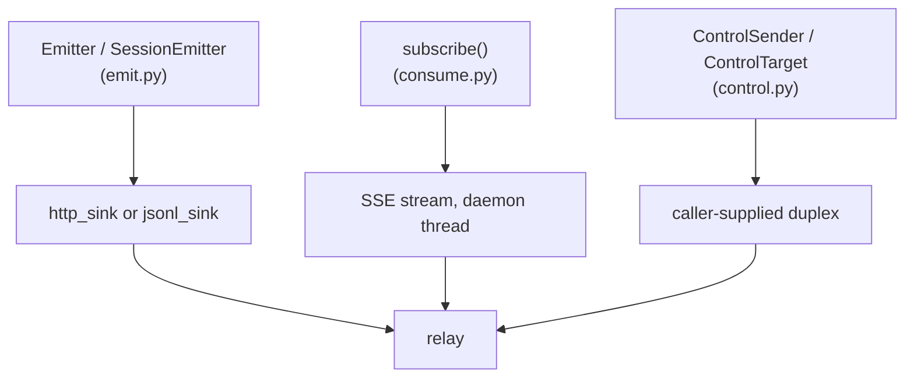

`aep-sdk` provides emit/consume/control helpers over the schema-generated
pydantic v2 types ([README](https://github.com/agenteventprotocol/python-sdk)). File paths below are
relative to the [python-sdk](https://github.com/agenteventprotocol/python-sdk) repository root.

<Note>

It's a **local, unpublished package**: `Private :: Do Not Upload` in
[pyproject.toml](https://github.com/agenteventprotocol/python-sdk) until the v0.1
tag, so install it from a clone, not from PyPI.

</Note>

This guide covers the three
tasks the smoke test exercises: emit, consume, control round-trip.

## Setup

Python ≥ 3.10; the only dependency is `pydantic>=2`
([pyproject.toml](https://github.com/agenteventprotocol/python-sdk)). From a
clone's root, run against the package directly (the smoke test does this via
`sys.path.insert`, [tests/smoke.py](https://github.com/agenteventprotocol/python-sdk))
or install it editable: `pip install -e .`. Verify with
`bash tests/run-smoke.sh`
([tests/run-smoke.sh](https://github.com/agenteventprotocol/python-sdk)): it
starts the vendored relay test fixture on an ephemeral port and runs
[tests/smoke.py](https://github.com/agenteventprotocol/python-sdk), the source of
every snippet below, via `uv run`.

## Emit an event

`Emitter` builds valid envelopes for one producer identity. `.session()`
returns a `SessionEmitter` that owns that session's `(epoch, seq)` counter
([aep_sdk/emit.py](https://github.com/agenteventprotocol/python-sdk)):

```python
from aep_sdk import Emitter, http_sink

session = Emitter("my-agent", "host-1", http_sink("http://127.0.0.1:8787"), epoch=1) \
    .session("s_001")
session.emit("session.started", {"client": {"name": "my-agent"}})
```

`epoch` is a constructor keyword you own; bump it whenever the process
restarts without durable `seq` state, per
[AEP-0001 §7](/specification/draft/aep-0001-core-and-envelope#7-ordering-replay-and-the-epoch-seq-contract).
`http_sink()` POSTs each Event to the relay's ingest endpoint. `jsonl_sink(path)`
is the append-only file binding
([aep_sdk/emit.py](https://github.com/agenteventprotocol/python-sdk)'s
`http_sink`/`jsonl_sink`). Built Events validate against the generated
pydantic models; the smoke test does this explicitly:

```python
from aep_sdk import AepEvent, ToolCompletedData

AepEvent.model_validate(built_event)
ToolCompletedData.model_validate(built_event["data"])
```

(`aep_sdk.gen.aep_types` is generated from `schemas/`, re-exported at the
top of `aep_sdk/__init__.py`; never edit it directly.)

## Consume / subscribe

`subscribe()` opens an SSE connection in a daemon thread, dedupes by `id`,
and tracks `(session, epoch, seq)` resume positions
([aep_sdk/consume.py](https://github.com/agenteventprotocol/python-sdk); `aep_sdk/aio.py`
mirrors the same surface for asyncio):

```python
from aep_sdk import subscribe

sub = subscribe("http://127.0.0.1:8787", print, filter={"session": "s_001"})
# later:
positions = sub.positions()   # persist and pass back as from_=... to resume
sub.close()
```

The `filter` argument is the
[attr-match dialect](/specification/draft/aep-0003-bindings-and-lifecycle#6-the-attr-match-filter-dialect).
See [Write a consumer](/guides/write-a-consumer) for why persisting `positions()`
and deduping by `id` are both required, not just one or the other.

## Control round-trip

Control is transport-agnostic in this SDK: the standard library has no
WebSocket client, and control commands require an authenticated duplex
binding ([AEP-0004 §4](/specification/draft/aep-0004-control-profile#4-gating-and-transport)).
`ControlSender` takes a `transport_send` callable you provide; you feed
inbound Events to `on_event()`
([aep_sdk/control.py](https://github.com/agenteventprotocol/python-sdk)). A
bundled WS transport may ship later as an optional dependency; it is not in
this package today. See
[README](https://github.com/agenteventprotocol/python-sdk).

```python
from aep_sdk import ControlSender, NackError

sender = ControlSender(my_ws_send, agent="phone", host="host-1")

try:
    ack = sender.send(
        "control.attention.respond", "s_001",
        subject=request_id, cause=request_id,
        data={"answer": {"option": "allow"}},
        ack_window_ms=5000, retries=1,
    )
    print("accepted", ack["id"])
except NackError as e:
    print(e.reason, e.detail)
```

Feed every inbound Event on your transport to `sender.on_event(ev)`. It
matches acks by `cause` (the command `id`) and resolves or raises the
pending `send()` call. Retries reuse the same command `id`
([AEP-0004 §2](/specification/draft/aep-0004-control-profile#2-command-events), item 3),
so a retried send never double-executes on the target.

On the *receiving* side, `ControlTarget` is the target-side conformance
helper: dedupe on `(source, id)`, one ack decision per command with the
recorded ack re-emitted byte-identically on a retransmit, `unsupported` nack
for undeclared types
([aep_sdk/control.py](https://github.com/agenteventprotocol/python-sdk)):

```python
from aep_sdk import ControlTarget

target = ControlTarget(session_emitter, accepts=["control.attention.respond"])
target.handle(incoming_command, execute=lambda cmd: ...)  # acks, then runs execute() once
```

The full round-trip, including the dedupe-on-retry and ack-window-timeout
paths, is exercised end-to-end in
[tests/smoke.py](https://github.com/agenteventprotocol/python-sdk).

## The three helper areas



## See also

- [TypeScript SDK quick guide](/guides/sdk-typescript): the same three tasks in
  TypeScript, including a bundled WS transport.
- [SDK architecture](/components/sdk): how the generated types and
  handwritten modules fit together.
- [Write a consumer](/guides/write-a-consumer) · [Write an adapter](/guides/write-an-adapter):
  the same tasks without the SDK.
- Normative sources: [AEP-0003](/specification/draft/aep-0003-bindings-and-lifecycle),
  [AEP-0004](/specification/draft/aep-0004-control-profile).
