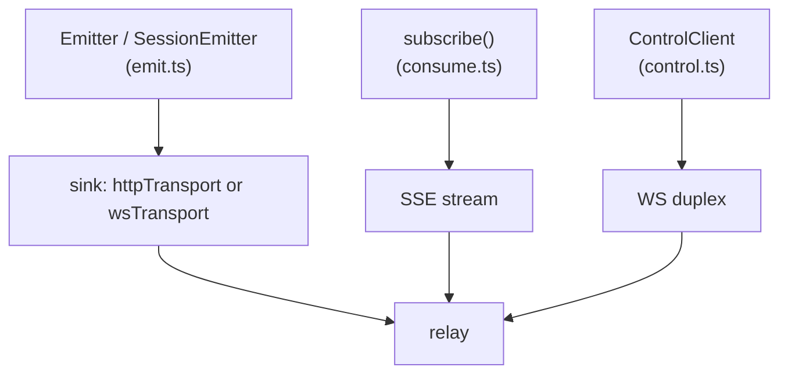

`@agenteventprotocol/sdk` provides emit/consume/control helpers over the schema-generated
envelope and payload types
([README](https://github.com/agenteventprotocol/typescript-sdk)). File paths below are relative to
the [typescript-sdk](https://github.com/agenteventprotocol/typescript-sdk) repository root.

<Note>

It's a **local, unpublished package**: `private: true` in
[package.json](https://github.com/agenteventprotocol/typescript-sdk) until the v0.1 tag, so you
use it from a clone, not `npm install @agenteventprotocol/sdk`.

</Note>

This guide covers the same
three tasks the smoke test exercises: emit, consume, control round-trip.

## Setup

The package has zero runtime dependencies and targets Node ≥ 22 (global
`fetch`/`WebSocket`) or any runtime with those. From a clone, either build a
local package to depend on (`npm install && npm run build && npm pack`, per
the README's install section), or import directly by relative path as the
smoke test does:

```ts
import { Emitter, wsTransport, subscribe, ControlClient } from '../src/index.js';
```

(`src/index.ts` is the public export surface; everything below is
re-exported from there.) Typecheck with `npm run typecheck` (strict, no
emit; see the script in
[package.json](https://github.com/agenteventprotocol/typescript-sdk)). Run the end-to-end smoke
test with `bash test/run-smoke.sh`; it boots the vendored relay test
fixture itself
([test/smoke.ts](https://github.com/agenteventprotocol/typescript-sdk) is the source of every
snippet below).

## Emit an event

`Emitter` builds valid envelopes for one producer identity; call `.session()`
once per session to get a `SessionEmitter` that owns that session's
`(epoch, seq)` counter
([src/emit.ts](https://github.com/agenteventprotocol/typescript-sdk)):

```ts
import { Emitter, wsTransport } from '@agenteventprotocol/sdk';

const t = wsTransport('http://127.0.0.1:8787', { agent: 'my-agent', host: 'host-1' });
const emitter = new Emitter({ agent: 'my-agent', host: 'host-1', sink: t.sink, epoch: 1 });
const session = emitter.session('s_001');

session.emit('session.started', { client: { name: 'my-agent' } });
```

`epoch` is a constructor option you own: bump it whenever the process
restarts without durable `seq` state, per
[AEP-0001 §7](/specification/draft/aep-0001-core-and-envelope#7-ordering-replay-and-the-epoch-seq-contract).
`sink` is anywhere finished Events go: `wsTransport()` for a duplex
connection to the relay (needed if you'll also receive control commands;
see below), or `httpTransport()` for a simple POST-per-Event path
([src/transports.ts](https://github.com/agenteventprotocol/typescript-sdk)). `emit()` on a
`SessionEmitter` is typed against `AepPayloadMap` for registered types, so
`session.emit('tool.completed', {...})` gets payload-shape checking at
compile time.

## Consume / subscribe

`subscribe()` opens an SSE connection with attr-match filtering, dedupes by
`id`, and tracks `(session, epoch, seq)` resume positions for you
([src/consume.ts](https://github.com/agenteventprotocol/typescript-sdk)):

```ts
import { subscribe } from '@agenteventprotocol/sdk';

const sub = subscribe({
  url: 'http://127.0.0.1:8787',
  filter: { severity: { gte: 'notice' } },
  onEvent: (ev) => console.log(ev.type),
});

// later, to persist for a clean resume:
const positions = sub.positions(); // ResumePosition[]; feed back as `from` next time
sub.close();
```

The filter is the [attr-match dialect](/specification/draft/aep-0003-bindings-and-lifecycle#6-the-attr-match-filter-dialect).
`positions()` gives you exactly what to persist and replay as `from` on
reconnect; see [Write a consumer](/guides/write-a-consumer) for why
resume-by-position and dedupe-by-id both matter.

## Control round-trip

`ControlClient` is the sending side of the experimental control profile. It
opens the WS duplex, sends a command, and resolves on the correlated
`control.accepted` (or rejects with `NackError` on `control.rejected` or a
locally synthesized ack-window timeout); see
[src/control.ts](https://github.com/agenteventprotocol/typescript-sdk):

```ts
import { ControlClient, NackError } from '@agenteventprotocol/sdk';

const ctl = new ControlClient({ url: 'http://127.0.0.1:8787', agent: 'phone', host: 'host-1' });

try {
  const ack = await ctl.send({
    type: 'control.attention.respond',
    session: 's_001',
    subject: requestId,       // the attention.requested id
    cause: requestId,
    data: { answer: { option: 'allow' } },
  }, { ackWindowMs: 5000, retries: 1 });
  console.log('accepted', ack.id);
} catch (e) {
  if (e instanceof NackError) console.error(e.reason, e.detail);
}
```

Retries reuse the same command `id` (idempotency; see
[AEP-0004 §2.3](/specification/draft/aep-0004-control-profile#2-command-events)): a
retried send never double-executes on the target side. A target that
still remembers the command answers the retry by re-emitting its recorded ack
byte-identically (§3), so a lost ack is recovered by the retry itself. On the *receiving*
side (an emitter accepting commands), pass `controlAccepts` to
`wsTransport()` and handle inbound commands via `onCommand`; see the
target-side block in
[test/smoke.ts](https://github.com/agenteventprotocol/typescript-sdk), which acks with
`control.accepted`/`control.rejected` and then emits the outcome
(`attention.answered`, `attention.resolved`).

## The three helper areas



## See also

- [Python SDK quick guide](/guides/sdk-python): the same three tasks in Python.
- [SDK architecture](/components/sdk): how the generated types and
  handwritten modules fit together.
- [Write a consumer](/guides/write-a-consumer) · [Write an adapter](/guides/write-an-adapter):
  the same tasks without the SDK.
- Normative sources: [AEP-0003](/specification/draft/aep-0003-bindings-and-lifecycle),
  [AEP-0004](/specification/draft/aep-0004-control-profile).
