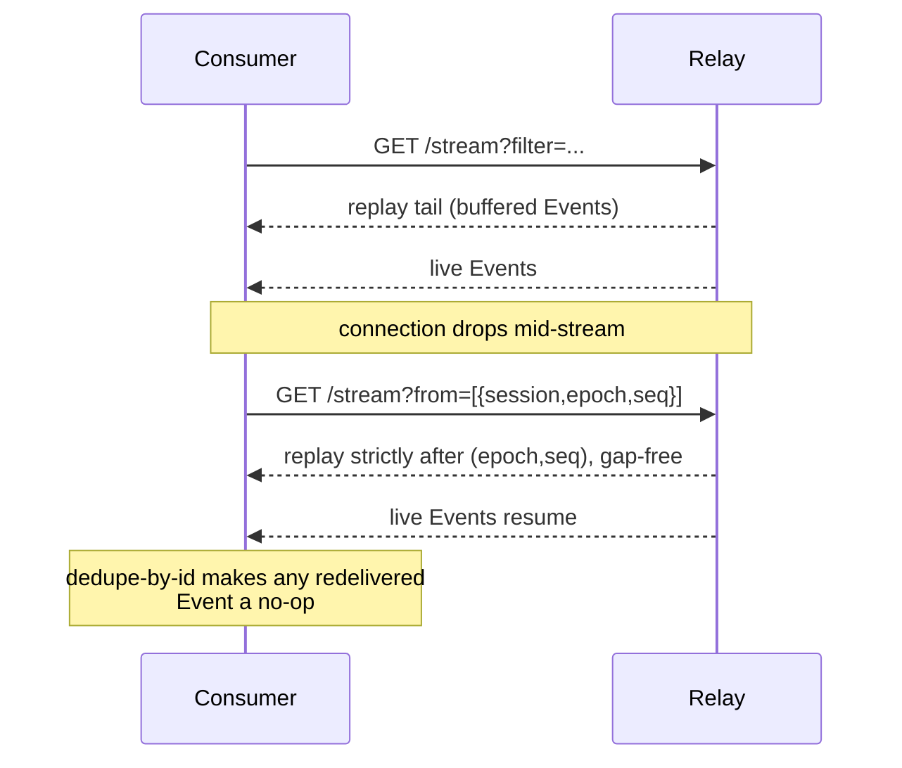

This page covers picking a binding, subscribing with attr-match, and the
resume/dedupe discipline every consumer owes the protocol, using
[impl/cli/aep.js](https://github.com/agenteventprotocol/reference),
[impl/bridge-ce/bridge.js](https://github.com/agenteventprotocol/reference), and the
TypeScript SDK's consume/control split
([typescript-sdk](https://github.com/agenteventprotocol/typescript-sdk)) as real
examples.

## Pick a binding

AEP-0003 defines two consuming bindings for live traffic (JSONL is a third,
for reading a session log file directly:
[AEP-0003 §3.1](/specification/draft/aep-0003-bindings-and-lifecycle#31-jsonl-stdio--file)):

- **SSE** (`GET {relay}/stream`): read-only, one-way, reconnects over plain
  HTTP. Use this unless you need to send commands back.
  [AEP-0003 §3.3](/specification/draft/aep-0003-bindings-and-lifecycle#33-sse-consume).
- **WebSocket** (`{relay}/socket`): duplex. Required if your consumer sends
  control commands (approve/deny, cancel, pause) as well as reading, because
  [control Events flow only on this binding](/specification/draft/aep-0003-bindings-and-lifecycle#35-websocket-duplex).

The reference consumers show the split: `aep tail`
([impl/cli/aep.js](https://github.com/agenteventprotocol/reference)) and both bridges are
SSE-only: they just read the stream.

The TypeScript SDK draws the same line structurally: `subscribe()`
(`src/consume.ts`) rides SSE read-only, while `ControlClient`
(`src/control.ts`) opens a WebSocket purely as the authenticated duplex
channel a command requires. Over that socket it subscribes to nothing but
the ack types (`control.accepted` / `control.rejected`,
`src/control.ts:94-99`) needed to resolve its own commands.

Mission Control
([agenteventprotocol/mission-control](https://github.com/agenteventprotocol/mission-control))
wires the two together into a full dashboard: SSE for the fleet view, a lazy
`ControlClient` for answering attention requests. Default to that split:
SSE for reading, WS only for the write path.

## Subscribe with attr-match

Every subscription (SSE query param or WS `subscribe` frame) takes an
`attr-match` filter: a JSON object of predicates on envelope attributes,
ANDed together. The dialect (allowed keys, type-prefix patterns, severity
comparisons) is defined in
[AEP-0003 §6](/specification/draft/aep-0003-bindings-and-lifecycle#6-the-attr-match-filter-dialect).
In practice, build the smallest filter that gets you what you need:

```js
// aep tail's filter builder: impl/cli/aep.js buildFilter()
{ type: ['attention.*'], severity: { gte: 'notice' } }
```

```js
// bridge-ce takes its filter from the environment: impl/bridge-ce/bridge.js:30
const FILTER = process.env.AEP_FILTER ? JSON.parse(process.env.AEP_FILTER) : {};
// e.g. AEP_FILTER='{"type":["attention.requested"],"severity":{"gte":"notice"}}'
```

Both pass the filter as `?filter=<url-encoded JSON>` on the SSE URL
(`impl/cli/aep.js`'s `subscribeWithState`, `impl/bridge-ce/bridge.js`'s `qs`
at line 61). A narrow filter isn't just tidiness: the relay applies capture
down-leveling and backpressure per subscription, so subscribing to only what
you act on keeps you off the
[backpressure](/specification/draft/aep-0003-bindings-and-lifecycle#84-backpressure)
path.

## Resume and dedupe: the consumer's obligations

Delivery on every binding is at-least-once, and the resume contract only
works if the consumer holds up its end. Two obligations, both normative;
see [AEP-0001 §7](/specification/draft/aep-0001-core-and-envelope#7-ordering-replay-and-the-epoch-seq-contract)
for the ordering/replay guarantees and
[AEP-0003 §7](/specification/draft/aep-0003-bindings-and-lifecycle#7-resume-contract-all-consuming-bindings)
for how they're carried on the wire:

1. **Track `(epoch, seq)` per session and reconnect with it.** `aep tail`
   persists `positions[session] = {epoch, seq}` to
   `~/.aep/tail-state.json` after every Event with a `session`/`seq`
   (`impl/cli/aep.js`'s `subscribeWithState`, shared by `tail` and `sink`;
   the `positions[...] = ...` line at 121), then sends it back as the `from`
   query parameter on reconnect. That turns a killed-and-restarted consumer
   into one that receives exactly the tail it missed, not a full replay or
   a gap. For a **cold start with no positions at all**, an endpoint that
   advertises `replay.all` accepts the literal string `all` in place of the
   array: every session it holds, each from its earliest held position
   ([AEP-0003 §5](/specification/draft/aep-0003-bindings-and-lifecycle#5-replay-buffers)).
   This replaces known-session enumeration entirely; it is bounded by what
   the endpoint *holds*, never a completeness claim, and an endpoint without
   the value refuses it in the same closed error classes as any malformed
   `from`, so try-and-fall-back is a legitimate strategy.
2. **Dedupe by id.** Every consumer here keeps a bounded `Set` of seen
   Event ids and drops repeats before acting on them:
   `impl/cli/aep.js`'s `seen.has(ev.id)` check (line 116), and
   `impl/bridge-ce/bridge.js`'s `seen.has(ev.id)` check before projecting
   (lines 67-68). Skip this and a redelivered Event after a reconnect shows
   up twice, or, worse for an exporting bridge, POSTs a duplicate CloudEvent
   to the downstream sink for an Event it already delivered.

The two together are what make redelivery safe: the relay doesn't promise
exactly-once, so id-dedupe absorbs the duplicates that resume-from-position
can legitimately produce at the boundary.



## Derive, don't track arrival

Two structure-bearing families reward a consumer that derives from the
ORDERED lane instead of reacting to arrival order. Buffered replay and resume
insert events *between* ones you already hold, so any "current step" you
tracked at arrival time is a lie by the next redelivery.

**Steps** (`run.step.started` / `run.step.finished`, optional types;
protocol sources like AG-UI emit them with the envelope `step` naming the
boundary): walk the lane in `(epoch, seq)` order. `run.step.started` opens
a step for its run, `run.step.finished` closes it *after* annotating
itself, and every run-scoped event between the two carries the open step.
Recompute on change (lanes are bounded; the walk is linear).

Mission Control's `stepsOf` is the worked example; its unit suite pins the
case that matters: an event arriving late lands inside its step by order,
not by when it showed up.

**State** (`state.snapshot` / `state.delta`, optional types): reconstruct
by applying snapshots and then each delta's JSON-Patch ops in lane order.

<Warning>

Capture honesty is a **contract here, not a tip**: the payloads are
redacted-gated, so below that ceiling you will receive `state.delta`
events whose patch bodies are absent but whose `data.ops` still counts
the operations:

- a gated snapshot **registers** (state exists upstream) without a value;
  render that fact, not an invented value;
- gated patch bodies are **counted, never fabricated**: "N ops gated at
  capture" is the honest rendering;
- ops that cannot apply against your current value are **skipped and
  counted**, not forced.

</Warning>

Mission Control's `stateOf` implements exactly this (with a minimal
add/replace/remove applier; `move`/`copy`/`test` are outside the honest
minimum and count as skipped); see
[Capture & redaction](/concepts/capture-and-redaction) for why the
ceiling shapes what a consumer may claim.

**Attention cards** (`attention.requested`): honor the request's own
`respond_via` before offering an answer affordance
([AEP-0008](/specification/draft/aep-0008-text-answers-and-response-channels)).
When it is present and does NOT include `control`, the request is
informational on the bus: its answer arrives by the stated channel
(`oob` = the agent's own UI). Render any `options` as information (the
menu the agent is showing its operator), not as buttons that send: a
command against such a request only earns a nack.

When `respond_via` is absent or includes `control`, offer the full
affordance: option buttons AND a free-text reply are both legitimate.
Receivers map text per the AEP-0008 rule, so option words count as the
option. On permission requests, unmatched text lands as the refusing choice
with the text as the reason, so a typed reason is never wasted.

Send-and-settle stays the honest posture for everything the request
itself does not declare: observed capability state can go stale, but
the request's own fields cannot.

## Ask the roster before you promise an affordance

On the WebSocket binding, an endpoint that declares `"roster": {}` in its
capabilities answers the `roster` frame
([AEP-0003 §4.1](/specification/draft/aep-0003-bindings-and-lifecycle)) with a
snapshot of every live emitter claim it terminates: session, agent identity,
and the claim's declared `control` block, verbatim:

```json
{ "type": "roster", "id": "r-1" }
```

Three honesty rules govern how a consumer uses it:

- **Gate on the advertisement.** If the endpoint's `hello` (or discovery
  document) did not declare `roster`, do not send the frame: unknown frames
  are ignored, and you would wait on silence.
- **Treat it as a snapshot, not a promise.** A daemon restarted with different
  gates since your last request will nack exactly as it would have anyway;
  the declared-`accepts` gate at command time stays authoritative. Re-request
  when live `session.*` events tell you the fleet changed.
- **Respect visible ambiguity.** A session value appearing in two entries
  means two live claimants: commands to it will be refused `ambiguous`, and
  your UI should say so rather than pick a claimant.

A session absent from the roster has no live duplex claimant: commands would
nack `no-route`, so the honest affordance is "not reachable right now", not a
grayed-out mystery.

## Certify it

The conformance class table's consumer row is self-serve: drive your
consumer from the standard's golden corpus
([`conformance/fixtures/golden/golden.jsonl`](https://github.com/agenteventprotocol/agent-event-protocol/blob/main/conformance/fixtures/golden/golden.jsonl)).
It deliberately contains shapes unknown to you (a vendor extension type,
extension envelope attributes, foreign-emitter seq-less events, an
agent-scoped event without a session). Vendor the file byte-identical with
a pinned provenance note, feed it through your real reducer or import
path, and assert the class obligations
([AEP-0001 §7/§10](/specification/draft/aep-0001-core-and-envelope),
[AEP-0003 §6-§7](/specification/draft/aep-0003-bindings-and-lifecycle)):

1. **Every event applies:** the unknown type, the extension attributes,
   and the sessionless event are tolerated and kept, never dropped.
2. **A full-corpus duplicate replay changes nothing:** dedupe on `id`
   makes the second pass a no-op you can assert on (state version, counts,
   derived lifecycle all unchanged).
3. **The fourteen mandatory types derive the full story:** the finished /
   failed / cancelled run terminals, the answered and timed-out attention
   arcs, and the form loop with its free-text answer kept.
4. **Foreign-emitter seq-less events keep arrival order** among the owner
   stream's `(epoch, seq)`-ordered events.
5. **Cause edges resolve** across the control boundary
   (`control.cancel` → `run.cancelled`).

Mission Control's suite is the shipped worked example
([`app/test/conformance.test.ts`](https://github.com/agenteventprotocol/mission-control/blob/main/app/test/conformance.test.ts)),
running the corpus through the real store via the real JSONL import path. The
resume/attr-match half of the class row is live-wire behavior; pin it the
way this guide's obligations section describes, or the way Mission
Control's end-to-end beats do (kill-and-reattach from persisted positions,
gap-free).

## See also

- [Run the stack](/guides/run-the-stack): get a relay and adapter running to
  point your consumer at.
- [Write an adapter](/guides/write-an-adapter): the producing side of the same
  contract.
- [The `aep` CLI](/components/cli): closer read of `tail`/`timeline`.
- Normative sources: [AEP-0001 §7](/specification/draft/aep-0001-core-and-envelope#7-ordering-replay-and-the-epoch-seq-contract),
  [AEP-0003 §6-7](/specification/draft/aep-0003-bindings-and-lifecycle#6-the-attr-match-filter-dialect).
