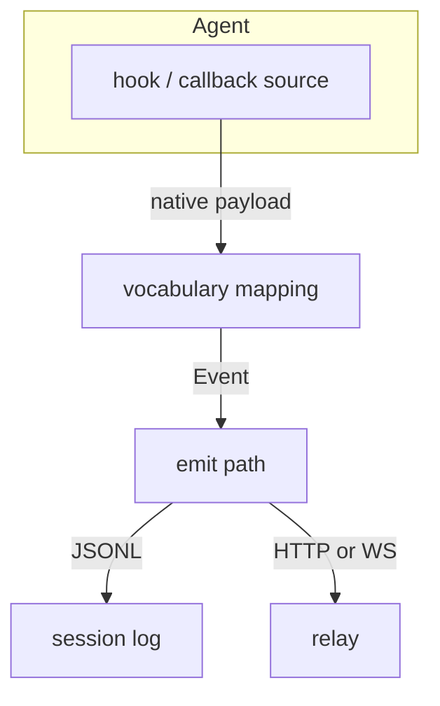
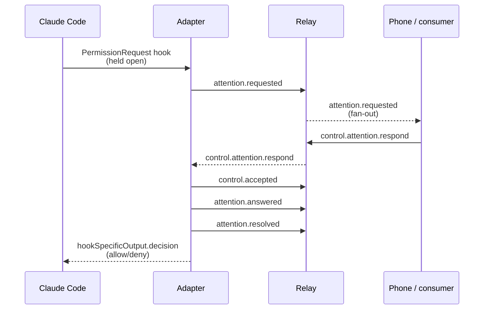

An adapter turns one agent's native lifecycle signals (hooks, callbacks,
whatever that agent exposes) into AEP [Event](/concepts/envelope-and-identity)s
on a transport binding. This guide builds one using
[impl/adapter-claude-code/adapter.js](https://github.com/agenteventprotocol/reference)
and [impl/adapter-codex/adapter.js](https://github.com/agenteventprotocol/reference) as
worked references, and ends with a conformance checklist.

## The shape of an adapter

Three jobs, in order:

1. **Map** the agent's native vocabulary onto AEP types and payload shapes.
2. **Build** a valid envelope for each mapped Event.
3. **Emit** it on a binding: JSONL, HTTP, or WebSocket.

<Steps>

<Step title="Map the agent's vocabulary">

This part is specific to your agent, and it's normative.
[AEP-0002 Annex A](/specification/draft/aep-0002-taxonomy-and-types#annex-a-normative-source-vocabulary-mappings)
adopts seventeen source-vocabulary mappings:

Claude Code · Codex (hooks and the OTel channel) · Gemini CLI · Qwen Code ·
the VS Code agent (hooks and the OTel channel) · Kimi Code CLI (hooks and the
web channel) · OpenCode (plugin and SSE channel) · Kilo Code · Cline ·
Hermes Agent · Antigravity · pi · ACP · AG-UI · OpenHands · OpenClaw Gateway ·
A2A

If you're mapping one of those sources, follow its table (the fixtures in
`conformance/fixtures/mappings/` are the most precise statement). Adding a
new source? Annex A is where a new table lands (via the SEP process, see
[CONTRIBUTING.md](/community/contributing)) once it has fixtures.

Walk your agent's event/hook list and, for each one, ask:

- Does it fit a mandatory core type already ([Taxonomy tour](/concepts/taxonomy-tour))?
  `handleHook`'s `switch` in
  [adapter-claude-code/adapter.js](https://github.com/agenteventprotocol/reference)
  shows the pattern: `SessionStart` → `session.started`, `PreToolUse` →
  `tool.requested`, `PermissionRequest` → `attention.requested`, and so on.
- Does it not fit any core type? Fall into a vendor extension type
  (`x.{vendor}.{category}.{rest}`) rather than force it. The adapter's
  `default` branch does exactly this for CC hooks with no core equivalent,
  picking the mechanical fallback category `session` and SNAKE-casing the
  hook name into the tail segment.
- Is it a paired concept your agent only fires once (like CC's
  `PreCompact`/`PostCompact`)? The adapter documents the deviation inline
  (`// paired concept; emitted once at PostCompact (documented deviation)`)
  rather than inventing a second Event; Annex A requires deviations to be
  documented, not silently absorbed.

For the mapping without the control loop, read the Codex adapter instead:
[config.example.toml](https://github.com/agenteventprotocol/reference)'s
header comment lists all ten Codex hook events against their AEP types in
one table.

</Step>

<Step title="Build the envelope">

Every Event needs the 16 context attributes described in
[The envelope & identity](/concepts/envelope-and-identity). The reference
adapters build them by hand in a small `emit()` helper: see
[adapter.js's `emit()`](https://github.com/agenteventprotocol/reference). It
stamps `aep`, `id` (ULID), `type`, `time`, `source`, `agent`, and, for
session-scoped types, `session`, `seq` (a per-session counter it owns), and
`epoch` (bumped once per adapter process start, persisted to
`~/.aep/adapter-cc.state.json`, because there's no durable seq to resume
from).

If you use the SDKs instead of hand-rolling this, `Emitter`/
`SessionEmitter` do the same job. See
[the TypeScript guide](/guides/sdk-typescript) or [the Python guide](/guides/sdk-python).

`capture` matters here too: the adapter computes a per-category ceiling
(`ceilingFor`, gating `attention.*` fields more strictly than everything
else by default) and includes only the payload fields the ceiling allows
(`gate()`). The *why* is in
[Capture & redaction](/concepts/capture-and-redaction); the mechanism your
adapter must implement is in
[AEP-0001 §8.2](/specification/draft/aep-0001-core-and-envelope#82-capture).

</Step>

<Step title="Pick an emit binding">

AEP-0003 defines three: JSONL (a session log file), HTTP POST, and
WebSocket. See
[AEP-0003 §3](/specification/draft/aep-0003-bindings-and-lifecycle#3-binding-specifications)
for the wire details of each.

The reference Claude Code adapter uses two at once. It appends every Event to
a durable per-session JSONL file (`logPath()`) *and* forwards live over a
WebSocket connection to the relay (`wsConnect()`). A crash therefore never
loses history, and a live consumer still gets the stream.

A simpler adapter can just POST to `{relay}/events` (see
[impl/adapter-codex](https://github.com/agenteventprotocol/reference)'s
command-hook shim) if it doesn't need the control loop below. WebSocket is
required only when the adapter must *receive* commands.

</Step>

</Steps>

## Two shim templates: command hook and in-process plugin

How your shim half talks to the agent depends on what the agent loads:

- **Command-hook shim** (Claude Code, Codex, Gemini CLI, Qwen Code): the
  agent spawns a process per hook firing with the payload on stdin. The
  shim is a tiny stdin→HTTP forwarder in front of the daemon (see
  `codex-hook.js` / `gemini-hook.js` / `qwen-hook.js`); Qwen's native
  `http` hook type even removes the shim. Fail-open rule: a dead daemon
  answers the hook with nothing, never an error.
- **Plugin shim** (OpenCode): the agent loads your code *into its own
  runtime*; the shim is a plugin file, not a process. The worked example
  is `impl/adapter-opencode/opencode-plugin.js` per the
  [design record](/components/adapter-opencode-design): keep it
  runtime-clean for the host (OpenCode runs Bun: ESM export, `fetch`, no
  Node built-ins), forward every moment with a short bounded timeout, and
  hold only the permission hook open longer (bounded above the daemon's
  own attention window). Same fail-open rule, same daemon behind it.

Either way, **the daemon half does not change**: mapping, identity, capture
gating, the JSONL log, and the relay binding live outside the agent's
process, where a wedged socket or a mapping bug cannot break the agent and
a supervisor can watch it. The conventions the reference daemons converged
on are the template's floor, not decoration:

- a **pure mapping module** (`map-hooks.js`) the conformance fixtures can
  pin without booting anything;
- `GET /healthz` → `{ ok, relay }`: `relay` turns true when the WS
  binding is live, so smokes and supervisors gate on delivery-readiness,
  not on the HTTP port answering (a bridge with a second upstream binding
  reports it too: `{ ok, relay, source }`);
- reconnect armed on **whichever of `error`/`close` fires first**, once
  per attempt, because on some Node versions a refused connection
  dispatches only `error`, and an `onclose`-only retry never runs;
- an **outbox** that queues emissions until the relay hello completes;
- a CI smoke on its **own port band**: two smokes sharing ports turn a
  slow teardown on a shared runner into a cross-smoke ghost failure.

## The control loop: PermissionRequest as attention

If your agent has a human-approval gate (a permission prompt, a
confirmation dialog), model it as the
[attention lifecycle](/concepts/control-profile) instead of a
one-off callback. The worked example is CC's `PermissionRequest` case in
[adapter.js](https://github.com/agenteventprotocol/reference):

The shape to copy:

- Emit `attention.requested` and hold the response open; don't answer the
  hook yet.
- Register a pending waiter keyed by the request id, with a timeout
  (`ATTENTION_TIMEOUT`, default 55 s) that emits `attention.timeout` and
  falls back to the agent's own dialog (fail-open) if nobody answers.
- When a `control.attention.respond` command arrives, ack it
  (`control.accepted`/`control.rejected`: one ack DECISION per deduplicated
  command; keep the emitted ack alongside the dedupe entry and re-send it
  byte-identically when the same command is redelivered, per
  [AEP-0004 §3](/specification/draft/aep-0004-control-profile#3-acknowledgement-events)),
  then emit `attention.answered` and `attention.resolved`, then finally
  respond to the still-open hook.
- Handle text answers per the
  [AEP-0008](/specification/draft/aep-0008-text-answers-and-response-channels)
  receiver rule: `{text}` that names an option (id or unambiguous label,
  case-insensitive, trimmed) counts as that option: record the mapped
  choice as `answer.option`. Any OTHER free text on a `kind: "permission"`
  request applies your REFUSING option with the text preserved as the
  stated reason (or rejects `invalid`), never the permissive one. Both
  reference held gates implement this; the CC-surface adapter
  additionally routes unmatched text as the hook message, mirroring CC's
  own "tell Claude what to do differently" dialog (the pending waiter's
  answer callback,
  [adapter.js](https://github.com/agenteventprotocol/reference)).
  Replicate the reason routing if your agent has an equivalent free-text
  redirect.
- If your agent's own approval UI is hook-visible but NOT answerable from
  the bus (an observed gate, not a held one), still emit the
  `attention.requested`, and make the card self-describing: carry the
  vendor's decision set as `options` data where you can source it
  honestly (when the offered menu is not in the payload, the return
  contract your post-decision hook can deliver IS the honest source), and
  declare `respond_via: ["oob"]` so consumers render information, not a
  doomed answer affordance. The Hermes-surface observed approval card is
  the worked example
  ([the design record's observed approval card](/components/adapter-hermes-design)).
- If your agent has an ask-the-user TOOL (a clarifying-question surface:
  Claude Code's `AskUserQuestion`, Hermes's `clarify`, and the next
  vendor's name for the same idea) whose ask and answer are
  hook-visible, map the FORM overlay
  ([AEP-0006](/specification/draft/aep-0006-structured-input-requests)
  `kind: "form"`) *beside* the tool events, never instead of them. The
  tool trio is the vendor truth, the form card is the human-loop fact.
  Make it answerable exactly when the vendor CONSUMES an injected answer
  (Claude Code's held hook returning `updatedInput` is that shape);
  where the vendor only lets you observe, declare `respond_via: ["oob"]`
  and record the vendor-delivered answer via `oob` from the vendor's own
  result. Eligibility is a consumption property, and a bus-answerable
  card on a surface that reads no injected result would claim a channel
  that never existed. The Hermes clarify overlay is the worked observed
  example
  ([the design record's clarify form overlay](/components/adapter-hermes-design)).

See [AEP-0004](/specification/draft/aep-0004-control-profile) for the full
command/ack model, and [components/adapters.md](/components/adapters) for a
closer read of this same loop with line references annotated.

### Screening vendor control affordances (the neutrality criteria)

Control affordances originate on vendor surfaces, and the standing risk
is per-vendor semantics leaking into core. Before mapping any vendor
control feature (a menu, a verb, a capability), screen it against these
six criteria (all must pass; also recorded in
[AEP-0008's rationale](/specification/draft/aep-0008-text-answers-and-response-channels)):

1. **Schema neutrality**: the feature rides generic AEP shapes
   (`options[]`, `field_spec`, kinds, the core verbs) as *instance data*;
   no vendor-named field or enum value enters core schemas, and `x.*`
   extensions are never load-bearing for the loop.
2. **Consumer-blind renderability**: a consumer that never heard of the
   vendor renders the affordance correctly and completely from the event
   alone; per-agent label sugar stays cosmetic.
3. **Answer round-trip fidelity**: `{option}`/`{text}`/`{values}`
   carries the decision losslessly; YOUR adapter owns what an option id
   means on the vendor surface; anything needing mid-answer vendor
   negotiation fails this test.
4. **Cross-vendor recurrence**: mint core semantics only for a
   capability class seen (or plausibly recurring) on at least two agent
   surfaces; one-vendor concepts stay in `x.{vendor}.*` (the
   vendor-scoped steering verb is the precedent in both directions).
5. **No degradation by absence**: absence must be the default posture;
   presence is purely additive for agents and consumers that lack it.
6. **Sovereignty and honesty**: never claim unobserved state, never
   override the agent's own decision surface; timeouts and fail-open
   semantics stay stated.

Apply the transform rule before judging a vendor menu: split its entries
into DECISION options (these ride `options[]` as data) and
INFORMATION/NAVIGATION actions ("show full command", "open the diff").
An information action dissolves into event data the consumer already
renders (capture-gated), or drops; it flags the feature only if it can
neither dissolve nor drop.

A feature that fails a criterion is recorded as **unsupported, with the
criterion cited** (in the adapter's README and design record) and parked
until vendor adoption changes the facts; that record is a feature, not a
failure.

## Conformance checklist

Before calling an adapter done, verify:

- [ ] **Valid envelope**: every emitted Event carries the required context
      attributes and validates against the envelope schema
      (`schemas/aep-event.schema.json`).
- [ ] **Ordering**: `(epoch, seq)` is monotonic per session, `epoch` bumps
      on any non-durable restart; see
      [AEP-0001 §7](/specification/draft/aep-0001-core-and-envelope#7-ordering-replay-and-the-epoch-seq-contract).
- [ ] **Capture/redaction applied**: payload fields respect the declared
      `capture` level; nothing above the ceiling leaks. Run redaction
      through [impl/shared/redact.js](https://github.com/agenteventprotocol/reference) rather
      than reimplementing it. See
      [Capture & redaction](/concepts/capture-and-redaction).
- [ ] **`aep validate` is green** on a captured session log:
      `node impl/cli/aep.js validate <session>.jsonl`. See
      [The `aep` CLI](/components/cli) for what it checks
      (envelope, payload, ordering, capture honesty, all in
      [impl/cli/aep.js](https://github.com/agenteventprotocol/reference)).
- [ ] **The conformance suite passes** for anything your adapter shares
      with the reference implementation (envelope structure, attr-match if
      you filter, CE/OTLP projections if you bridge). Run both independent
      runners, `python3 conformance/run.py` and `node conformance/run.js`,
      per [conformance/README.md](https://github.com/agenteventprotocol/agent-event-protocol/blob/main/conformance/README.md); disagreement
      between them is a spec-ambiguity bug, not a bug in your adapter.
- [ ] **Annex A deviations are documented**: if your mapping departs from
      the adopted table, say so in the adapter source (see the `PreCompact`
      comment in
      [adapter.js](https://github.com/agenteventprotocol/reference) for the
      pattern), per
      [AEP-0002 Annex A](/specification/draft/aep-0002-taxonomy-and-types#annex-a-normative-source-vocabulary-mappings).
- [ ] **Vendor control affordances screened**: every mapped vendor menu,
      verb, or capability passed the six neutrality criteria above (or is
      recorded unsupported with the criterion cited); text answers follow
      the AEP-0008 receiver rule; observed-but-unanswerable requests
      declare their real channel (`respond_via`).

## See also

- [Write a consumer](/guides/write-a-consumer): the other half of the pipe.
- [Adapters](/components/adapters): full internals of the ten
  reference adapters.
- [The control profile](/concepts/control-profile): the attention
  lifecycle this section builds on.
- Normative sources: [AEP-0002](/specification/draft/aep-0002-taxonomy-and-types),
  [AEP-0003](/specification/draft/aep-0003-bindings-and-lifecycle),
  [AEP-0004](/specification/draft/aep-0004-control-profile).
