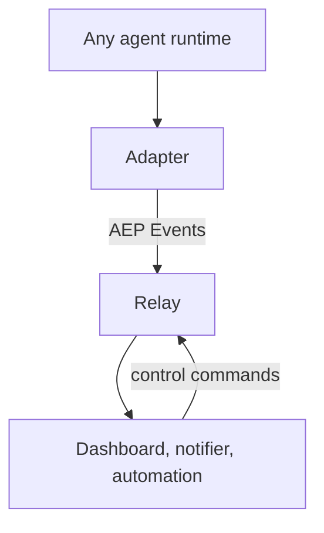

AEP (Agent Event Protocol) is an open, vendor-neutral standard for **agent
activity events and control**.

An AI agent doing work generates a stream of facts: a run started, a tool ran,
a step is 40% through, a human needs to approve something. Every agent runtime
emits those facts differently, so anything that wants to watch them (a
dashboard, a history store, a notifier, an automation) is written once per
runtime. AEP standardizes the wire format instead: any agent emits lifecycle,
tool, progress, and **attention** events once, over stdio (JSONL), HTTP, SSE,
or WebSocket, and any consumer reads one vocabulary for every agent it watches.

Think of AEP the way syslog works for daemons, or OTLP for services: not a new
place to send your data, but one agreed shape for it, so the tools that read it
stop caring who produced it.



Events flow out; control commands flow back along the same stream, so approving
a tool call or answering an agent's question lands in the same replayable
history as everything else. See [AEP-0001 §4.2](/specification/draft/aep-0001-core-and-envelope)
for the architecture and [AEP-0004](/specification/draft/aep-0004-control-profile)
for the control profile.

<Info>

**Status: pre-release.** The specifications are v0.1; the
[specification index](/specification/draft) lists each document's status
(Draft or Accepted). Identifiers (the `dev.aep.` type root, the `aep://`
scheme, the `@aep/*` and `aep-sdk` package names) are settled; nothing is
published to any registry yet.

</Info>

## What AEP makes possible

- **One timeline across every runtime you run.** A coding agent, a support bot,
  and a batch job runner appear on the same stream, in the same vocabulary.
- **Agent-needs-a-human as a routable event.** `attention.requested` can reach
  a phone, a chat channel, or a policy automation, and be answered from there,
  without the agent knowing which. See [the taxonomy tour](/concepts/taxonomy-tour).
- **Approve, cancel, or pause from anywhere.** Control commands are ordinary
  events, so every control action is audit-logged by construction rather than
  written to a separate log.
- **Kill a consumer and reattach without losing events.** `(epoch, seq)` resume
  returns exactly the tail that was missed. See
  [the envelope and identity](/concepts/envelope-and-identity).
- **Feed your existing pipeline.** Normative bridges map the same stream into
  CloudEvents and OTLP, so adopting AEP does not mean a second instrumentation
  pass. See [AEP-0005](/specification/draft/aep-0005-bridges).

## Why AEP matters

Where you sit determines which part matters most.

- **Agent authors.** Write one adapter and every AEP consumer works with your
  runtime. You do not negotiate a format with each dashboard vendor.
- **Consumer authors.** Write against one contract and support every agent that
  speaks it, including runtimes that did not exist when you shipped.
- **Fleet observers.** Watch many sessions you did not initiate, retain them
  uniformly, and act on the ones that need a human. This is the case no
  adjacent protocol was built for; see
  [what and why AEP](/concepts/what-and-why).
- **Security and compliance readers.** [Capture levels](/concepts/capture-and-redaction)
  decide what content leaves the machine, per event, and the control round-trip
  leaves an audit trail in the stream itself.

## The envelope in one glance

Every Event is a self-describing JSON object: 16 context attributes plus
`data`. The attributes are what make fleet-wide ordering, causality, capture
levels, and replay possible.

```json
{
  "aep": "0.1", "id": "01JZX7Q4R8T0V2W4X6Y8Z0AB1C",
  "source": "aep://host-1/agent/claude-code/session/s_9f2c",
  "type": "tool.completed", "subject": "Bash",
  "agent": "claude-code", "session": "s_9f2c", "run": "r_01",
  "step": "turn-3", "seq": 42, "epoch": 1,
  "time": "2026-07-04T12:00:00.000Z",
  "cause": "01JZX7Q4R8T0V2W4X6Y8Z0AB0B",
  "severity": "info", "capture": "metadata",
  "data": { "tool": { "name": "Bash", "call_id": "t_91" },
            "status": "success", "duration_ms": 412 }
}
```

The taxonomy that fills `type` is fixed rather than open-ended: 13 categories,
14 mandatory types, defined in [AEP-0002](/specification/draft/aep-0002-taxonomy-and-types).
A field-by-field walk through the envelope is in
[the envelope and identity](/concepts/envelope-and-identity).

## Start here

New to AEP? Read these two in order, then pick a task below.

<CardGroup cols={2}>

<Card title="What AEP is, and why" icon="book" href="/concepts/what-and-why">

The fleet-observer problem, and the one-contract answer

</Card>

<Card title="The envelope & identity" icon="envelope" href="/concepts/envelope-and-identity">

The 16 attributes, and how `session` / `epoch` / `seq` give ordering and replay

</Card>

</CardGroup>

## Build something

<CardGroup cols={2}>

<Card title="Run the stack" icon="terminal" href="/guides/run-the-stack">

Relay, adapter, and a consumer on one machine, no external accounts

</Card>

<Card title="Write an adapter" icon="plug" href="/guides/write-an-adapter">

Connect a new agent runtime, with a conformance checklist

</Card>

<Card title="Write a consumer" icon="diagram-project" href="/guides/write-a-consumer">

Subscribe, resume from `(epoch, seq)`, dedupe

</Card>

<Card title="TypeScript SDK" icon="code" href="/guides/sdk-typescript">

Emit, consume, and control with `@aep/sdk`

</Card>

<Card title="Python SDK" icon="code" href="/guides/sdk-python">

The same with `aep-sdk`, sync and asyncio

</Card>

<Card title="Troubleshoot the stack" icon="gear" href="/guides/troubleshoot-the-stack">

When a consumer is refused or a daemon reads down, diagnose the environment first

</Card>

</CardGroup>

## Learn the concepts

<CardGroup cols={2}>

<Card title="Taxonomy tour" icon="list" href="/concepts/taxonomy-tour">

The mandatory event types and the attention lifecycle

</Card>

<Card title="Capture & redaction" icon="shield" href="/concepts/capture-and-redaction">

Capture levels and the redaction pipeline

</Card>

<Card title="The control profile" icon="bolt" href="/concepts/control-profile">

Attention and the acknowledged control round-trip (`experimental`)

</Card>

<Card title="Specification" icon="book" href="/specification/draft">

The normative AEP-0001..AEP-0009 suite

</Card>

</CardGroup>

## Ecosystem

The standard lives here; the runnable code lives in sibling repositories. The
reference stack ships twelve adapters, eight bridge sidecars (2 outbound,
6 inbound), an MCP server, and the `aep` CLI, and self-certifies its
conformance classes in CI against this repository's checker.

| Repository | What it is |
|---|---|
| [reference](https://github.com/agenteventprotocol/reference) | The runnable reference stack: relay, `aep` CLI, adapters, bridges, MCP server, demo |
| [mission-control](https://github.com/agenteventprotocol/mission-control) | Fleet operator console: live session lanes, attention inbox, replay, causal graphs |
| [typescript-sdk](https://github.com/agenteventprotocol/typescript-sdk) | `@aep/sdk`: emit, consume, and control helpers over the generated types |
| [python-sdk](https://github.com/agenteventprotocol/python-sdk) | `aep-sdk`: the same for Python, sync and asyncio |

Which runtimes are covered today, and what each one exposes, is tracked in
[supported agents](/agents) and [vendor surfaces](/vendor-surfaces). How the
reference code is put together is documented under
[components](/components/repo-map).

## Contribute

Spec changes follow the AEP proposal process, and the one rule that never
bends is that normative text lands with its conformance fixtures in the same
change.

- [Contributing](/community/contributing): how to propose a change.
- [Governance](/community/governance): the AEP process, the firewall, versioning.
- [AEP-TEMPLATE.md](https://github.com/agenteventprotocol/agent-event-protocol/blob/main/spec/AEP-TEMPLATE.md): start a proposal.

## About these docs

These docs *explain*. The [specification](/specification/draft) *defines*: it is
the single normative source, and every page here links into it rather than
restating it (the [firewall](/STYLE#the-firewall-docs-explain-the-spec-defines)).
When a doc and the spec disagree, the spec wins.

- [Docs style & conventions](/STYLE): read before writing any doc.
- [_TEMPLATE.md](https://github.com/agenteventprotocol/agent-event-protocol/blob/main/docs/_TEMPLATE.md): copy to start a new doc.
- [check-docs.sh](https://github.com/agenteventprotocol/agent-event-protocol/blob/main/docs/check-docs.sh): the offline QA gate (mermaid, links, spec terms, running counts), run in CI as its own `docs` job so public docs cannot drift.
